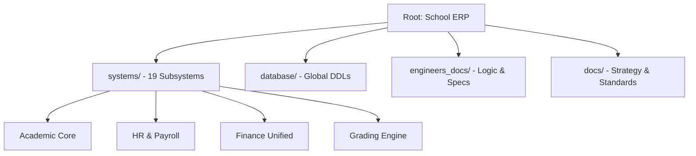

# 🏫 نظام إدارة المدرسة المتكامل (Integrated Educational ERP)

---

## 🌟 الرؤية والأهداف (Vision & Goals)
يمثل هذا المشروع **نظام تخطيط موارد تعليمي (ERP)** متكامل، مصمم لرقمنة كافة العمليات الأكاديمية والإدارية والمالية في المؤسسات التعليمية الحديثة. لا يقتصر النظام على حفظ البيانات، بل يعمل كمحرك ذكي لصنع القرار، وتتبع الأداء، وتعزيز الشفافية بين الإدارة والموظفين وأولياء الأمور.

---

## 🚀 الركائز الأساسية للنظام (Core Pillars)

### 🛡️ الحوكمة والتدقيق (Governance & Audit)
نظام صارم لتتبع كافة التغييرات (Audit Trails)، مع آليات قفل (Locking) للنتائج والبيانات الحساسة بعد الاعتماد، لضمان أعلى مستويات النزاهة الأكاديمية والمالية.

### 🧠 الذكاء الأكاديمي (Academic Intelligence)
محرك حسابي متطور يقوم بحساب الترتيب الآلي، وتحليلات الرسوب والنجاح، وتحديد مستويات الطلاب بناءً على معايير مركبة تشمل الحضور، السلوك، والواجبات.

### 🔗 التكامل السحابي والمحلي (Hybrid Integration)
ربط شامل بين 19 نظاماً فرعياً، مع دعم كامل للإشعارات اللحظية (SNS) وتطبيق أولياء الأمور، لضمان بقاء جميع أطراف العملية التعليمية في قلب الحدث.

---

## 📁 هيكل المشروع (Project Architecture)

---

## 🔷 منظومة الأنظمة الفرعية (Subsystem Ecosystem)

| # | النظام (Subsystem) | المسؤول (Lead Engineer) | الوصف المختصر |
|---|-------------------|------------------------|----------------|
| 01 | [البنية المشتركة](./systems/01_البنية_المشتركة/) | عماد الجماعي | الأساس الهيكلي، المستخدمين، والصلاحيات (RBAC). |
| 02 | [النواة الأكاديمية](./systems/02_النواة_الأكاديمية/) | موسى العواضي | إدارة الفصول، المواد، والتقويم الأكاديمي. |
| 03 | [الموارد البشرية](./systems/03_الموارد_البشرية/) | يونس العفيف | شؤون الموظفين، العقود، والأرشفة الذكية. |
| 04 | [الطلاب](./systems/04_الطلاب/) | أحمد الهتار | القبول والتسجيل، البيانات الشخصية، والملفات الأكاديمية. |
| 05 | [التعليم والدرجات](./systems/05_التعليم_والدرجات/) | عمار الشعيبي | محرك الدرجات، المحصلات الشهرية، والترتيب الآلي. |
| 06 | [الإدارة](./systems/06_الإدارة/) | عماد الجماعي | التقارير المركزية، التراخيص، وإدارة الإعدادات. |
| 07 | [النظام المالي الموحد](./systems/07_النظام_المالي/) | فيصل الجماعي / عماد | المحاسبة، الأجور، والمساهمة المجتمعية الموحدة. |
| 08 | [لجان الامتحانات](./systems/08_لجان_الامتحانات/) | عمار الشعيبي | توزيع اللجان، أرقام الجلوس، وضبط القاعات. |
| 09 | [النقل](./systems/09_النقل/) | يونس العفيف | إدارة الحافلات، المسارات، واشتراكات الطلاب. |
| 10 | [المكتبة](./systems/10_المكتبة/) | أحمد الهتار | الفهرسة، الإعارة، وتتبع الكتب المدرسية. |
| 11 | [جدول الحصص](./systems/11_جدول_الحصص/) | موسى العواضي | توزيع الحصص، القاعات، ومنع تعارض المواعيد. |
| 12 | [تطبيق أولياء الأمور](./systems/12_تطبيق_أولياء_الأمور/) | أحمد الهتار | واجهة التواصل المباشر، النتائج، والبلاغات. |
| 13 | [المنصة التعليمية](./systems/13_المنصة_التعليمية/) | موسى العواضي | التعليم عن بعد، المحتوى الرقمي، والاختبارات الإلكترونية. |
| 14 | [نظام الإشعارات](./systems/14_نظام_الاشعارات/) | موسى العواضي | محرك التنبيهات (SMS/Push/Email) لكافة العمليات. |
| 15 | [لوحة المعلومات BI](./systems/15_لوحة_المعلومات/) | موسى العواضي | الرؤى التحليلية ومؤشرات الأداء للمدير. |
| 16 | [التقارير والكشوفات](./systems/16_التقارير_والكشوفات/) | موسى / أحمد | محرك توليد التقارير الذكي وطباعة السجلات. |
| 17 | [نظام الشهادات](./systems/17_نظام_الشهادات/) | عمار الشعيبي | إصدار شهادات النجاح والوثائق الرسمية الموثقة. |
| 18 | [نظام المشاهد/التدقيق](./systems/18_المشاهد/) | عماد الجماعي | التدقيق المالي والإداري ورصد انطباعات الملاك. |
| 19 | [الصحة المدرسية](./systems/19_الصحة_المدرسية/) | موسى العواضي | السجلات الطبية، التحصينات، وزيارات العيادة. |

---

## 🛠️ المواصفات التقنية (Technical Excellence)

*   **MySQL 8.0+**: استخدام الـ `Window Functions` للترتيب، و `CTE` للتقارير المعقدة، و `JSON Data Types` لمرونة الإشعارات.
*   **Normalization**: الالتزام بمعيار **3NF** لضمان سلامة البيانات ومنع التكرار.
*   **Security**: تطبيق نظام صلاحيات دقيق (Fine-grained RBAC) على مستوى الجداول والعمليات.
*   **Performance**: فهارس (Indexes) وعروض (Views) محسنة للتعامل مع آلاف السجلات بلحظية.

---

## 👥 فريق العمل (The Engineering Team)

| المهندس | الدور | المسؤولية الرئيسية |
|---------|-------|-------------------|
| **موسى العواضي** | المسؤول التنفيذي | النواة، الجدول، المنصة، الإشعارات، لوحة BI، والصحة. |
| **عماد الجماعي** | المشرف العام | البنية المشتركة، نظام الإدارة، ونظام المشاهد/التدقيق. |
| **أحمد الهتار** | مهندس تنفيذي | الطلاب، المكتبة، تطبيق أولياء الأمور، ومحرك التقارير. |
| **عمار الشعيبي** | مهندس تنفيذي | محرك الدرجات، لجان الامتحانات، ونظام الشهادات الرقمية. |
| **يونس العفيف** | مهندس تنفيذي | الموارد البشرية، الأرشفة الذكية، واللوجستيات (النقل). |
| **فيصل الجماعي** | مهندس تنفيذي | الهندسة المالية الموحدة وإدارة التحصيل المجتمعي. |

---

## 📄 الوثائق المرجعية (Reference)

- 📘 [التقرير الهندسي النهائي](./docs/التقرير_الهندسي_النهائي_المعتمد.md) - المواصفات الكاملة.
- 📜 [لوائح العمل الهندسية](./docs/لوائح_العمل_والقواعد_الهندسية.md) - معايير البرمجة والتوثيق.
- 📂 [وثائق المهندسين](./engineers_docs/) - تفاصيل كل نظام فرعي بشكل مستقل.

---
**شركة إنما سوفت للحلول التقنية (InmaSoft)** | 2026
