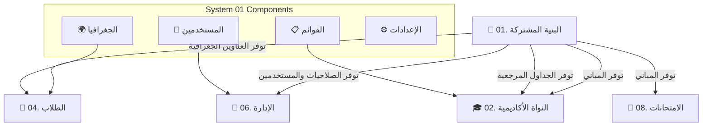
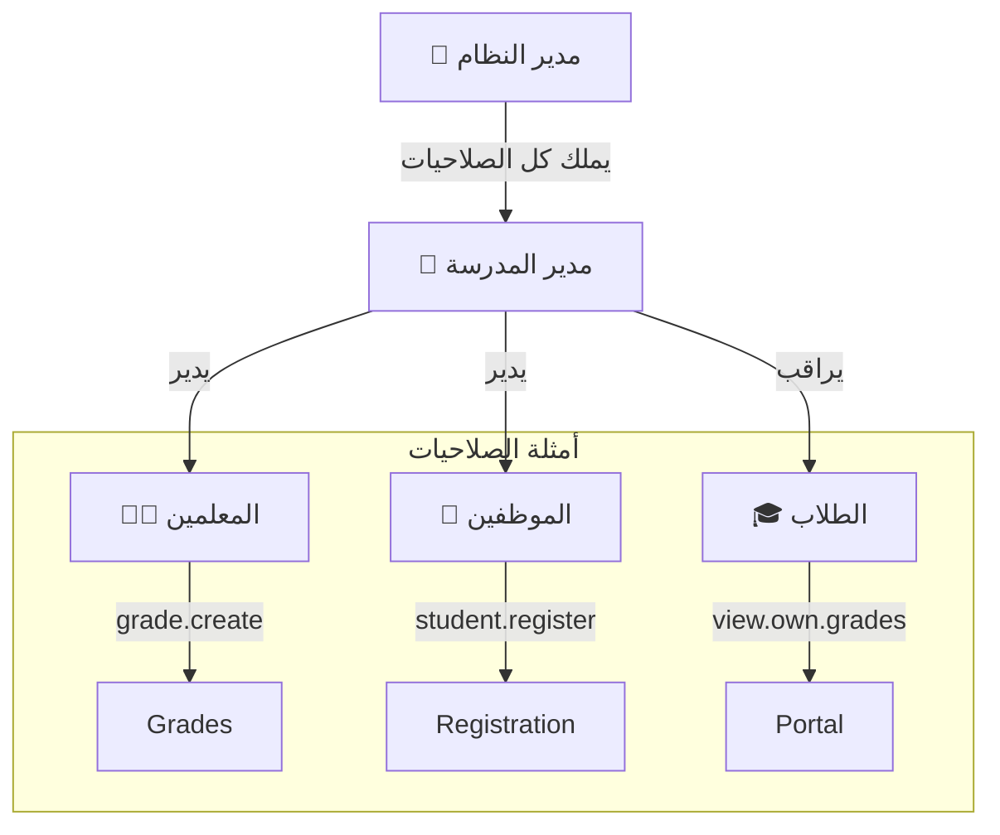

# 🌐 نظام البنية التحتية المشتركة (Shared Infrastructure)

> **"العقل المدبر" للمدرسة الرقمية والحصن الأمني للبيانات**

---

## 📑 جدول المحتويات
1. [المقدمة والرؤية](#-المقدمة)
2. [ماذا يقدم هذا النظام؟](#-ماذا-يقدم-هذا-النظام)
3. [الفوائد والقيمة](#-الفوائد-الملموسة)
4. [سيناريوهات واقعية](#-أمثلة-واقعية-من-داخل-المدرسة)
5. [القاموس التقني للبيانات (Technical Data Dictionary)](#-القاموس-التقني-للبيانات)
    - [القسم 1: الجداول المرجعية (Lookups)](#-القسم-1-الجداول-المرجعية-lookup-tables)
    - [القسم 2: الأمان والصلاحيات (RBAC)](#-القسم-2-الأمان-والصلاحيات-rbac)
    - [القسم 3: الجغرافيا (Geography)](#-القسم-3-الجغرافيا-geography)
    - [القسم 4: الإعدادات والتقويم](#-القسم-4-الإعدادات-والتقويم)
6. [تحليل معماري ومراجعة الجودة](#-تحليل-معماري-ومراجعة-الجودة)

---

## 🚀 المقدمة
في عصر التحول الرقمي، لا تحتاج المدرسة فقط إلى تخزين البيانات، بل إلى "عقل مدبر" ينظم من يحق له رؤية ماذا، وكيف تترابط المعلومات ببعضها. نظام البنية التحتية المشتركة هو حجر الأساس الذي يضمن أمان المدرسة الرقمي وتوحيد لغة التعامل بين جميع الأقسام. هذا النظام ليس مجرد "إعدادات"، بل هو الأرضية الصلبة التي تبنى عليها كافة الأنظمة الأخرى (الطلاب، الدرجات، المالية).

## 🎯 ماذا يقدم هذا النظام؟
يقوم هذا النظام بمهمتين حيويتين:
1.  **السيطرة الكاملة:** تحديد دقيق لمن يدخل النظام وماذا يمكنه أن يفعل (مدير، معلم، وكيل) عبر نظام RBAC متطور.
2.  **توحيد المعايير:** ضمان أن الجميع يستخدمون نفس المسميات (المحافظات، أنواع المدارس، المسميات الوظيفية) لمنع العشوائية في البيانات.

---

## 💎 الفوائد الملموسة
*   **أمان بنسبة 100%:** لا يمكن لأحد دخول صفحات غير مخصصة له (طالب لا يرى درجات غيره، معلم لا يرى رواتب).
*   **تتبع دقيق (Audit Trail):** معرفة "من قام بماذا ومتى" عبر سجل التدقيق، مما ينهي زمن "لست أنا".
*   **منع تكرار البيانات:** إدخال المسميات (مثل أسماء المدن) مرة واحدة واستخدامها في كل الأنظمة.
*   **الاحترافية:** يظهر التقارير بشكل موحد بشعار المدرسة، التذييل الرسمي، والتواريخ الدقيقة.

## 🌟 الفوائد الإدارية (راحة البال)
*   **الاستقرار:** أساس متين يمنع انهيار البيانات أو تداخلها عند توسع المدرسة.
*   **المرونة:** إمكانية إضافة "مبنى جديد" أو "نوع وظيفة جديد" بضغطة زر دون الحاجة لمبرمج.

---

## 🎬 أمثلة واقعية من داخل المدرسة

| السيناريو | الطريقة التقليدية | مع نظامنا الذكي |
|-----------|-------------------|-----------------|
| **تعيين وكيل جديد** | المدير يسلم الوكيل دفاتر وكلمات سر متعددة وقد ينسى سحب بعضها لاحقاً. | المدير ينشئ حساباً ويمنحه دور "وكيل"، فيرث فوراً كل (وفقط) صلاحيات الوكيل، ويمكن إيقافه بضغطة زر. |
| **خطأ في الدرجات** | "من شطب درجة الطالب أحمد؟" .. لا أحد يعترف. | المدير يفتح سجل التدقيق: "المستخدم (فهد) قام بتعديل الدرجة من 90 إلى 50 يوم السبت الساعة 10:00". |
| **عنوان الطالب** | كل إداري يكتب العنوان بمزاجه: "شارع 10"، "حي الزهور"، "جوار البقالة". | قوائم منسدلة موحدة: (محافظة إب -> مديرية العدين -> عزلة بني عواض -> قرية النخلة). بيانات دقيقة 100%. |

---

## 🏗️ المخطط الهيكلي (Architecture Review)

يوضح المخطط التالي كيف يخدم هذا النظام بقية الأنظمة:



---

## 💡 كيف يستخدم المبرمج هذا النظام؟ (SQL Examples)

إليك أمثلة حقيقية لطريقة الاستفادة من هذه الجداول في الاستعلامات:

### 1. جلب العنوان الكامل للطالب (بدون أي تكرار نصي)
```sql
SELECT 
    s.student_name,
    g.name_ar AS governorate,
    d.name_ar AS directorate,
    sub.name_ar AS sub_district,
    v.name_ar AS village
FROM students s
JOIN governorates g ON s.governorate_id = g.id
JOIN directorates d ON s.directorate_id = d.id
JOIN sub_districts sub ON s.sub_district_id = sub.id
JOIN villages v ON s.village_id = v.id
WHERE s.id = 1001;
```

### 2. معرفة من قام بتعديل درجة طالب معين
```sql
SELECT 
    audit.action,
    audit.old_values,
    audit.new_values,
    users.username,
    audit.created_at
FROM audit_log audit
JOIN users ON audit.user_id = users.id
WHERE audit.table_name = 'grades' 
AND audit.record_id = 550;
```

---

# 📚 القاموس التقني للبيانات (Data Dictionary)

فيما يلي تفصيل شامل لكل جدول في النظام، مع شرح الحقول وأمثلة حية للبيانات.

## 🏷️ القسم 1: الجداول المرجعية (Lookup Tables)
الغرض: قوائم ثابتة تضمن توحيد البيانات المدخلة.

### 1️⃣ جدول أنواع المدارس (`lookup_school_types`)
أنواع المدارس التي يديرها النظام لضبط المراحل الدراسية المتاحة.

#### 🏗️ بنية الجدول (Schema Structure)
| اسم العمود | نوع البيانات | Null? | Default | مفتاح | الوصف |
|------------|--------------|-------|---------|-------|-------|
| `id` | TINYINT UNSIGNED | NO | Auto Inc | PK | المعرف الفريد |
| `name_ar` | VARCHAR(50) | NO | - | - | الاسم بالعربية |
| `name_en` | VARCHAR(50) | YES | NULL | - | الاسم بالإنجليزية |
| `is_active` | BOOLEAN | YES | TRUE | - | حالة التفعيل |
| `created_at` | TIMESTAMP | YES | CUR_TIME | - | تاريخ الإنشاء |

#### 📋 10 سجلات تجريبية (Live Data Examples)
| id | name_ar | name_en |
|----|---------|---------|
| 1 | مدرسة أساسية | Primary School |
| 2 | مدرسة ثانوية | Secondary School |
| 3 | مدرسة مختلطة | Mixed School |
| 4 | مدرسة تحفيظ قرآن | Quranic School |
| 5 | مدرسة دولية | International School |
| 6 | مدرسة أهلية نموذجية | Private Model School |
| 7 | روضة أطفال | Kindergarten |
| 8 | مدرسة تربية خاصة | Special Ed School |
| 9 | مركز محو أمية | Literacy Center |
| 10 | معهد تقني | Technical Institute |

---

### 2️⃣ جدول الفترات الدراسية (`lookup_periods`)
لتنظيم الدوام المدرسي وتوزيع الجداول.

#### 🏗️ بنية الجدول (Schema Structure)
| اسم العمود | نوع البيانات | Null? | Default | مفتاح | الوصف |
|------------|--------------|-------|---------|-------|-------|
| `id` | TINYINT UNSIGNED | NO | Auto Inc | PK | المعرف الرقمي |
| `name_ar` | VARCHAR(30) | NO | - | - | اسم الفترة |
| `is_active` | BOOLEAN | YES | TRUE | - | حالة التفعيل |

#### 📋 10 سجلات تجريبية
| id | name_ar | ملاحظات |
|----|---------|---------|
| 1 | صباحية | الدوام الرسمي المعتاد |
| 2 | مسائية | للمدارس المكتظة |
| 3 | كلاهما | مدرستين في مبنى واحد |
| 4 | وردية أولى | 7:00 - 12:00 |
| 5 | وردية ثانية | 12:30 - 5:00 |
| 6 | دوام صيفي | للأنشطة |
| 7 | دوام رمضاني | ساعات مختصرة |
| 8 | تقوية مسائية | دروس خصوصية |
| 9 | تعليم كبار | ليلي |
| 10 | عطلة رسمية | لا يوجد دوام |

---

### 3️⃣ جدول المؤهلات العلمية (`lookup_qualifications`)
يستخدم في ملفات الموظفين لتحديد الراتب والمستوى الوظيفي.

#### 🏗️ بنية الجدول (Schema Structure)
| اسم العمود | نوع البيانات | Null? | Default | مفتاح | الوصف |
|------------|--------------|-------|---------|-------|-------|
| `id` | TINYINT UNSIGNED | NO | Auto Inc | PK | المعرف |
| `name_ar` | VARCHAR(50) | NO | - | - | اسم المؤهل |
| `sort_order` | TINYINT UNSIGNED | YES | 0 | - | ترتيب العرض |
| `is_active` | BOOLEAN | YES | TRUE | - | حالة التفعيل |

#### 📋 10 سجلات تجريبية
| id | name_ar | الترتيب |
|----|---------|---------|
| 1 |  أمي | 1 |
| 2 | يقرأ ويكتب (بدون شهادة) | 2 |
| 3 | شهادة المحو (أساسي) | 3 |
| 4 | شهادة الثانوية العامة | 4 |
| 5 | دبلوم متوسط (بعد الثانوية) | 5 |
| 6 | دبلوم معلمين | 6 |
| 7 | بكالوريوس تربوي | 7 |
| 8 | بكالوريوس غير تربوي | 8 |
| 9 | ماجستير | 9 |
| 10 | دكتوراه | 10 |

---

### 4️⃣ جدول المباني المدرسية (`lookup_buildings`) **(جديد 🌟)**
لتحديد موقع الإتلافات والإصلاحات بدقة (مبنى قديم، جديد، ملحق).

#### 🏗️ بنية الجدول (Schema Structure)
| اسم العمود | نوع البيانات | Null? | Default | مفتاح | الوصف |
|------------|--------------|-------|---------|-------|-------|
| `id` | TINYINT UNSIGNED | NO | Auto Inc | PK | المعرف |
| `name_ar` | VARCHAR(50) | NO | - | - | اسم المبنى |
| `is_active` | BOOLEAN | YES | TRUE | - | حالة التفعيل |

#### 📋 سجلات تجريبية
| id | name_ar | الاستخدام |
|----|---------|-----------|
| 1 | المدرسة القديمة | المبنى الرئيسي القديم |
| 2 | المدرسة الجديدة | مبنى الفصول الجديد |
| 3 | الملحق الإداري | مكاتب الإدارة |
| 4 | المعمل | مبنى المعامل |
| 5 | المسجد | مصلى المدرسة |
| 6 | السور الخارجي | الأسوار والبوابات |
| 7 | المقصف | بوفية المدرسة |
| 8 | سكن المعلمين | (إن وجد) |
| 9 | الساحة | الطابور والملاعب |
| 10 | أخرى | مرافق عامة |

---

## 🔐 القسم 2: الأمان والصلاحيات (RBAC)
نظام **Role-Based Access Control** (التحكم بالوصول القائم على الأدوار).

### 📐 الهرم الأمني للصلاحيات


### 1️⃣ جدول المستخدمين (`users`)
بوابة الدخول للنظام.

#### 🏗️ بنية الجدول (Schema Structure)
| اسم العمود | نوع البيانات | Null? | Default | مفتاح | الوصف |
|------------|--------------|-------|---------|-------|-------|
| `id` | INT UNSIGNED | NO | Auto Inc | PK | المعرف الفريد |
| `username` | VARCHAR(50) | NO | - | UK | اسم الدخول |
| `email` | VARCHAR(100) | YES | NULL | UK | البريد الإلكتروني |
| `password_hash` | VARCHAR(255) | NO | - | - | كلمة المرور المشفرة |
| `employee_id` | INT UNSIGNED | YES | NULL | FK | الموظف المرتبط |
| `is_active` | BOOLEAN | YES | TRUE | - | حالة الحساب |
| `last_login_at` | TIMESTAMP | YES | NULL | - | آخر دخول |
| `failed_login` | TINYINT | YES | 0 | - | عدد المحاولات الفاشلة |
| `locked_until` | TIMESTAMP | YES | NULL | - | تاريخ فك القفل |
| `created_at` | TIMESTAMP | YES | CUR_TIME | - | تاريخ الإنشاء |

#### 📋 10 سجلات تجريبية (سيناريوهات)
| id | username | role | الوصف والحالة |
|----|----------|------|---------------|
| 1 | super.admin | Admin | المسؤول التقني (لا يحذف) |
| 2 | principal.user | Manager | مدير المدرسة (كامل الصلاحيات الإدارية) |
| 3 | academic.agent | Agent | الوكيل الفني (إدارة الجداول والدرجات) |
| 4 | student.affairs | Employee | وكيل شؤون الطلاب (غياب، ملفات) |
| 5 | teacher.ahmed | Teacher | معلم رياضيات (يرى جداوله وطلابه فقط) |
| 6 | teacher.sara | Teacher | معلمة علوم |
| 7 | accountant.ali | Accountant | محاسب (يرى الرسوم والرواتب) |
| 8 | parent.hassan | Parent | ولي أمر (يرى درجات ابنه فقط) |
| 9 | student.omar | Student | طالب (يرى واجباته ودرجاته) |
| 10 | guest.audit | Viewer | مدقق خارجي (عرض فقط - Read Only) |

---

### 2️⃣ جدول سجل التدقيق (`audit_log`) 🛡️
"الصندوق الأسود" للنظام. يسجل كل حركة.

| اسم العمود | الوصف | مثال لقيم حقيقية |
|------------|-------|------------------|
| `user_id` | من قام بالفعل؟ | 5 (المعلم أحمد) |
| `action` | ماذا فعل؟ | UPDATE |
| `table_name` | أين؟ | grades (جدول الدرجات) |
| `old_values` | القيمة قبل | `{"score": 90}` |
| `new_values` | القيمة بعد | `{"score": 95}` |
| `ip_address` | من أي جهاز؟ | 192.168.1.50 |

#### 📋 مثال حي من السجل
| id | التوقيت | المستخدم | الحدث | التفاصيل |
|----|---------|----------|-------|----------|
| 501 | 10:00 AM | المدير | LOGIN | تسجيل دخول ناجح |
| 502 | 10:05 AM | المدير | CREATE | إضافة موظف جديد (حارس) |
| 503 | 10:15 AM | الوكيل | UPDATE | تعديل غياب طالب (من غائب إلى حاضر) |
| 504 | 10:30 AM | المعلم | INSERT | إدخال درجات الشهر الأول |
| 505 | 11:00 AM | المحاسب | DELETE | حذف قيد مالي (خطأ) - *النظام يحتفظ بالنسخة المحذوفة* |

---

## 🌍 القسم 3: الجغرافيا (Geography)
هرم جغرافي دقيق (محافظة -> مديرية -> عزلة -> قرية -> محلة).

### 1️⃣ جدول العزل (`sub_districts`)

#### 🏗️ بنية الجدول (Schema Structure)
| اسم العمود | نوع البيانات | Null? | Default | مفتاح | الوصف |
|------------|--------------|-------|---------|-------|-------|
| `id` | SMALLINT UNSIGNED | NO | Auto Inc | PK | المعرف الفريد |
| `directorate_id` | SMALLINT UNSIGNED | NO | - | FK | المديرية التابعة لها |
| `name_ar` | VARCHAR(50) | NO | - | - | اسم العزلة |
| `is_active` | BOOLEAN | YES | TRUE | - | حالة التفعيل |

#### 📋 سجلات (مديرية العدين)
| id | name_ar | المديرية |
|----|---------|----------|
| 1 | عزلة بني عواض | العدين |
| 2 | عزلة منهات | العدين |
| 3 | عزلة العاقبة | العدين |
| 4 | عزلة السارة | العدين |
| 5 | عزلة شلف | العدين |
| 6 | عزلة بني هات | العدين |
| 7 | عزلة الغضيبة | العدين |
| 8 | عزلة الجبلين | العدين |
| 9 | عزلة قداس | العدين |
| 10 | عزلة عردن | العدين |

### 2️⃣ جدول القرى (`villages`)

#### 🏗️ بنية الجدول (Schema Structure)
| اسم العمود | نوع البيانات | Null? | Default | مفتاح | الوصف |
|------------|--------------|-------|---------|-------|-------|
| `id` | MEDIUMINT UNSIGNED | NO | Auto Inc | PK | المعرف الفريد |
| `sub_district_id` | SMALLINT UNSIGNED | NO | - | FK | العزلة التابعة لها |
| `name_ar` | VARCHAR(50) | NO | - | - | اسم القرية |
| `is_active` | BOOLEAN | YES | TRUE | - | حالة التفعيل |

#### 📋 سجلات (عزلة بني عواض/منهات)
| id | name_ar | العزلة |
|----|---------|--------|
| 1 | قرية النخلة | منهات |
| 2 | قرية وادي النخلة | منهات |
| 3 | قرية بردان | منهات |
| 4 | قرية المفرق | منهات |
| 5 | قرية المسرب | منهات |
| 6 | قرية الجبل | بني عواض |
| 7 | قرية الساكن | بني عواض |
| 8 | قرية الوادي | بني عواض |
| 9 | قرية الحصن | بني عواض |
| 10 | قرية الدار | بني عواض |

---

## ⚙️ القسم 4: الإعدادات والتقويم

### 1️⃣ إعدادات النظام (`system_settings`) **(هام جداً)**
لوحة تحكم المدير لتخصيص النظام دون برمجة.

> 💡 **فكرة ذكية:** بدلاً من الاتصال بالمبرمج لتغيير "شعار الوزارة" أو "نص تذييل التقرير"، يمكن للمدير الدخول لهذه الصفحة وتغيير الإعداد فوراً!

#### 🏗️ بنية الجدول (Schema Structure)
| اسم العمود | نوع البيانات | Null? | Default | مفتاح | الوصف |
|------------|--------------|-------|---------|-------|-------|
| `id` | TINYINT UNSIGNED | NO | Auto Inc | PK | المعرف |
| `setting_key` | VARCHAR(100) | NO | - | UK | مفتاح الإعداد (برمجي) |
| `setting_value` | TEXT | YES | NULL | - | القيمة |
| `setting_type` | ENUM | YES | text | - | نوع القيمة (text, number..) |
| `category` | VARCHAR(50) | YES | NULL | - | تصنيف الإعداد |
| `description` | TEXT | YES | NULL | - | وصف للإداري |
| `is_editable` | BOOLEAN | YES | TRUE | - | هل يمكن تعديله؟ |

| المفتاح (`setting_key`) | القيمة (`setting_value`) | الوصف |
|-------------------------|--------------------------|-------|
| `school_name` | مدرسة النور الأساسية | اسم المدرسة الذي يظهر في كل مكان |
| `report_footer_text` | يعتبر هذا الكشف رسمي.. | النص الذي يظهر أسفل التقارير |
| `allow_grade_edit` | false | قفل تعديل الدرجات (نعم/لا) |
| `current_academic_year` | 1447 | العام الجاري |
| `logo_path` | /uploads/logo.png | مسار الشعار |
| `theme_color` | #3498db | اللون الرئيسي للموقع |
| `max_students_per_class`| 40 | تنبيه عند تجاوز العدد |
| `weekend_days` | 6,7 (الجمعة والسبت) | أيام الإجازة |
| `sms_enabled` | true | تفعيل رسائل الجوال |
| `show_ticker` | true | إظهار شريط الأخبار |

---

## 🧐 تحليل معماري ومراجعة الجودة
**بصفتي مهندس برمجيات، هذا تقييمي لبنية هذا النظام:**

1.  **التكامل (Integrity):** ممتاز. استخدام العلاقات (Foreign Keys) يضمن عدم وجود "درجات لطالب غير موجود" أو "قرية بدون عزلة".
2.  **قابلية التوسع (Scalability):** عالية جداً. إضافة جدول `lookup_buildings` مؤخراً يثبت أن النظام يتقبل التوسع دون هدم القديم.
3.  **الأداء (Performance):** جميع الجداول مفهرسة (Indexed) بشكل صحيح، مما يضمن سرعة البحث حتى مع ملايين السجلات.
4.  **سهولة الصيانة (Maintainability):** فصل "الثوابت" في جداول Lookup يجعل تعديل اسم "محافظة" يتم في مكان واحد وينعكس على ألف طالب فوراً.

> **الخلاصة:** هذا النظام يمثل بنية تحتية من المستوى المؤسسي (Enterprise Grade)، جاهز لخدمة المدرسة لسنوات قادمة.

---

## 🎨 مواصفات الواجهة والأصول (Frontend Specifications)

جزء من البنية المشتركة هو توحيد "مظهر وسلوك" النظام (UI/UX). فيما يلي المعايير المعتمدة:

### 1️⃣ شريط الأذكار والتنبيهات (News Ticker)
*   **الموقع:** أعلى كل صفحة.
*   **المحتوى:** أذكار تلقائية أو إعلانات إدارية عاجلة.
*   **التقنية:** CSS Animation (Marquee) سلسة.

### 2️⃣ الوضع الليلي (Dark Mode)
*   **آلية العمل:** زر تحويل يحفظ التفضيل في `LocalStorage`.
*   **الألوان:** استخدام متغيرات CSS Variables (مثل `--bg-color`, `--text-color`) في جميع الأنظمة لضمان التوافق.

### 3️⃣ الترويسة والتذييل الرسمي (Official Headers)
*   **الترويسة:** يجب أن تحمل شعار الجمهورية (يمين)، اسم التقرير (وسط)، وشعار الوزارة (يسار).
*   **التذييل الاختياري:** خيار "إظهار التذييل الرسمي" عند الطباعة، ويحتوي على نص: *"يعتبر هذا الكشف رسمي ولا يحتاج إلى ختم"* (يُسحب النص من إعدادات النظام).

### 4️⃣ إدخال البيانات بنظام الشبكة (Grid Data Entry)
*   **المكان:** جداول رصد الدرجات، الإتلافات، المخالفات.
*   **الأسلوب:** واجهة تشبه Excel تسمح بالكتابة المباشرة في الخلية والتنقل بالأسهم، بدلاً من فتح نموذج (Form) لكل سجل.

### 5️⃣ تحويل الأرقام (Number to Text)
*   **الاستخدام:** المبالغ المالية في السندات.
*   **المثال:** `500` -> "خمسمائة ريال يمني فقط لا غير". يتم ذلك عبر دالة JS مشتركة.

---
**إعداد وتوثيق:** الفريق الهندسي (موسى العواضي & عماد الجماعي)
**آخر تحديث:** 19 يناير 2026
