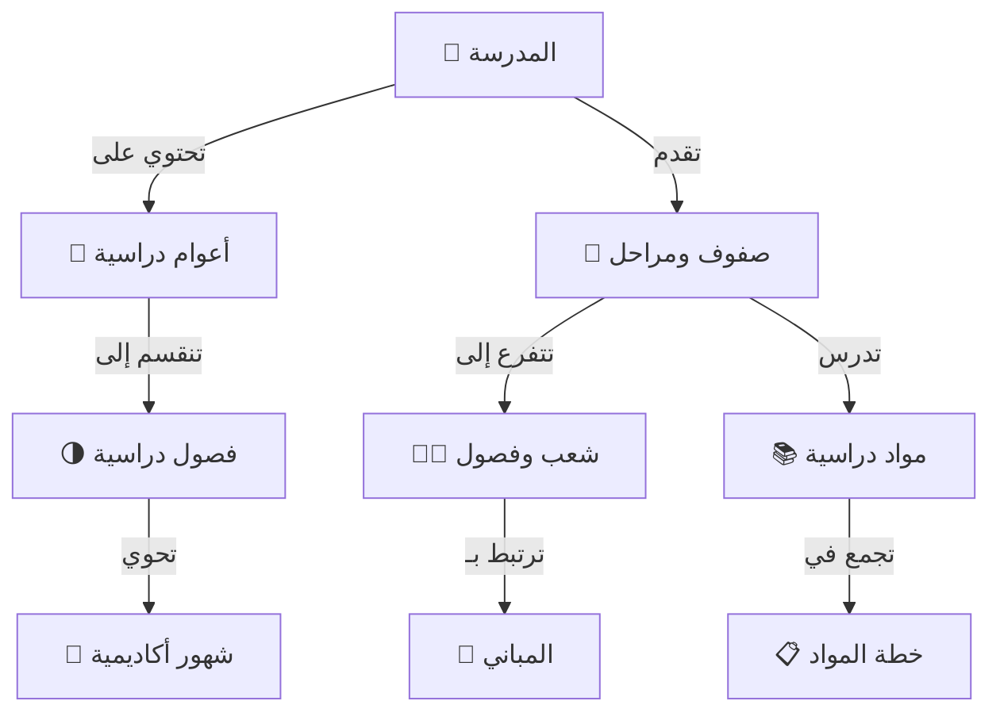

# 📁 النواة الأكاديمية
## Core Academic Structure

---

## 📌 بطاقة النظام

| البند | القيمة |
|-------|--------|
| **المهندس المسؤول** | موسى العواضي (المهندس المسؤول) |
| **عدد الجداول** | 8 جداول |
| **النسبة** | جزء من 18% |
| **ملف DDL** | `DDL.sql` |
| **حالة المراجعة** | ✅ تمت المراجعة المعمارية (Architectural Review) - 5/5 ⭐ |

---

## 🚀 المقدمة
النواة الأكاديمية هي "القلب النابض" للنظام، حيث تتدفق منها الدماء (البيانات) لتغذي بقية الأعضاء. بدون هذا النظام، لا يمكن تسجيل طالب، ولا رصد درجة، ولا طباعة جدول.

إنه النظام الذي يجيب على الأسئلة الوجودية للمدرسة:
*   من نحن؟ (المدرسة)
*   متى نحن؟ (العام والفصل الدراسي)
*   ماذا ندرس؟ (المواد والصفوف)
*   أين ندرس؟ (المباني والشعب)

## 💎 الفوائد الملموسة (القابلة للقياس)
- **تجهيز العام الجديد في دقائق:** بدلاً من إعادة كتابة القوائم، يتم ترحيل الهيكلية للعام الجديد بضغطة زر.
- **منع تضارب البيانات:** لا يمكن تسجيل طالب في صف غير موجود، أو مادة لا تُدرس في هذه المرحلة.
- **سهولة الوصول:** معرفة فورية لعدد الشعب في كل صف وسعتها الاستيعابية.

## 🌟 الفوائد غير الملموسة (القيمة الإدارية)
- **وضوح الرؤية:** المدير يرى الخريطة الأكاديمية للمدرسة بوضوح تام.
- **التخطيط السليم:** يساعد في معرفة الاحتياج الحقيقي من الفصول والمعلمين بناءً على الخطط الدراسية.
- **الاستمرارية:** تاريخ المدرسة الأكاديمي محفوظ عاماً بعد عام بشكل منظم.

---

## 🏗️ الهيكل الأكاديمي (Academic Hierarchy)

المخطط التالي يوضح كيف تترابط الكيانات ببعضها لتشكل الهرم الأكاديمي:



---

# 📊 تفاصيل الجداول والبيانات (Tables & Data Dictionary)

---

## 1️⃣ جدول المدرسة (schools)

بيانات المدرسة الأساسية (يدعم تعدد المدارس مستقبلاً).

#### 🏗️ بنية الجدول (Schema Structure)
| اسم العمود | نوع البيانات | Null? | Default | مفتاح | الوصف |
|------------|--------------|-------|---------|-------|-------|
| `id` | INT UNSIGNED | NO | Auto Inc | PK | المعرف الفريد |
| `name_ar` | VARCHAR(150) | NO | - | - | اسم المدرسة بالعربية |
| `name_en` | VARCHAR(150) | YES | NULL | - | اسم المدرسة بالإنجليزية |
| `school_type_id` | TINYINT UNSIGNED | NO | - | FK | نوع المدرسة (Lookup) |
| `ownership_type_id` | TINYINT UNSIGNED | NO | - | FK | نوع الملكية (Lookup) |
| `period_id` | TINYINT UNSIGNED | NO | - | FK | نظام الدوام (Lookup) |
| `governorate_id` | TINYINT UNSIGNED | YES | NULL | FK | المحافظة |
| `directorate_id` | SMALLINT UNSIGNED | YES | NULL | FK | المديرية |
| `is_active` | BOOLEAN | YES | TRUE | - | حالة التفعيل |
| `created_at` | TIMESTAMP | YES | CUR_TIME | - | تاريخ الإنشاء |

#### 📋 بيانات استرشادية
| id | name_ar | code | school_type | ownership | period | is_active |
|----|---------|------|-------------|-----------|--------|-----------|
| 1 | مدارس النخبة الحديثة | ELITE-01 | 1 | 2 | 1 | 1 |
| 2 | مدرسة المستقبل | FUT-02 | 1 | 1 | 1 | 1 |
| 3 | ثانوية المجد | GLO-03 | 2 | 1 | 1 | 1 |
| 4 | مجمع النور التعليمي | NOOR-04 | 3 | 2 | 3 | 1 |
| 5 | روضة الأمل | HOPE-KG | 9 | 2 | 1 | 1 |
| 6 | مدرسة التفوق الأهلية | EXCEL-05 | 1 | 3 | 1 | 1 |
| 7 | مدرسة الهدى لتحفيظ القرآن | HUDA-06 | 4 | 3 | 2 | 1 |
| 8 | العالمية للغات | INTL-07 | 5 | 2 | 1 | 1 |
| 9 | مدرسة الفجر الجديد | DAWN-08 | 1 | 1 | 2 | 1 |
| 10 | معهد الأفاق | HOR-09 | 2 | 2 | 2 | 1 |

---

## 2️⃣ جدول الأعوام الدراسية (academic_years)

#### 🏗️ بنية الجدول (Schema Structure)
| اسم العمود | نوع البيانات | Null? | Default | مفتاح | الوصف |
|------------|--------------|-------|---------|-------|-------|
| `id` | INT UNSIGNED | NO | Auto Inc | PK | المعرف الفريد |
| `name_ar` | VARCHAR(50) | NO | - | - | اسم العام (مثل 1447 هـ) |
| `name_en` | VARCHAR(50) | YES | NULL | - | الاسم بالإنجليزية |
| `is_current` | BOOLEAN | YES | FALSE | UK | هل هو العام الحالي؟ |
| `start_date_gregorian` | DATE | YES | NULL | - | تاريخ البداية |
| `end_date_gregorian` | DATE | YES | NULL | - | تاريخ النهاية |

#### 📋 بيانات استرشادية
| id | name_ar | name_en | is_current | is_active |
|----|---------|---------|------------|-----------|
| 1 | 1440-1441 هـ | 2018-2019 | 0 | 0 |
| 2 | 1441-1442 هـ | 2019-2020 | 0 | 0 |
| 3 | 1442-1443 هـ | 2020-2021 | 0 | 0 |
| 4 | 1443-1444 هـ | 2021-2022 | 0 | 0 |
| 5 | 1444-1445 هـ | 2022-2023 | 0 | 0 |
| 6 | 1445-1446 هـ | 2023-2024 | 0 | 1 |
| 7 | 1446-1447 هـ | 2024-2025 | 1 | 1 |
| 8 | 1447-1448 هـ | 2025-2026 | 0 | 1 |
| 9 | 1448-1449 هـ | 2026-2027 | 0 | 0 |
| 10 | 1449-1450 هـ | 2027-2028 | 0 | 0 |

---

## 3️⃣ جدول الفصول الدراسية (semesters)

#### 🏗️ بنية الجدول (Schema Structure)
| اسم العمود | نوع البيانات | Null? | Default | مفتاح | الوصف |
|------------|--------------|-------|---------|-------|-------|
| `id` | INT UNSIGNED | NO | Auto Inc | PK | المعرف الفريد |
| `academic_year_id` | INT UNSIGNED | NO | - | FK | العام الدراسي التابع له |
| `name_ar` | VARCHAR(50) | NO | - | - | اسم الفصل (الأول/الثاني) |
| `semester_number` | TINYINT UNSIGNED | NO | - | - | رقم الفصل (1 أو 2) |
| `is_current` | BOOLEAN | YES | FALSE | - | هل هو الفصل الحالي؟ |

#### 📋 بيانات استرشادية
| id | academic_year_id | name_ar | semester_number | is_current |
|----|------------------|---------|-----------------|------------|
| 1 | 6 | الفصل الدراسي الأول | 1 | 0 |
| 2 | 6 | الفصل الدراسي الثاني | 2 | 0 |
| 3 | 7 | الفصل الدراسي الأول | 1 | 0 |
| 4 | 7 | الفصل الدراسي الثاني | 2 | 1 |
| 5 | 8 | الفصل الدراسي الأول | 1 | 0 |
| 6 | 8 | الفصل الدراسي الثاني | 2 | 0 |
| 7 | 1 | الفصل الدراسي الأول | 1 | 0 |
| 8 | 1 | الفصل الدراسي الثاني | 2 | 0 |
| 9 | 2 | الفصل الدراسي الأول | 1 | 0 |
| 10 | 2 | الفصل الدراسي الثاني | 2 | 0 |

---

## 4️⃣ جدول الأشهر الأكاديمية (academic_months)

يستخدم لتقسيم الفصل الدراسي إلى فترات شهرية (للرسوم والامتحانات الشهرية).

| الحقل | الوصف |
|-------|-------|
| `semester_id` | الفصل الدراسي |
| `name_ar` | اسم الشهر الأكاديمي |
| `month_number` | ترتيبه في الفصل |

#### 📋 بيانات استرشادية
| id | semester_id | name_ar | month_number |
|----|-------------|---------|--------------|
| 1 | 3 | شهر محرم | 1 |
| 2 | 3 | شهر صفر | 2 |
| 3 | 3 | شهر ربيع الأول | 3 |
| 4 | 3 | شهر ربيع الثاني | 4 |
| 5 | 4 | شهر جمادى الأولى | 1 |
| 6 | 4 | شهر جمادى الآخرة | 2 |
| 7 | 4 | شهر رجب | 3 |
| 8 | 4 | شهر شعبان | 4 |
| 9 | 5 | شهر شوال (صيفي) | 1 |
| 10 | 5 | شهر ذو القعدة | 2 |

---

## 5️⃣ جدول المستويات/الصفوف (grade_levels)

#### 🏗️ بنية الجدول (Schema Structure)
| اسم العمود | نوع البيانات | Null? | Default | مفتاح | الوصف |
|------------|--------------|-------|---------|-------|-------|
| `id` | INT UNSIGNED | NO | Auto Inc | PK | المعرف الفريد |
| `name_ar` | VARCHAR(50) | NO | - | - | اسم الصف |
| `grade_number` | TINYINT UNSIGNED | NO | - | - | الترتيب (1-12) |
| `stage` | ENUM | NO | - | - | المرحلة (ابتدائي/...) |
| `period_id` | TINYINT UNSIGNED | YES | NULL | FK | فترة الدوام الافتراضية |

#### 📋 بيانات استرشادية
| id | name_ar | grade_number | stage |
|----|---------|--------------|-------|
| 1 | الصف الأول | 1 | ابتدائي |
| 2 | الصف الثاني | 2 | ابتدائي |
| 3 | الصف الثالث | 3 | ابتدائي |
| 4 | الصف الرابع | 4 | ابتدائي |
| 5 | الصف الخامس | 5 | ابتدائي |
| 6 | الصف السادس | 6 | ابتدائي |
| 7 | الصف السابع | 7 | إعدادي |
| 8 | الصف الثامن | 8 | إعدادي |
| 9 | الصف التاسع | 9 | إعدادي |
| 10 | الأول الثانوي | 10 | ثانوي |

---

## 6️⃣ جدول الفصول/الشعب (classrooms)

#### 🏗️ بنية الجدول (Schema Structure)
| اسم العمود | نوع البيانات | Null? | Default | مفتاح | الوصف |
|------------|--------------|-------|---------|-------|-------|
| `id` | INT UNSIGNED | NO | Auto Inc | PK | المعرف الفريد |
| `grade_level_id` | INT UNSIGNED | NO | - | FK | الصف الدراسي |
| `academic_year_id` | INT UNSIGNED | NO | - | FK | العام الدراسي |
| `name_ar` | VARCHAR(50) | NO | - | - | اسم الشعبة (أ، ب، ج) |
| `classroom_number` | VARCHAR(10) | YES | NULL | - | رقم الغرفة على الباب |
| `building_id` | TINYINT UNSIGNED | YES | NULL | FK | المبنى (من System 01) |
| `floor` | TINYINT UNSIGNED | YES | NULL | - | الدور |
| `capacity` | TINYINT UNSIGNED | YES | NULL | - | السعة القصوى |
| `supervisor_id` | INT UNSIGNED | YES | NULL | FK | مشرف الشعبة |

**ملاحظة:** تم تحديث حقل `building_id` ليرتبط بجدول `lookup_buildings` في النظام 01 بدلاً من كتابة نص عشوائي.

#### 📋 بيانات استرشادية
| id | grade_level_id | name_ar | capacity | supervisor_id |
|----|----------------|---------|----------|---------------|
| 1 | 1 | 1/أ | 30 | 101 |
| 2 | 1 | 1/ب | 30 | 102 |
| 3 | 2 | 2/أ | 30 | 103 |
| 4 | 2 | 2/ب | 30 | 104 |
| 5 | 3 | 3/أ | 35 | 105 |
| 6 | 9 | 9/أ | 40 | 106 |
| 7 | 9 | 9/ب | 40 | 107 |
| 8 | 10 | 1ث/أ | 45 | 108 |
| 9 | 12 | 3ث/علمي | 35 | 109 |
| 10 | 12 | 3ث/أدبي | 35 | 110 |

---

## 7️⃣ جدول المواد الدراسية (subjects)

#### 🏗️ بنية الجدول (Schema Structure)
| اسم العمود | نوع البيانات | Null? | Default | مفتاح | الوصف |
|------------|--------------|-------|---------|-------|-------|
| `id` | INT UNSIGNED | NO | Auto Inc | PK | المعرف الفريد |
| `name_ar` | VARCHAR(100) | NO | - | - | اسم المادة |
| `code` | VARCHAR(20) | YES | NULL | UK | رمز المادة (MATH..) |
| `subject_type` | ENUM | YES | أساسي | - | نوع المادة |
| `max_grade` | DECIMAL(5,2) | YES | 100 | - | الدرجة العظمى |

#### 📋 بيانات استرشادية
| id | name_ar | code | subject_type | max_grade |
|----|---------|------|--------------|-----------|
| 1 | القرآن الكريم | QURAN | أساسي | 100 |
| 2 | التربية الإسلامية | ISL | أساسي | 100 |
| 3 | اللغة العربية | ARB | أساسي | 100 |
| 4 | اللغة الإنجليزية | ENG | أساسي | 100 |
| 5 | الرياضيات | MATH | أساسي | 100 |
| 6 | العلوم | SCI | أساسي | 100 |
| 7 | الاجتماعيات | SOC | أساسي | 50 |
| 8 | الرسم | ART | نشاط | 20 |
| 9 | الرياضة | PE | نشاط | 20 |
| 10 | الحاسوب | CS | أساسي | 50 |

---

## 8️⃣ جدول خطة المواد (grade_subjects)

يحدد المواد التي يدرسها كل صف، وعدد حصصها.

#### 🏗️ بنية الجدول (Schema Structure)
| اسم العمود | نوع البيانات | Null? | Default | مفتاح | الوصف |
|------------|--------------|-------|---------|-------|-------|
| `id` | INT UNSIGNED | NO | Auto Inc | PK | المعرف الفريد |
| `grade_level_id` | INT UNSIGNED | NO | - | FK | الصف الدراسي |
| `subject_id` | INT UNSIGNED | NO | - | FK | المادة |
| `weekly_periods` | TINYINT UNSIGNED | YES | 1 | - | عدد الحصص الأسبوعية |
| `is_required` | BOOLEAN | YES | TRUE | - | مادة إجبارية |

#### 📋 بيانات استرشادية
| id | grade_level_id | subject_id | weekly_periods | is_required |
|----|----------------|------------|----------------|-------------|
| 1 | 1 | 1 (قرآن) | 5 | 1 |
| 2 | 1 | 3 (عربي) | 6 | 1 |
| 3 | 1 | 5 (رياضيات) | 4 | 1 |
| 4 | 7 | 4 (إنجليزي) | 4 | 1 |
| 5 | 7 | 6 (علوم) | 3 | 1 |
| 6 | 10 | 10 (حاسوب) | 2 | 1 |
| 7 | 12 | 1 (قرآن) | 2 | 1 |
| 8 | 12 | 5 (رياضيات) | 6 | 1 |
| 9 | 1 | 8 (رسم) | 1 | 0 |
| 10 | 5 | 9 (رياضة) | 2 | 0 |

---

## 💡 كيف يستخدم المبرمج هذا النظام؟ (SQL Examples)

### 1. جلب شجرة المدرسة كاملة (للصفحة الرئيسية)
```sql
SELECT 
    gl.stage AS stage_name,
    gl.name_ar AS grade_name,
    COUNT(c.id) AS active_classes,
    SUM(c.capacity) AS total_capacity
FROM grade_levels gl
LEFT JOIN classrooms c ON gl.id = c.grade_level_id
WHERE gl.is_active = 1
GROUP BY gl.stage, gl.name_ar
ORDER BY gl.grade_number;
```

### 2. معرفة المواد التي يدرسها "الصف التاسع" مع عدد الحصص
```sql
SELECT 
    s.name_ar AS subject_name,
    s.subject_type,
    gs.weekly_periods,
    gs.is_required
FROM grade_subjects gs
JOIN subjects s ON gs.subject_id = s.id
JOIN grade_levels gl ON gs.grade_level_id = gl.id
WHERE gl.grade_number = 9
ORDER BY s.sort_order;
```

---

**المهندس المسؤول:** موسى العواضي
**تم التحديث:** 2026-01-16 (إضافة قاموس البيانات)
