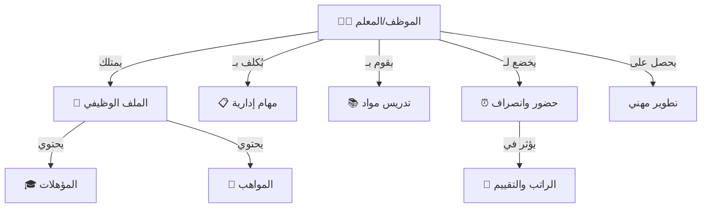

# 📁 الموارد البشرية
## Human Resources

---

## 📌 بطاقة النظام

| البند | القيمة |
|-------|--------|
| **المهندس المسؤول** | يونس العفيف |
| **عدد الجداول** | 10 جداول |
| **النسبة** | جزء من 9% |
| **ملف DDL** | `DDL.sql` |
| **حالة المراجعة** | ✅ تمت المراجعة المعمارية (Architectural Review) - 4.6/5 ⭐ |

---

## 🚀 المقدمة
المعلم والموظف هم القلب النابض لأي مدرسة. نجاح المدرسة يعتمد كلياً على كفاءة وانضباط طاقمها. نظام الموارد البشرية (HR) صُمم ليكون أكثر من مجرد "سجل أسماء"؛ هو أداة شاملة لإدارة دورة حياة الموظف داخل المدرسة، من لحظة التعاقد، مروراً بالحضور والمهام والدورات، وصولاً إلى تقييم الأداء.

## 🏗️ الهيكل الوظيفي (HR Architecture)



## 💎 الفوائد الملموسة
*   **ضبط الانضباط:** تقارير دقيقة عن التأخير والغياب تساعد في اتخاذ القرارات الإدارية.
*   **سهولة الوصول للمعلومات:** معرفة مؤهلات أو رقم هاتف أي معلم في ثوانٍ.
*   **عدالة التوزيع:** معرفة مهام كل موظف لضمان عدم تحميل شخص فوق طاقته.

# 📊 تفاصيل الجداول والبيانات (Tables & Data Dictionary)

---

## 1️⃣ جدول الموظفين (employees)

السجل الشامل لبيانات الموظف.

| الحقل | الاسم البرمجي | النوع | الوصف | مثال |
|-------|---------------|-------|-------|------|
| المعرف | `id` | INT (PK) | المعرف الفريد | 100 |
| الاسم الكامل | `full_name` | VARCHAR | اسم الموظف | محمد أحمد اليمني |
| الرقم الوظيفي | `job_number` | VARCHAR | رقم الملف | EMP-101 |
| الرقم المالي | `financial_number` | VARCHAR | رقم البصمة | 987654 |
| الجنس | `gender_id` | TINYINT (FK) | معرف الجنس (ذكر/أنثى) | 1 (ذكر) |
| الدور الوظيفي | `job_role_id` | TINYINT (FK) | المهنة | 5 (معلم) |
| المؤهل | `qualification_id` | TINYINT (FK) | الشهادة | 6 (بكالوريوس) |
| الحالة الوظيفية | `employment_status_id` | TINYINT (FK) | طبيعة العمل (ثابت/متعاقد) | 1 (ثابت) |
| المدرسة | `school_id` | INT (FK) | المدرسة التابع لها | لدعم تعدد المدارس (Multi-tenancy) |

#### 📋 بيانات استرشادية
| id | full_name | job_number | gender | job_role_id | employment_status |
|----|-----------|------------|--------|-------------|-------------------|
| 101 | أحمد محمد علي | EMP-001 | ذكر | 1 (مدير) | ثابت |
| 102 | سمية عبدالسلام | EMP-002 | أنثى | 3 (وكيل) | ثابت |
| 103 | عبدالله قاسم | EMP-003 | ذكر | 5 (معلم) | ثابت |
| 104 | بلقيس سيف | EMP-004 | أنثى | 5 (معلمة) | ثابت |
| 105 | عمر الحكيم | EMP-005 | ذكر | 6 (محاسب) | متعاقد |
| 106 | ياسر المخلافي | EMP-006 | ذكر | 5 (معلم) | ثابت |
| 107 | هدى الصنعاني | EMP-007 | أنثى | 5 (معلمة) | ثابت |
| 108 | خالد الإرياني | EMP-008 | ذكر | 8 (حارس) | ثابت |
| 109 | فاطمة العدني | EMP-009 | أنثى | 5 (معلمة) | متطوع |
| 110 | جمال منصور | EMP-010 | ذكر | 7 (أمين مكتبة) | ثابت |

---

## 2️⃣ جدول مهام الموظف (employee_tasks)

| الحقل | الوصف | |
|-------|-------|---|
| `employee_id` | الموظف (FK) | |
| `academic_year_id` | العام الدراسي | لضمان أرشفة المهام وعدم تراكمها تاريخياً عبر السنوات |
| `task_name` | اسم المهمة | |
| `day_of_week` | يوم التنفيذ (1-7) | |

#### 📋 بيانات استرشادية
| id | employee_id | task_name | day_of_week |
|----|-------------|-----------|-------------|
| 1 | 101 | إشراف عام | 1 |
| 2 | 102 | متابعة المتأخرين | 1 |
| 3 | 106 | إشراف الإذاعة | 2 |
| 4 | 107 | إشراف الإذاعة | 3 |
| 5 | 103 | كنترول الاختبارات | 5 |
| 6 | 105 | جرد الصندوق | 6 |
| 7 | 108 | مناوبة بوابة | 1 |
| 8 | 108 | مناوبة بوابة | 2 |
| 9 | 104 | ريادة الفصل | 1 |
| 10 | 110 | ترتيب المكتبة | 4 |

---

## 3️⃣ جدول تعيينات التدريس (employee_teaching_assignments)

| الحقل | الوصف |
|-------|-------|
| `employee_id` | المعلم |
| `classroom_id` | الفصل |
| `subject_id` | المادة |
| `academic_year_id` | العام |

#### 📋 بيانات استرشادية
| id | employee_id | classroom_id | subject_id | academic_year_id |
|----|-------------|--------------|------------|------------------|
| 1 | 103 (عبدالله) | 1 (1/أ) | 3 (عربي) | 7 |
| 2 | 103 | 1 (1/أ) | 1 (قرآن) | 7 |
| 3 | 104 (بلقيس) | 1 (1/أ) | 5 (رياضيات) | 7 |
| 4 | 106 (ياسر) | 4 (2/ب) | 3 (عربي) | 7 |
| 5 | 107 (هدى) | 4 (2/ب) | 5 (رياضيات) | 7 |
| 6 | 109 (فاطمة) | 8 (1ث/أ) | 4 (إنجليزي) | 7 |
| 7 | 103 | 2 (1/ب) | 3 (عربي) | 7 |
| 8 | 104 | 2 (1/ب) | 5 (رياضيات) | 7 |
| 9 | 106 | 3 (2/أ) | 3 (عربي) | 7 |
| 10 | 109 | 9 (3ث) | 4 (إنجليزي) | 7 |

---

## 4️⃣ جدول مواهب الموظف (employee_talents)

| الحقل | الوصف |
|-------|-------|
| `employee_id` | الموظف |
| `talent_id` | الموهبة (خط، رسم...) |

#### 📋 بيانات استرشادية
| id | employee_id | talent_id | notes |
|----|-------------|-----------|-------|
| 1 | 103 | 1 (الخط) | خطاط محترف |
| 2 | 107 | 2 (الرسم) | تشكيلية |
| 3 | 106 | 3 (إلقاء) | صوت مميز |
| 4 | 101 | 12 (إدارة) | قيادي |
| 5 | 109 | 4 (تصوير) | |
| 6 | 104 | 5 (رياضة) | |
| 7 | 102 | 1 (الخط) | |
| 8 | 105 | 10 (حاسوب) | مبرمج |
| 9 | 108 | 9 (زراعة) | بستنة |
| 10 | 110 | 8 (قراءة) | نهم للقراءة |

---

## 5️⃣ جدول دورات الموظف (employee_courses)

| الحقل | الوصف |
|-------|-------|
| `employee_id` | الموظف |
| `course_name` | اسم الدورة |
| `course_provider` | الجهة |

#### 📋 بيانات استرشادية
| id | employee_id | course_name | course_provider |
|----|-------------|-------------|-----------------|
| 1 | 101 | الإدارة المدرسية الحديثة | الوزارة |
| 2 | 102 | القيادة التربوية | مركز القادة |
| 3 | 103 | مهارات تدريس اللغة العربية | التوجيه |
| 4 | 103 | التعلم النشط | المدرسة |
| 5 | 104 | تدريس الرياضيات باللعب | أونلاين |
| 6 | 106 | مهارات الإلقاء والتأثير | مركز زدني |
| 7 | 105 | النظام المالي المحاسبي | شركة إنما |
| 8 | 109 | طرق تدريس الإنجليزية | المعهد البريطاني |
| 9 | 108 | الأمن والسلامة المدرسية | الدفاع المدني |
| 10 | 107 | الفنون التشكيلية للأطفال | المرسم الحر |

---

## 6️⃣ جدول مخالفات الموظف (employee_violations)

| الحقل | الوصف |
|-------|-------|
| `employee_id` | الموظف | |
| `violation_date` | التاريخ | تاريخ وقوع المخالفة |
| `violation_aspect` | نوع المخالفة | |
| `reported_by_employee_id` | المبلّغ | الموظف الذي رفع التقرير (تكامل مع Audit) |
| `action_taken` | الإجراء | |

#### 📋 بيانات استرشادية
| id | employee_id | violation_aspect | action_taken | has_warning |
|----|-------------|------------------|--------------|-------------|
| 1 | 106 | تأخير صباحي | تنبيه شفهي | 0 |
| 2 | 108 | غياب بدون إذن | خصم يوم | 1 |
| 3 | 104 | عدم تحضير الدرس | لفت نظر | 0 |
| 4 | 106 | استخدام الهاتف في الفصل | إنذار كتابي | 1 |
| 5 | 109 | تأخير عن الحصة | تنبيه | 0 |
| 6 | 103 | خروج مبكر | خصم ساعات | 0 |
| 7 | 105 | تأخر تسليم التقرير | تنبيه | 0 |
| 8 | 108 | النوم أثناء الدوام | إنذار نهائي | 1 |
| 9 | 107 | مشادة مع زميلة | لفت نظر | 0 |
| 10 | 106 | تأخير صباحي متكرر | خصم ربع يوم | 0 |

---

## 7️⃣ جدول حضور الموظفين (employee_attendance)

| الحقل | الوصف |
|-------|-------|
| `employee_id` | الموظف |
| `attendance_date` | التاريخ |
| `status_id` | الحالة |

#### 📋 بيانات استرشادية
| id | employee_id | attendance_date | status_id | notes |
|----|-------------|-----------------|-----------|-------|
| 1 | 101 | 2026-01-01 | 1 (حاضر) | |
| 2 | 102 | 2026-01-01 | 1 (حاضر) | |
| 3 | 103 | 2026-01-01 | 3 (تأخير) | 10 دقائق |
| 4 | 104 | 2026-01-01 | 1 (حاضر) | |
| 5 | 105 | 2026-01-01 | 2 (غائب) | مرضية |
| 6 | 106 | 2026-01-01 | 1 (حاضر) | |
| 7 | 107 | 2026-01-01 | 1 (حاضر) | |
| 8 | 108 | 2026-01-01 | 1 (حاضر) | |
| 9 | 109 | 2026-01-01 | 5 (غائب بإذن) | ظرف عائلي |
| 10 | 110 | 2026-01-01 | 1 (حاضر) | |

---

| 10 | 110 | 2026-01-01 | 1 (حاضر) | |

---

## 8️⃣ جدول تقييم الأداء (employee_performance_evaluations)

يستخدم لتوثيق كفاءة الموظف السنوية بناءً على معايير محددة.

| الحقل | الوصف |
|-------|-------|
| `employee_id` | الموظف |
| `score` | الدرجة (من 100) |
| `rating_level_id` | المستوى (ممتاز، جيد جداً...) |
| `evaluator_id` | المدير المقيم |

#### 📋 بيانات استرشادية
| id | employee_id | score | rating_level_id | evaluation_date |
|----|-------------|-------|-----------------|-----------------|
| 1 | 103 | 95 | 1 (ممتاز) | 2026-01-15 |
| 2 | 104 | 88 | 2 (جيد جداً) | 2026-01-15 |

---

## 💡 كيف يستخدم المبرمج هذا النظام؟ (SQL Examples)

### 1. البحث عن معلم "رياضيات" متاح (للاحتياط)
```sql
SELECT e.full_name, e.phone_number
FROM employees e
JOIN employee_specialties s ON e.id = s.employee_id
WHERE s.subject_name = 'رياضيات'
AND e.is_active = 1;
```

### 2. تقرير انضباط الموظفين لشهر معين
```sql
SELECT 
    e.full_name,
    COUNT(CASE WHEN ea.status_id = 1 THEN 1 END) AS present_days,
    COUNT(CASE WHEN ea.status_id = 2 THEN 1 END) AS absent_days,
    COUNT(CASE WHEN ea.status_id = 3 THEN 1 END) AS late_days
FROM employees e
LEFT JOIN employee_attendance ea ON e.id = ea.employee_id
WHERE MONTH(ea.attendance_date) = 1
GROUP BY e.full_name;
```

---

**المهندس المسؤول:** يونس العفيف
**تم التحديث:** 2026-01-16 (إضافة قاموس البيانات)
