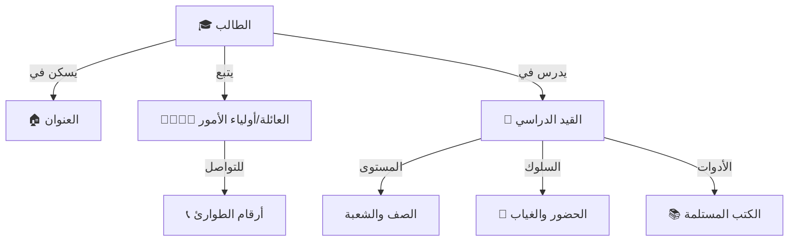

# 📁 نظام الطلاب SIS
## Student Information System

---

## 📌 بطاقة النظام

| البند | القيمة |
|-------|--------|
| **المهندس المسؤول** | أحمد الهتار |
| **عدد الجداول** | 10 جداول |
| **النسبة** | جزء من 18% |
| **ملف DDL** | `DDL.sql` |
| **حالة المراجعة** | ✅ تمت المراجعة المعمارية (Architectural Review) - 4.8/5 ⭐ |

---

## 🚀 المقدمة
الطالب هو محور العملية التعليمية، والسبب الذي أنشئت المدرسة من أجله. نظام شؤون الطلاب (SIS) هو القلب النابض للمدرسة الرقمية، حيث يجمع كل ما يخص الطالب من لحظة دخوله بوابة المدرسة وحتى تخرجه في مكان واحد آمن ومنظم، مما يغني عن عشرات السجلات الورقية المبعثرة.

## 🏗️ هيكلية بيانات الطالب (Student Profile Structure)



## 💎 الفوائد الملموسة
*   **السرعة الفائقة:** استخراج إفادة قيد أو كشف بأسماء الطلاب في ثوانٍ.
*   **دقة التواصل:** الوصول لرقم الأب أو الأم بضغطة زر عند الطوارئ.
*   **توفير الوقت:** رصد الحضور إلكترونياً بدلاً من المناداة وإضاعة وقت الحصة.

# 📊 تفاصيل الجداول والبيانات (Tables & Data Dictionary)

---

## 1️⃣ جدول الطلاب (students)

| الحقل | الاسم البرمجي | النوع | الوصف | مثال |
|-------|---------------|-------|-------|------|
| المعرف | `id` | INT (PK) | المعرف الفريد | 1 |
| الاسم الكامل | `full_name` | VARCHAR | الاسم الرباعي | أسامة محمد علي |
| الجنس | `gender_id` | TINYINT (FK) | مرجع للجنس (ذكر/أنثى) | 1 (ذكر) |
| تاريخ الميلاد | `birth_date` | DATE | التاريخ بدقة | 2015-05-10 |
| الحالة الصحية | `health_status_id` | FK | مرجع للحالة | 1 (سليم) |
| حالة اليتم | `orphan_status_id` | TINYINT (FK) | مرجع لحالة اليتم | 1 (لا) |

#### 📋 بيانات استرشادية
| id | full_name | gender_id | birth_date | health_status_id | orphan_status_id |
|----|-----------|-----------|------------|------------------|------------------|
| 1001 | محمد أحمد حسن | 1 | 2018-03-15 | 1 | 1 |
| 1002 | مريم علي صالح | 2 | 2019-07-22 | 1 | 1 |
| 1003 | عمر خالد يوسف | 1 | 2017-11-01 | 1 | 2 |
| 1004 | سارة إبراهيم سعيد | 2 | 2018-01-05 | 4 | 1 |
| 1005 | يوسف عبدالرحمن | 1 | 2016-09-10 | 1 | 1 |
| 1006 | فاطمة محمد العزي | 2 | 2017-04-20 | 1 | 1 |
| 1007 | علي حسين ناصر | 1 | 2015-06-30 | 2 | 3 |
| 1008 | خديجة عمر فؤاد | 2 | 2016-12-12 | 1 | 1 |
| 1009 | حمزة مصطفى كامل | 1 | 2014-02-28 | 1 | 1 |
| 1010 | زينب عادل محمود | 2 | 2018-08-08 | 1 | 4 |

---

## 2️⃣ جدول أولياء الأمور (guardians)

| الحقل | الوصف |
|-------|-------|
| `full_name` | الاسم الرباعي |
| `phone_primary` | رقم الجوال |
| `whatsapp_number` | رقم الواتساب |

#### 📋 بيانات استرشادية
| id | full_name | phone_primary | whatsapp_number |
|----|-----------|---------------|-----------------|
| 201 | أحمد حسن علي | 777111222 | 777111222 |
| 202 | علي صالح محمد | 777333444 | 777333444 |
| 203 | خالد يوسف إبراهيم | 777555666 | 777555666 |
| 204 | إبراهيم سعيد ناجي | 733111222 | 733111222 |
| 205 | عبدالرحمن محمد | 711222333 | 711222333 |
| 206 | محمد العزي قاسم | 700111222 | 700111222 |
| 207 | حسين ناصر أحمد | 777999888 | 777999888 |
| 208 | عمر فؤاد إسماعيل | 733444555 | 733444555 |
| 209 | مصطفى كامل سيف | 711555666 | 711555666 |
| 210 | عادل محمود يحيى | 700888999 | 700888999 |

---

## 3️⃣ جدول ربط الطلاب بأولياء الأمور (student_guardians)

| الحقل | الوصف |
|-------|-------|
| `student_id` | الطالب |
| `guardian_id` | ولي الأمر |
| `relationship_id` | الصلة (أب، عم...) |
| `is_primary` | هل هو المسؤول الأول؟ |

#### 📋 بيانات استرشادية
| id | student_id | guardian_id | relationship_id | is_primary |
|----|------------|-------------|-----------------|------------|
| 1 | 1001 | 201 | 1 (أب) | 1 |
| 2 | 1002 | 202 | 1 (أب) | 1 |
| 3 | 1003 | 203 | 5 (عم) | 1 |
| 4 | 1004 | 204 | 1 (أب) | 1 |
| 5 | 1005 | 205 | 1 (أب) | 1 |
| 6 | 1006 | 206 | 1 (أب) | 1 |
| 7 | 1007 | 207 | 7 (خال) | 1 |
| 8 | 1008 | 208 | 1 (أب) | 1 |
| 9 | 1009 | 209 | 1 (أب) | 1 |
| 10 | 1010 | 210 | 1 (أب) | 1 |

---

## 4️⃣ جدول التسجيل الأكاديمي (student_enrollments)

| الحقل | الوصف |
|-------|-------|
| `student_id` | الطالب |
| `academic_year_id` | العام الدراسي |
| `classroom_id` | الفصل/الشعبة |
| `enrollment_status_id` | حالة القيد | (نشط/منسحب/...) |

#### 📋 بيانات استرشادية
| id | student_id | academic_year_id | classroom_id | enrollment_status_id |
|----|------------|------------------|--------------|----------------------|
| 1 | 1001 | 7 | 1 (1/أ) | 1 |
| 2 | 1002 | 7 | 1 (1/أ) | 1 |
| 3 | 1003 | 7 | 3 (2/أ) | 1 |
| 4 | 1004 | 7 | 1 (1/أ) | 2 |
| 5 | 1005 | 7 | 3 (2/أ) | 1 |
| 6 | 1006 | 7 | 5 (3/أ) | 1 |
| 7 | 1007 | 7 | 5 (3/أ) | 3 |
| 8 | 1008 | 7 | 5 (3/أ) | 1 |
| 9 | 1009 | 7 | 6 (9/أ) | 1 |
| 10 | 1010 | 7 | 1 (1/أ) | 1 |

---

## 5️⃣ جدول الحضور (student_attendance)

| الحقل | الوصف |
|-------|-------|
| `enrollment_id` | سجل الطالب في العام |
| `attendance_date` | التاريخ |
| `status_id` | الحالة (حاضر/غائب) |

#### 📋 بيانات استرشادية
| id | enrollment_id | attendance_date | status_id | notes |
|----|---------------|-----------------|-----------|-------|
| 1 | 1 | 2026-01-01 | 1 (حاضر) | |
| 2 | 2 | 2026-01-01 | 1 (حاضر) | |
| 3 | 3 | 2026-01-01 | 2 (غائب) | بدون عذر |
| 4 | 5 | 2026-01-01 | 1 (حاضر) | |
| 5 | 6 | 2026-01-01 | 3 (تأخير) | |
| 6 | 8 | 2026-01-01 | 1 (حاضر) | |
| 7 | 9 | 2026-01-01 | 5 (غائب بعذر) | مرض |
| 8 | 10 | 2026-01-01 | 1 (حاضر) | |
| 9 | 1 | 2026-01-02 | 1 (حاضر) | |
| 10 | 3 | 2026-01-02 | 1 (حاضر) | |

---

## 6️⃣ جدول الكتب (student_books)

| الحقل | الوصف |
|-------|-------|
| `enrollment_id` | التسجيل |
| `subject_id` | المادة |
| 3 | 1 | 5 (رياضيات) | ج1 | 0 |
| 4 | 2 | 1 | جزئين | 0 |
| 5 | 2 | 3 | ج1 | 0 |
| 6 | 3 | 3 | ج1 | 1 |
| 7 | 3 | 5 | ج1 | 1 |
| 8 | 6 | 6 (علوم) | ج1 | 0 |
| 9 | 9 | 4 (إنجليزي) | ج1 | 0 |
| 10 | 10 | 1 | جزئين | 0 |

---

| 10 | 10 | 1 | جزئين | 0 |

---

## 💡 كيف يستخدم المبرمج هذا النظام؟ (SQL Examples)

### 1. جلب بيانات "بطاقة الطالب" الشاملة
```sql
SELECT 
    s.full_name AS student_name,
    g.full_name AS guardian_name,
    g.phone_primary AS guardian_phone,
    se.classroom_id,
    c.name_ar AS class_name
FROM students s
JOIN student_guardians sg ON s.id = sg.student_id
JOIN guardians g ON sg.guardian_id = g.id
JOIN student_enrollments se ON s.id = se.student_id
JOIN classrooms c ON se.classroom_id = c.id
WHERE s.id = 1001 AND sg.is_primary = 1;
```

### 2. قائمة الغياب ليوم محدد (لإرسال الرسائل)
```sql
SELECT 
    s.full_name,
    g.phone_primary,
    sa.attendance_date,
    sa.status_id
FROM student_attendance sa
JOIN student_enrollments se ON sa.enrollment_id = se.id
JOIN students s ON se.student_id = s.id
JOIN student_guardians sg ON s.id = sg.student_id
JOIN guardians g ON sg.guardian_id = g.id
WHERE sa.attendance_date = CURRENT_DATE 
AND sa.status_id = 2 -- (غائب)
AND sg.is_primary = 1;
```

---

**المهندس المسؤول:** أحمد الهتار
**تم التحديث:** 2026-01-16 (إضافة قاموس البيانات)
