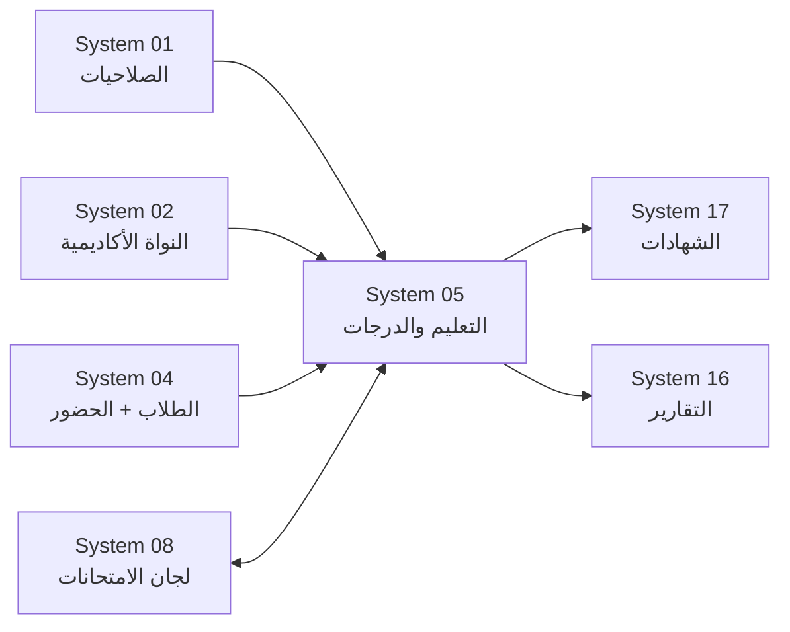

# 📊 نظام الدرجات والتقويم الذكي (SGAS)
## النسخة 3.3 - هيكل مرن قابل للتخصيص 🏗️

---

## 📌 بطاقة النظام
| البند | القيمة |
|-------|--------|
| **المهندس المصمم** | عمار الشعيبي |
| **المهندس المعتمد** | موسى العواضي (Senior Architect) |
| **محرك التطوير** | Antigravity AI |
| **الحالة** | ⭐⭐⭐⭐⭐ (Intelligence Grade) |
| **ملفات DDL** | 8 ملفات مُقسّمة (انظر أدناه) |

---

## 🚀 المقدمة
التعليم هو "المنتج" الأساسي للمدرسة، والدرجات هي مقياس جودته. نظام التعليم والدرجات هو المصنع الذي تدار فيه العملية التعليمية؛ من تحضير الدروس، وشرحها، واختبار الطلاب فيها، وحتى إصدار الشهادات النهائية. صُمم هذا النظام ليضمن حق الطالب في تقييم عادل، وحق المعلم في تنظيم وقته، وحق ولي الأمر في معرفة مستوى ابنه بوضوح.

## ❓ ماذا يقدّم هذا النظام؟
يغطي الدورة الأكاديمية الكاملة:
- **للمعلم:** أداة لتنظيم الجدول، تحضير الدروس، ورصد الدرجات بسهولة.
- **للطالب:** معرفة واجباته ونتائج اختباراته أولاً بأول.
- **للإدارة:** مراقبة سير المناهج وإصدار الشهادات بدقة متناهية دون أخطاء الجمع اليدوي.

## 💎 الفوائد الملموسة
- **صفر أخطاء حسابية:** النظام يجمع الدرجات ويحسب المعدلات والنسب المئوية آلياً.
- **سرعة إصدار النتائج:** الشهادات جاهزة للطباعة فور انتهاء آخر اختبار.
- **حساب المواظبة آلياً:** درجة المواظبة تُحسب من نظام الحضور مباشرة — لا إدخال يدوي.
- **نتيجة العام الشاملة:** مجموع الفصلين + النسبة + الترتيب + قرار النقل في مكان واحد.

---

## 📂 هيكل الملفات (v3.3)

```
05_التعليم_والدرجات/
├── DDL.sql                  → ملف Master (توثيق ترتيب التنفيذ)
├── DDL_POLICIES.sql         → 1️⃣ سياسات الدرجات والأوزان
├── DDL_EXAMS.sql            → 2️⃣ الفترات الامتحانية + الجداول + الدرجات
├── DDL_HOMEWORKS.sql        → 3️⃣ الواجبات (مبسط: نفذ/لم ينفذ + درجة يدوية)
├── DDL_MONTHLY.sql          → 4️⃣ المحصلات الشهرية + حساب آلي
├── DDL_RESULTS.sql          → 5️⃣ نتائج الفصل + العام + النقل 🆕
├── DDL_LESSON_PREP.sql      → 6️⃣ تحضير الدروس
├── DDL_AUDIT.sql            → 7️⃣ التدقيق والحوكمة
├── DEMO_DATA.sql            → بيانات تجريبية كاملة
├── README_END_TO_END_EXAMPLE.md → شرح عملي من الألف للياء (10 سجلات)
└── README.md                → هذا الملف
```

---

## 🔄 كيف يعمل النظام؟ (المسار الكامل)

```
التخطيط → التنفيذ → التقييم الشهري → نتيجة الفصل → نتيجة العام → قرار النقل
```

1. **التخطيط:** سياسات الدرجات تُحدد لكل صف ومادة (`grading_policies`)
2. **التنفيذ:** المعلم يحضّر دروسه ويعطي واجبات مرتبطة بالمادة والفصل
3. **الرصد الشهري:** الاختبارات + الواجبات + المواظبة + النشاط + المساهمة + المكونات المخصصة → `monthly_grades`
4. **نتيجة الفصل:** مجموع المحصلات الشهرية + الاختبار النهائي → `semester_grades`
5. **نتيجة العام:** الفصل الأول + الفصل الثاني → `annual_grades`
6. **قرار النقل:** حسب قواعد مخصصة لكل صف/عام (`grading_outcome_rules`) → `annual_result`

---

## 📊 ملخص الجداول والعناصر

| الملف | العناصر | العدد |
|-------|---------|-------|
| DDL_POLICIES | `grading_policies`, `lookup_grading_statuses`, `grading_policy_custom_components` | 3 جداول |
| DDL_EXAMS | `exam_periods`, `exam_schedules`, `student_exam_scores`, `exam_session_periods` | 4 جداول + 1 View + 1 Proc + Triggers حوكمة |
| DDL_HOMEWORKS | `lookup_homework_types`, `homeworks`, `student_homeworks` + Views + `sp_populate_student_homeworks` | 1 Lookup + 2 جداول + 2 Views + 1 Proc + Triggers تحقق |
| DDL_MONTHLY | `monthly_grades`, `monthly_custom_component_scores` + `v_auto_attendance_score`, `v_auto_homework_score` + `sp_calculate_monthly_grades` | 2 جداول + 2 Views + 1 Proc + Triggers |
| DDL_RESULTS | `semester_grades`, `annual_grades`, `annual_result`, `lookup_annual_statuses`, `lookup_promotion_decisions`, `grading_outcome_rules` + `v_sgas_class_ranking` + 3 Procedures | 6 جداول + 1 View + 3 Procs |
| DDL_LESSON_PREP | `lesson_preparation` | 1 جدول |
| DDL_AUDIT | `student_grade_audit` + 5 Triggers | 1 جدول + 5 Triggers |
| DDL_REPORTS | `v_rpt_monthly_subject_details`, `v_rpt_monthly_student_summary` + `fn_get_grade_description` | 2 Views + 1 Function |
| **الإجمالي** | | **نموذج مرن مع مكونات تقييم قابلة للتخصيص لكل مدرسة** |

---

## 🔗 الأنظمة المرتبطة (Dependencies)



| النظام | العلاقة | التفاصيل |
|--------|---------|----------|
| **System 01 — الصلاحيات** | يقرأ منه | `users` (من أنشأ / من اعتمد) |
| **System 02 — النواة** | يقرأ منه | `academic_years`, `semesters`, `academic_months`, `grade_levels`, `classrooms`, `subjects` |
| **System 04 — الطلاب** | يقرأ منه | `student_enrollments`, `student_attendance` (حساب المواظبة آلياً) |
| **System 08 — لجان الامتحانات** | تكامل ثنائي | `exam_session_periods` تربط الفترات الامتحانية بالجلسات اللوجستية |
| **System 16 — التقارير** | يقرأ من S05 | `v_report_grades_detailed` يعرض درجات الطلاب |
| **System 17 — الشهادات** | يقرأ من S05 | `v_certificate_data_primary` يجمّع بيانات الشهادة |

---

## 📝 نظام الواجبات (المبسّط)

### الفكرة
المعلم يُنشئ واجب مرتبط بـ**المادة + الفصل + الشهر**، ثم يحدد لكل طالب:
- ✅ **نفّذ** (`is_completed = TRUE`) → الدرجة = `max_grade` آلياً
- ❌ **لم ينفّذ** (`is_completed = FALSE`) → الدرجة = 0
- ✏️ **درجة يدوية** (`manual_grade`) → إذا أراد المعلم تقييم مختلف

### المعادلة
```
درجة_الواجب_الفعلية = manual_grade إذا موجودة
                      = max_grade إذا نفّذ
                      = 0 إذا لم ينفّذ

درجة_الواجبات_الشهرية = (مجموع الدرجات الفعلية ÷ المجموع الأقصى) × max_homework_score
```

---

## 🧮 معادلات الحساب الآلي

### المحصلة الشهرية
```
monthly_total = attendance_score (من الحضور آلياً)
              + homework_score (من الواجبات آلياً)
              + activity_score (يدوي من المعلم)
              + contribution_score (يدوي من المعلم)
              + custom_components_score (من مكونات السياسة المخصصة)
              + exam_score (من الاختبارات)
```

### نتيجة الفصل
```
semester_work_total = مجموع monthly_total لأشهر الفصل
semester_total = semester_work_total + final_exam_score
```

### نتيجة العام
```
annual_total = semester1_total + semester2_total
annual_percentage = (annual_total ÷ الدرجة_العظمى) × 100

إذا annual_percentage >= passing_score → ناجح
وإلا → راسب
```

### قرار النقل
```
القيم الافتراضية:
0 مواد راسب       → ينقل للصف التالي
1-2 مواد راسب     → ينقل بشروط (مكمل)
أكثر من 2 راسب    → يعيد السنة

ويمكن تخصيص هذه الحدود من جدول `grading_outcome_rules`.
```

---

## ⚡ التنفيذ السريع

```sql
-- 1. تنفيذ الجداول بالترتيب
SOURCE DDL_POLICIES.sql;
SOURCE DDL_EXAMS.sql;
SOURCE DDL_HOMEWORKS.sql;
SOURCE DDL_MONTHLY.sql;
SOURCE DDL_RESULTS.sql;
SOURCE DDL_LESSON_PREP.sql;
SOURCE DDL_AUDIT.sql;
SOURCE DDL_REPORTS.sql;

-- 2. البيانات التجريبية
SOURCE DEMO_DATA.sql;

-- 3. حساب المحصلات الشهرية آلياً
CALL sp_calculate_monthly_grades(1, 1, 1);  -- (month_id, subject_id, classroom_id)

-- 4. حساب مجاميع الفصل
CALL sp_calculate_semester_totals(1, 1, 1);  -- (semester_id, subject_id, classroom_id)

-- 5. حساب النتائج السنوية + الترتيب + قرار النقل
CALL sp_calculate_annual_results(1, 1);  -- (academic_year_id, classroom_id)
```

---

## 🔒 الحوكمة والأمان
- **طبقة Triggers حوكمة** تمنع تعديل الحقول الجوهرية بعد الاعتماد
- **سجل تدقيق** يوثّق كل تعديل على الدرجات مع اسم المعدّل والقيمة القديمة/الجديدة
- **حالات الاعتماد:** مسودة → قيد المراجعة → معتمد → مرحل للأرشيف
- **قفل الفترات الامتحانية** (`is_locked`) يمنع تعديل الدرجات بعد الاعتماد
