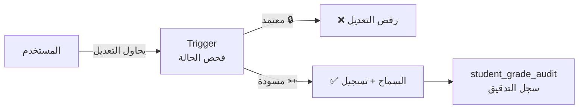

# 🔒 التدقيق والحوكمة
## DDL_AUDIT — Audit Trail & Governance

---

## 📌 بطاقة الملف
| البند | القيمة |
|-------|--------|
| **الملف** | `DDL_AUDIT.sql` |
| **ترتيب التنفيذ** | 7️⃣ الأخير |
| **عدد العناصر** | 1 جدول + 5 Triggers |
| **يعتمد على** | جميع ملفات DDL السابقة |

---

## 🚀 المقدمة
الحوكمة هي **الحارس الأمين** للدرجات. هذا الملف يمنع تعديل الدرجات المعتمدة ويسجّل كل تغيير في سجل تدقيق لا يُمحى. **لا يمكن لأحد تغيير درجة معتمدة** بدون فك القفل أولاً — وكل تغيير مُوثّق.



---

## 📊 تفاصيل الجدول

### 1️⃣ سجل تدقيق الدرجات (student_grade_audit)

| الحقل | الاسم البرمجي | النوع | الوصف | مثال |
|-------|---------------|-------|-------|------|
| المعرف | `id` | BIGINT (PK) | معرف فريد | 1 |
| الطالب | `enrollment_id` | INT (FK) | تسجيل الطالب | 1 |
| المادة | `subject_id` | INT (FK) | المادة | 1 (رياضيات) |
| الجدول المصدر | `grade_table` | ENUM | أي جدول تم التعديل فيه | monthly_grades |
| الحقل المعدّل | `grade_field` | VARCHAR(50) | اسم الحقل | exam_score |
| القيمة القديمة | `old_value` | DECIMAL(5,2) | قبل التعديل | 15.00 |
| القيمة الجديدة | `new_value` | DECIMAL(5,2) | بعد التعديل | 18.50 |
| المعدّل | `changed_by_user_id` | INT (FK) | من قام بالتعديل | 5 |
| السبب | `change_reason` | TEXT | سبب التعديل | خطأ في الرصد |
| التاريخ | `changed_at` | TIMESTAMP | وقت التعديل | 2026-09-16 14:30 |

#### 📋 بيانات استرشادية
| id | enrollment_id | grade_table | grade_field | old | new | changed_by | reason |
|----|---------------|-------------|-------------|-----|-----|------------|--------|
| 1 | 1 | student_exam_scores | score | 15.00 | 18.50 | أ. أحمد | خطأ في الرصد |
| 2 | 2 | monthly_grades | attendance_score | 3.00 | 4.50 | النظام | تحديث آلي |
| 3 | 3 | monthly_grades | exam_score | 0.00 | 12.00 | أ. أحمد | اختبار بديل |

---

## ⚡ Triggers (5 محفّزات)

### 🔐 Triggers القفل (منع التعديل)

| # | الاسم | الجدول المحمي | الوظيفة |
|---|-------|---------------|---------|
| 1 | `trg_semester_grade_lock` | semester_grades | يمنع تعديل نتيجة فصل **معتمدة** |
| 2 | `trg_annual_grade_lock` | annual_grades | يمنع تعديل نتيجة سنوية **معتمدة** |
| 3 | `trg_annual_result_lock` | annual_result | يمنع تعديل نتيجة نهائية **معتمدة** |

**السلوك:** إذا `grading_status_id = 3` (معتمد) → التعديل مرفوض مع رسالة خطأ.

### 📝 Triggers التدقيق (تسجيل التغييرات)

| # | الاسم | الجدول المراقب | ما يسجّله |
|---|-------|----------------|-----------|
| 4 | `trg_exam_score_audit` | student_exam_scores | تغيير `score` |
| 5 | `trg_monthly_grade_audit` | monthly_grades | تغيير `exam_score` أو `attendance_score` |

---

## 💡 أمثلة SQL

### عرض سجل التعديلات لطالب معين
```sql
SELECT 
    sga.changed_at,
    sga.grade_table,
    sga.grade_field,
    sga.old_value,
    sga.new_value,
    u.full_name AS changed_by,
    sga.change_reason
FROM student_grade_audit sga
LEFT JOIN users u ON sga.changed_by_user_id = u.id
WHERE sga.enrollment_id = 1
ORDER BY sga.changed_at DESC;
```

### عدد التعديلات لكل جدول (تقرير رقابي)
```sql
SELECT 
    grade_table,
    COUNT(*) AS total_changes,
    COUNT(DISTINCT enrollment_id) AS affected_students
FROM student_grade_audit
GROUP BY grade_table;
```

---

## 🧩 عناصر تقنية إضافية موثقة
- `grade_table` في `student_grade_audit` يدعم القيم:
  - `monthly_grades`
  - `semester_grades`
  - `annual_grades`
  - `student_exam_scores`
- Triggers التدقيق تعتمد على متغير الجلسة `@current_user_id` لتعبئة `changed_by_user_id`.
- Triggers القفل الحالية تتحقق من محاولة تغيير `grading_status_id` من `3` (معتمد) إلى قيمة أخرى.

**تم التحديث:** 2026-02-14
