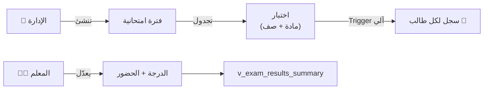
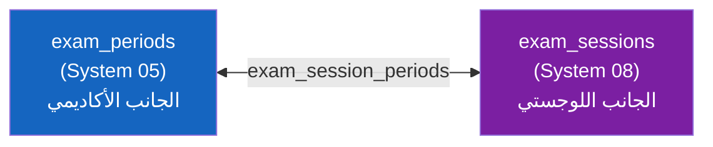

# 📝 الاختبارات والفترات الامتحانية
## DDL_EXAMS v3.1 — Enhanced Exam System

---

## 📌 بطاقة الملف
| البند | القيمة |
|-------|--------|
| **الملف** | `DDL_EXAMS.sql` |
| **ترتيب التنفيذ** | 2️⃣ الثاني |
| **الإصدار** | v3.2 |
| **المكونات** | 4 جدول + 1 View + 1 Procedure + 3 Trigger |
| **يعتمد على** | DDL_POLICIES, System 01 (users), System 02 (النواة), System 04 (الطلاب) |
| **يتكامل مع** | System 08 (لجان الامتحانات) عبر `exam_session_periods` |

---

## 🚀 المقدمة
نظام اختبارات **متكامل:** الإدارة تُنشئ فترة امتحانية → تجدول اختبار لكل مادة/صف → الـ Trigger يُنشئ سجلات لكل الطلاب آلياً → المعلم يعدّل الدرجات فقط.

الاختبار مرتبط بـ**الصف** (أول ثانوي) وليس الشعبة — أي **موحد لكل الشعب**.



---

## 📊 تفاصيل المكونات

### 1️⃣ الفترات الامتحانية (exam_periods)

| الحقل | الاسم البرمجي | النوع | الوصف |
|-------|---------------|-------|-------|
| المعرف | `id` | INT (PK) | معرف فريد |
| العام | `academic_year_id` | INT (FK) | العام الدراسي |
| الفصل | `semester_id` | INT (FK) | الفصل الدراسي |
| الاسم | `name` | VARCHAR(100) | اسم الفترة |
| النوع | `type` | ENUM | MONTHLY, MIDTERM, FINAL, DIAGNOSTIC |
| البداية | `start_date` | DATE (**NOT NULL**) | تاريخ البداية |
| النهاية | `end_date` | DATE (**NOT NULL**) | تاريخ النهاية |
| نشط؟ | `is_active` | BOOLEAN | هل الفترة فعالة |
| المنشئ | `created_by` | INT (FK → users) | **جديد** — من أنشأ الفترة |
| مقفل؟ | `is_locked` | BOOLEAN | حوكمة — هل مقفلة |

---

### 2️⃣ جدولة الاختبارات (exam_schedules)

| الحقل | الاسم البرمجي | النوع | الوصف |
|-------|---------------|-------|-------|
| المعرف | `id` | INT (PK) | معرف فريد |
| الفترة | `exam_period_id` | INT (FK) | الفترة الامتحانية |
| المادة | `subject_id` | INT (FK) | المادة |
| الصف | `grade_level_id` | INT (FK) | الصف (موحد لكل الشعب) |
| التاريخ | `exam_date` | DATE | تاريخ الاختبار |
| الوقت | `start_time` | TIME (NULL) | **جديد** — وقت بداية الاختبار |
| المدة | `duration_minutes` | SMALLINT (NULL) | **جديد** — مدة الاختبار بالدقائق |
| العظمى | `max_score` | DECIMAL(5,2) | الدرجة العظمى |
| المنشئ | `created_by` | INT (FK → users) | **جديد** — من جدول الاختبار |

> ⚡ عند إنشاء جدول اختبار، الـ Trigger `trg_exam_schedule_auto_populate` يُنشئ سجلات لكل طالب نشط في **كل شعب الصف** آلياً

---

### 3️⃣ درجات الطلاب (student_exam_scores)

| الحقل | الاسم البرمجي | النوع | الوصف |
|-------|---------------|-------|-------|
| المعرف | `id` | INT (PK) | معرف فريد |
| الاختبار | `exam_schedule_id` | INT (FK) | جدول الاختبار |
| الطالب | `enrollment_id` | INT (FK) | تسجيل الطالب |
| الدرجة | `score` | DECIMAL(5,2) | الدرجة المحصلة |
| حاضر؟ | `is_present` | BOOLEAN | حضر الاختبار |
| نوع الغياب | `absence_type` | ENUM | **جديد** — `بعذر` / `بدون_عذر` |
| تفاصيل العذر | `excuse_details` | TEXT | سبب الغياب |
| ملاحظات | `teacher_notes` | TEXT | ملاحظات المعلم |

---

### 4️⃣ View: ملخص نتائج الاختبار (v_exam_results_summary) — جديد

| الحقل | الوصف |
|-------|-------|
| `total_students` | عدد الطلاب الكلي |
| `present_count` / `absent_count` | عدد الحضور / الغياب |
| `excused_absent` / `unexcused_absent` | غياب بعذر / بدون عذر |
| `avg_score` / `avg_percentage` | متوسط الدرجات / النسبة |
| `passed_count` / `failed_count` | عدد الناجحين / الراسبين |

---

### 5️⃣ Triggers

| الـ Trigger | التوقيت | الوظيفة |
|---|---|---|
| `trg_exam_schedule_auto_populate` | AFTER INSERT ON exam_schedules | يُنشئ سجلات لكل طالب نشط في الصف |
| `trg_exam_score_validate_insert` | BEFORE INSERT ON student_exam_scores | يمنع `score > max_score` + يصفّر درجة الغائب |
| `trg_exam_score_validate_update` | BEFORE UPDATE ON student_exam_scores | نفس التحقق عند التعديل |

---

### 6️⃣ Procedure داخلية للرصد الآلي (`sp_populate_exam_scores`)

هذا الإجراء موجود في SQL ويتم استدعاؤه تلقائياً من `trg_exam_schedule_auto_populate`:
- يقرأ `grade_level_id` من `exam_schedules`
- ينشئ سجلات افتراضية في `student_exam_scores` لكل طالب نشط في جميع شعب نفس الصف
- يستخدم `INSERT IGNORE` لتجنب التكرار عند إعادة الاستدعاء

```sql
CALL sp_populate_exam_scores(1);  -- exam_schedule_id
```

---

## 💡 أمثلة SQL

### سير العمل الكامل (الجديد)
```sql
-- 1️⃣ الإدارة تنشئ فترة امتحانية
INSERT INTO exam_periods (academic_year_id, semester_id, name, type, 
    start_date, end_date, created_by)
VALUES (1, 1, 'اختبار شهر محرم', 'MONTHLY', '2026-09-15', '2026-09-17', 1);

-- 2️⃣ جدولة اختبار → الـ Trigger يرصد الطلاب آلياً
INSERT INTO exam_schedules (exam_period_id, subject_id, grade_level_id, 
    exam_date, max_score, start_time, duration_minutes, created_by)
VALUES (1, 1, 1, '2026-09-15', 20.00, '08:00', 90, 1);

-- 3️⃣ المعلم يعدّل الدرجات بالـ UPDATE فقط
UPDATE student_exam_scores SET score = 18.50 
WHERE exam_schedule_id = 1 AND enrollment_id = 1;

-- 4️⃣ تسجيل غياب بعذر
UPDATE student_exam_scores 
SET is_present = FALSE, absence_type = 'بعذر', excuse_details = 'مريض — تقرير طبي'
WHERE exam_schedule_id = 1 AND enrollment_id = 3;
-- ⬆ الـ Trigger سيصفّر الدرجة آلياً

-- 5️⃣ ملخص النتائج
SELECT * FROM v_exam_results_summary WHERE exam_schedule_id = 1;
```

### سحب درجة النهائي إلى semester_grades
```sql
-- بعد رصد درجات الاختبار النهائي (type = 'FINAL'):
CALL sp_fill_final_exam_score(1, 1);  -- فصل أول، شعبة 1
```

---

### 7️⃣ 🆕 ربط الفترات بجلسات اللجان (exam_session_periods)

جدول وسيط يربط الفترة الامتحانية **الأكاديمية** (System 05) بالجلسة **اللوجستية** (System 08):
- **System 05** = الدرجات والنتائج (اختبار شهر محرم، درجة 20)
- **System 08** = التنظيم المادي (لجنة 1، مقعد 5، رقم جلوس 123)

| الحقل | الاسم البرمجي | النوع | الوصف |
|-------|---------------|-------|-------|
| المعرف | `id` | INT (PK) | معرف فريد |
| جلسة الامتحان | `exam_session_id` | INT (FK) | جلسة لجان الامتحانات (System 08) |
| الفترة الامتحانية | `exam_period_id` | INT (FK) | الفترة الأكاديمية (System 05) |
| ملاحظات | `notes` | TEXT | ملاحظات اختيارية |
| المنشئ | `created_by` | INT (FK → users) | المستخدم الذي أنشأ الربط |

#### 📋 بيانات استرشادية
| id | exam_session_id | exam_period_id | notes |
|----|-----------------|----------------|-------|
| 1 | 1 (اختبارات نهاية الفصل الأول) | 4 (فترة نهاية الفصل الأول) | ربط النهائي باللجان |
| 2 | 4 (اختبارات شهر محرم النصفية) | 1 (اختبار شهر محرم) | ربط الشهري باللجان |



### جلب الفترة الأكاديمية مع بيانات اللجان
```sql
SELECT 
    ep.name AS period_name,
    ep.type,
    es.exam_name AS session_name,
    es.exam_type,
    COUNT(ea.id) AS assigned_students
FROM exam_session_periods esp
JOIN exam_periods ep ON esp.exam_period_id = ep.id
JOIN exam_sessions es ON esp.exam_session_id = es.id
LEFT JOIN exam_assignments ea ON es.id = ea.exam_session_id
GROUP BY esp.id;
```

---

## 🧩 عناصر تقنية إضافية موثقة
- `exam_periods` يحتوي أيضاً على: `created_at`, `locked_at`, `locked_by_user_id`.
- `exam_schedules` يحتوي أيضاً على: `created_at`.
- `student_exam_scores` يحتوي أيضاً على: `created_at`, `updated_at`.
- `exam_session_periods` يحتوي أيضاً على: `created_at`.

**تم التحديث:** 2026-02-14
