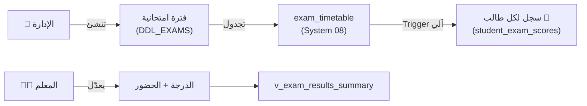

# 📝 الاختبارات والفترات الامتحانية
## DDL_EXAMS v4.0 — Enhanced Exam System

---

## 📌 بطاقة الملف
| البند | القيمة |
|-------|--------|
| **الملف** | `DDL_EXAMS.sql` |
| **ترتيب التنفيذ** | 2️⃣ الثاني |
| **الإصدار** | v4.0 |
| **المكونات** | 2 جدول + 1 View + 1 Procedure + 3 Trigger |
| **يعتمد على** | DDL_POLICIES, System 01 (users), System 02 (النواة), System 04 (الطلاب), **System 08 (الجدولة)** |
| **يتكامل مع** | System 08 (لجان الامتحانات) عبر `exam_timetable` |

---

## 🚀 المقدمة
نظام اختبارات **متكامل:** الإدارة تُنشئ فترة امتحانية → الجدولة تتم في **System 08 (exam_timetable)** → الـ Trigger يُنشئ سجلات لكل الطلاب آلياً هنا → المعلم يعدّل الدرجات فقط.

الاختبار مرتبط بجدول `exam_timetable` في System 08، الذي يحدد المادة والصف والتاريخ والوقت.



---

## 📊 تفاصيل المكونات

### 1️⃣ الفترات الامتحانية (exam_periods)

| الحقل | الاسم البرمجي | النوع | الوصف |
|-------|---------------|-------|-------|
| المعرف | `id` | INT (PK) | معرف فريد |
| العام | `academic_year_id` | INT (FK) | العام الدراسي |
| الفصل | `semester_id` | INT (FK) | الفصل الدراسي |
| الاسم | `name_ar` | VARCHAR(100) | اسم الفترة |
| النوع | `exam_type_id` | TINYINT (FK) | **تم التحديث (v4.0)** — رابط `lookup_exam_types` في System 08 |
| البداية | `start_date` | DATE (**NOT NULL**) | تاريخ بداية الفترة |
| النهاية | `end_date` | DATE (**NOT NULL**) | تاريخ نهاية الفترة |
| الحالة | `status_id` | TINYINT (FK) | **جديد** — DRAFT, SCHEDULING, SCORING, APPROVED |
| نشط؟ | `is_active` | BOOLEAN | هل الفترة فعالة |
| مقفل؟ | `is_locked` | BOOLEAN | حوكمة — هل مقفلة |

---

### 2️⃣ درجات الطلاب (student_exam_scores)

| الحقل | الاسم البرمجي | النوع | الوصف |
|-------|---------------|-------|-------|
| المعرف | `id` | INT (PK) | معرف فريد |
| الجدول | `exam_timetable_id` | INT (FK) | **تم التحديث (v4.0)** — رابط جدول الاختبار في System 08 |
| الطالب | `enrollment_id` | INT (FK) | تسجيل الطالب |
| الدرجة | `score` | DECIMAL(5,2) | الدرجة المحصلة |
| حاضر؟ | `is_present` | BOOLEAN | حضر الاختبار |
| نوع الغياب | `absence_type` | ENUM | `بعذر` / `بدون_عذر` |
| تفاصيل العذر | `excuse_details` | TEXT | سبب الغياب |
| ملاحظات | `teacher_notes` | TEXT | ملاحظات المعلم |

> ⚡ **ملاحظة:** جدول `exam_schedules` تم نقله بالكامل إلى **System 08** باسم `exam_timetable` لتوحيد الجدولة واللجان.

---

### 3️⃣ View: ملخص نتائج الاختبار (v_exam_results_summary)

يعرض إحصائيات سريعة لكل اختبار بجدول `exam_timetable`:

| الحقل | الوصف |
|-------|-------|
| `total_students` | عدد الطلاب الكلي |
| `present_count` / `absent_count` | عدد الحضور / الغياب |
| `excused_absent` / `unexcused_absent` | غياب بعذر / بدون عذر |
| `avg_score` / `avg_percentage` | متوسط الدرجات / النسبة |
| `passed_count` / `failed_count` | عدد الناجحين / الراسبين |

---

### 4️⃣ Triggers

| الـ Trigger | التوقيت | الوظيفة |
|---|---|---|
| `trg_exam_score_validate_insert` | BEFORE INSERT | يمنع `score > max_score` (يجلب `max_score` من `exam_timetable`) + يصفّر الغائب |
| `trg_exam_score_validate_update` | BEFORE UPDATE | نفس التحقق عند التعديل |

---

### 5️⃣ Procedure داخلية للرصد الآلي (`sp_populate_exam_scores`)

هذا الإجراء موجود الآن في **System 08** (`DDL_SCHEDULING.sql`) ويقوم بملء جدول `student_exam_scores` في System 05 عند اعتماد الجدول.

---

## 💡 أمثلة SQL

### سير العمل الكامل (الجديد v4.0)

```sql
-- 1️⃣ الإدارة تنشئ فترة امتحانية (System 05)
INSERT INTO exam_periods (academic_year_id, semester_id, name_ar, exam_type_id, status_id, start_date, end_date)
VALUES (1, 1, 'اختبار شهر محرم', 1, 1, '2026-09-15', '2026-09-17');
-- (1 = MONTHLY, 1 = DRAFT)

-- 2️⃣ جدولة اختبار (System 08 - exam_timetable)
-- يقوم System 08 بملء student_exam_scores تلقائياً عبر SP

-- 3️⃣ المعلم يعدّل الدرجات بالـ UPDATE فقط (System 05)
UPDATE student_exam_scores SET score = 18.50 
WHERE exam_timetable_id = 101 AND enrollment_id = 1;

-- 4️⃣ تسجيل غياب بعذر
UPDATE student_exam_scores 
SET is_present = FALSE, absence_type = 'بعذر', excuse_details = 'مريض — تقرير طبي'
WHERE exam_timetable_id = 101 AND enrollment_id = 3;
-- ⬆ الـ Trigger سيصفّر الدرجة آلياً
```

---

## 🧩 عناصر تقنية إضافية موثقة
- `exam_periods` يحتوي أيضاً على: `created_at`, `locked_at`, `locked_by_user_id`.
- `student_exam_scores` يحتوي أيضاً على: `created_at`, `updated_at`.

**تم التحديث:** 2026-02-19 (v4.0)
