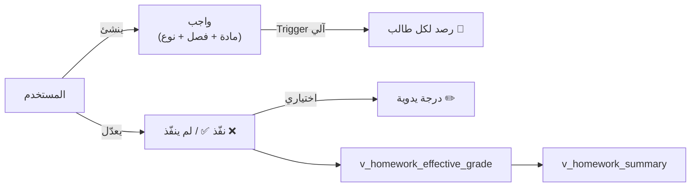

# 📓 الواجبات المنزلية
## DDL_HOMEWORKS v3.1 — Enhanced Homework System

---

## 📌 بطاقة الملف
| البند | القيمة |
|-------|--------|
| **الملف** | `DDL_HOMEWORKS.sql` |
| **ترتيب التنفيذ** | 3️⃣ الثالث |
| **الإصدار** | v3.1 |
| **المكونات** | 1 Lookup + 2 جدول + 2 View + 1 Procedure + 2 Trigger |
| **يعتمد على** | System 01 (users), System 02 (النواة), System 04 (الطلاب) |

---

## 🚀 المقدمة
نظام واجبات **متكامل:** المستخدم يُنشئ واجب مرتبط بـ**المادة + الفصل**، ثم الـ Trigger يُنشئ سجلات لكل الطلاب آلياً. المعلم يعدّل حالة كل طالب (نفّذ/لم ينفّذ). يدعم أنواع واجبات متعددة، تاريخ تسليم، وحذف ناعم.



### 🧮 معادلة الدرجة
```
إذا المعلم أدخل درجة يدوية → نستخدمها
وإلا إذا نفّذ               → الدرجة = max_grade (كاملة)
وإلا                         → الدرجة = 0
```

---

## 📊 تفاصيل المكونات

### 0️⃣ أنواع الواجبات (lookup_homework_types)

| id | name_ar |
|----|---------|
| 1 | واجب منزلي |
| 2 | بحث |
| 3 | مشروع |
| 4 | تقرير |
| 5 | نشاط صفي |
| 6 | أخرى |

---

### 1️⃣ تعريف الواجبات (homeworks)

| الحقل | الاسم البرمجي | النوع | الوصف |
|-------|---------------|-------|-------|
| المعرف | `id` | INT (PK) | معرف فريد |
| العام | `academic_year_id` | INT (FK) | العام الدراسي |
| الفصل | `semester_id` | INT (FK) | الفصل الدراسي |
| الشهر | `month_id` | INT (FK) | الشهر الأكاديمي (**NOT NULL**) |
| المنشئ | `created_by` | INT (FK → users) | **المستخدم** الذي أنشأ الواجب |
| الشعبة | `classroom_id` | INT (FK) | الفصل/الشعبة |
| المادة | `subject_id` | INT (FK) | المادة الدراسية |
| النوع | `homework_type_id` | TINYINT (FK) | نوع الواجب (افتراضي: واجب منزلي) |
| تاريخ الإعطاء | `homework_date` | DATE | تاريخ إعطاء الواجب |
| تاريخ التسليم | `due_date` | DATE (NULL) | تاريخ التسليم المطلوب |
| العنوان | `title` | VARCHAR(200) | عنوان الواجب |
| المحتوى | `content` | TEXT | تفاصيل (اختياري) |
| الدرجة العظمى | `max_grade` | DECIMAL(4,1) | الدرجة المستحقة (افتراضي 5.0) |
| نشط | `is_active` | BOOLEAN | حذف ناعم (TRUE = نشط) |

---

### 2️⃣ رصد الواجبات (student_homeworks)

| الحقل | الاسم البرمجي | النوع | الوصف |
|-------|---------------|-------|-------|
| المعرف | `id` | INT (PK) | معرف فريد |
| الواجب | `homework_id` | INT (FK) | مرجع للواجب |
| الطالب | `enrollment_id` | INT (FK) | مرجع لتسجيل الطالب |
| نفّذ؟ | `is_completed` | BOOLEAN | نفّذ / لم ينفّذ |
| وقت التسليم | `submitted_at` | TIMESTAMP (NULL) | **جديد** — يُملأ آلياً عند is_completed = TRUE |
| درجة يدوية | `manual_grade` | DECIMAL(4,1) | اختيارية — NULL = آلي |
| ملاحظات | `notes` | VARCHAR(255) | ملاحظة مختصرة |

> ⚡ يتم إنشاء سجلات الطلاب **آلياً** بواسطة `trg_homework_auto_populate` عند إنشاء واجب جديد

---

### 3️⃣ View: الدرجة الفعلية (v_homework_effective_grade)

| الحقل | الوصف |
|-------|-------|
| `homework_id` | الواجب |
| `enrollment_id` | الطالب |
| `subject_id` | المادة |
| `month_id` | الشهر |
| `is_completed` | نفّذ؟ |
| `submitted_at` | وقت التسليم |
| `due_date` | تاريخ التسليم المطلوب |
| `is_late` | **جديد** — هل التسليم متأخر؟ |
| `effective_grade` | الدرجة الفعلية |

---

### 4️⃣ View: ملخص الواجب (v_homework_summary) — جديد

| الحقل | الوصف |
|-------|-------|
| `homework_id` | الواجب |
| `total_students` | عدد الطلاب الكلي |
| `completed_count` | عدد المنفذين |
| `not_completed_count` | عدد غير المنفذين |
| `completion_rate` | نسبة التنفيذ % |
| `avg_grade` | متوسط الدرجات |

---

### 5️⃣ Triggers

| الـ Trigger | التوقيت | الوظيفة |
|---|---|---|
| `trg_homework_auto_populate` | AFTER INSERT ON homeworks | يُنشئ سجلات `student_homeworks` لكل طالب نشط في الفصل |
| `trg_homework_submitted_at` | BEFORE UPDATE ON student_homeworks | يُعيّن `submitted_at` آلياً عند `is_completed = TRUE` ويعيده `NULL` عند إرجاع الحالة إلى `FALSE` |

---

### 6️⃣ Procedure داخلية للرصد الآلي (`sp_populate_student_homeworks`)

هذا الإجراء موجود في SQL ويتم استدعاؤه تلقائياً من `trg_homework_auto_populate`:
- يقرأ `classroom_id` من `homeworks`
- ينشئ سجلاً لكل طالب نشط في نفس الفصل داخل `student_homeworks`
- يستخدم `INSERT IGNORE` لتجنب التكرار

```sql
CALL sp_populate_student_homeworks(1);  -- homework_id
```

---

## 💡 أمثلة SQL

### سير العمل الكامل (الجديد)
```sql
-- 1️⃣ المستخدم ينشئ واجب → الـ Trigger يرصد الطلاب آلياً
INSERT INTO homeworks (academic_year_id, semester_id, month_id, created_by, 
    classroom_id, subject_id, title, max_grade, due_date, homework_type_id)
VALUES (1, 1, 1, 1, 1, 1, 'حل تمارين الباب الأول', 5.0, '2026-09-21', 1);

-- 2️⃣ المعلم يعدّل حالة الطلاب (الافتراضي: لم ينفّذ)
UPDATE student_homeworks SET is_completed = TRUE 
WHERE homework_id = 1 AND enrollment_id = 1;
-- ⬆ submitted_at يُملأ آلياً بالـ Trigger

-- 3️⃣ التحقق من الدرجات
SELECT enrollment_id, effective_grade, is_late 
FROM v_homework_effective_grade WHERE homework_id = 1;

-- 4️⃣ ملخص الواجب
SELECT * FROM v_homework_summary WHERE homework_id = 1;
```

### الواجبات المتأخرة
```sql
SELECT enrollment_id, effective_grade, submitted_at, due_date
FROM v_homework_effective_grade 
WHERE is_late = TRUE AND month_id = 1;
```

### حذف ناعم
```sql
UPDATE homeworks SET is_active = FALSE WHERE id = 1;
-- الواجب لن يظهر في v_homework_effective_grade ولا v_homework_summary
```

---

## 🧩 عناصر تقنية إضافية موثقة
- `homeworks` يحتوي أيضاً على: `created_at`, `updated_at`.
- `student_homeworks` يحتوي أيضاً على: `created_at`, `updated_at`.
- يوجد قيد فريد `uk_student_homework` يمنع تكرار نفس الطالب لنفس الواجب.

**تم التحديث:** 2026-02-14
