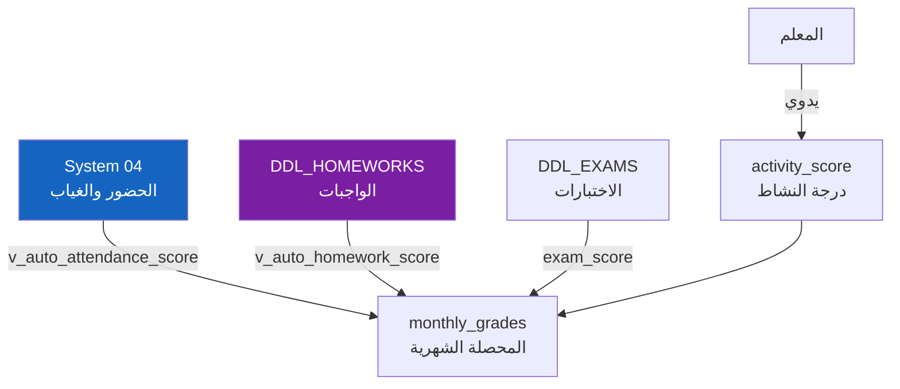

# 📅 المحصلات الشهرية والحساب الآلي
## DDL_MONTHLY — Monthly Grades + Auto-Calculation

---

## 📌 بطاقة الملف
| البند | القيمة |
|-------|--------|
| **الملف** | `DDL_MONTHLY.sql` |
| **ترتيب التنفيذ** | 4️⃣ الرابع |
| **عدد العناصر** | 2 جداول + 2 Views + 1 Stored Procedure + Triggers تحقق |
| **يعتمد على** | DDL_POLICIES, DDL_EXAMS, DDL_HOMEWORKS, System 04 (الحضور) |

---

## 🚀 المقدمة
المحصلة الشهرية هي **تجميع أداء الطالب خلال شهر واحد** في مادة معينة. النموذج الحالي مرن ويتضمن: المواظبة + الواجبات + النشاط + المساهمة + المكونات المخصصة + الاختبارات.



### 🧮 المعادلة
```
monthly_total = attendance_score (آلي من الحضور)
              + homework_score (آلي من الواجبات)  
              + activity_score (يدوي من المعلم)
              + contribution_score (يدوي من المعلم)
              + custom_components_score (حسب سياسة المدرسة)
              + exam_score (من الاختبارات)
```

---

## 📊 تفاصيل الجداول

### 1️⃣ المحصلة الشهرية (monthly_grades)

| الحقل | الاسم البرمجي | النوع | الوصف | مثال |
|-------|---------------|-------|-------|------|
| المعرف | `id` | INT (PK) | معرف فريد | 1 |
| الطالب | `enrollment_id` | INT (FK) | تسجيل الطالب | 1 |
| المادة | `subject_id` | INT (FK) | المادة الدراسية | 1 (رياضيات) |
| الشهر | `month_id` | INT (FK) | الشهر الأكاديمي | 1 (محرم) |
| المواظبة | `attendance_score` | DECIMAL(5,2) | **محسوب آلياً** | 4.80 |
| الواجبات | `homework_score` | DECIMAL(5,2) | **محسوب آلياً** | 5.00 |
| النشاط | `activity_score` | DECIMAL(5,2) | يدوي من المعلم | 4.50 |
| المساهمة | `contribution_score` | DECIMAL(5,2) | يدوي من المعلم | 0.00 |
| مكونات مخصصة | `custom_components_score` | DECIMAL(5,2) | من مكونات السياسة المخصصة | 0.00 |
| الاختبار | `exam_score` | DECIMAL(5,2) | من درجات الاختبارات | 18.50 |

#### 📋 بيانات استرشادية
| id | enrollment_id | subject_id | month_id | attendance | homework | activity | exam | **المجموع** |
|----|---------------|------------|----------|------------|----------|----------|------|-------------|
| 1 | 1 (محمد) | 1 (رياضيات) | 1 (محرم) | 4.80 | 5.00 | 4.50 | 18.50 | **32.80** |
| 2 | 2 (مريم) | 1 (رياضيات) | 1 (محرم) | 5.00 | 3.50 | 4.00 | 15.00 | **27.50** |
| 3 | 3 (عمر) | 1 (رياضيات) | 1 (محرم) | 3.00 | 0.00 | 3.50 | 0.00 | **6.50** |
| 4 | 1 (محمد) | 2 (عربي) | 1 (محرم) | 4.80 | 5.00 | 5.00 | 17.00 | **31.80** |

---

### 2️⃣ View: حساب المواظبة آلياً (v_auto_attendance_score)

يحسب نسبة الحضور من `student_attendance` (System 04) لكل طالب في كل شهر.

| الحقل | الوصف |
|-------|-------|
| `enrollment_id` | الطالب |
| `month_id` | الشهر |
| `total_days` | إجمالي أيام الدراسة |
| `present_days` | أيام الحضور |
| `absent_days` | أيام الغياب |
| `attendance_percentage` | **نسبة الحضور %** |

#### مثال: طالب حضر 24 من 25 يوم
```
attendance_percentage = (24 / 25) × 100 = 96%
attendance_score = 96% × 5.00 (max) = 4.80
```

---

### 3️⃣ View: حساب الواجبات آلياً (v_auto_homework_score)

يحسب متوسط درجات الواجبات من `v_homework_effective_grade` لكل طالب/مادة/شهر.

| الحقل | الوصف |
|-------|-------|
| `enrollment_id` | الطالب |
| `subject_id` | المادة |
| `month_id` | الشهر |
| `total_homeworks` | عدد الواجبات |
| `completed_count` | عدد المنفّذة |
| `total_grade` | مجموع الدرجات الفعلية |
| `total_max_grade` | المجموع الأقصى |

---

### 4️⃣ Procedure: ملء المحصلات آلياً (sp_calculate_monthly_grades)

```sql
CALL sp_calculate_monthly_grades(
    1,  -- month_id (الشهر)
    1,  -- subject_id (المادة)
    1   -- classroom_id (الفصل)
);
```

**يقوم بـ:**
1. جلب أوزان السياسة (`grading_policies`) للصف والمادة
2. حساب `attendance_score` من `v_auto_attendance_score`
3. حساب `homework_score` من `v_auto_homework_score`
4. إدراج/تحديث `monthly_grades` لكل طلاب الفصل

---

## 💡 أمثلة SQL

### جلب المحصلة الشهرية لفصل معين
```sql
SELECT 
    s.full_name,
    mg.attendance_score, mg.homework_score, 
    mg.activity_score, mg.exam_score,
    (mg.attendance_score + mg.homework_score + mg.activity_score + mg.exam_score) AS total
FROM monthly_grades mg
JOIN student_enrollments se ON mg.enrollment_id = se.id
JOIN students s ON se.student_id = s.id
WHERE mg.subject_id = 1 AND mg.month_id = 1
ORDER BY total DESC;
```

---

## 🧩 عناصر تقنية إضافية موثقة
- جدول `monthly_grades` يحتوي أيضاً على: `created_at`, `updated_at`.
- View `v_auto_attendance_score` يعيد أيضاً `semester_id` مع بيانات الشهر.
- View `v_auto_homework_score` يعيد أيضاً `avg_grade` (متوسط الدرجة الفعلية قبل إعادة التحجيم).
- الإجراء `sp_calculate_monthly_grades` يحسب كذلك `exam_score` من `student_exam_scores` خلال نطاق تاريخ الشهر، ويستخدم `ON DUPLICATE KEY UPDATE` لتحديث السجلات الموجودة.

**تم التحديث:** 2026-02-14
