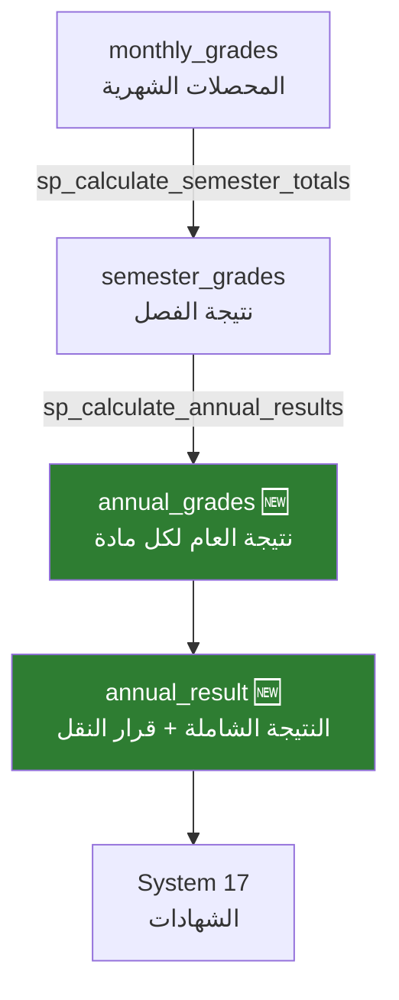

# 🏆 النتائج — الفصل + العام + قرار النقل
## DDL_RESULTS — Semester, Annual & Promotion Decisions

---

## 📌 بطاقة الملف
| البند | القيمة |
|-------|--------|
| **الملف** | `DDL_RESULTS.sql` |
| **ترتيب التنفيذ** | 5️⃣ الخامس |
| **عدد العناصر** | 5 جداول + 1 View + 3 Stored Procedures |
| **يعتمد على** | DDL_POLICIES, DDL_MONTHLY, System 02 (النواة) |
| **🆕 جديد** | `annual_grades` + `annual_result` + `lookup_promotion_decisions` |

---

## 🚀 المقدمة
هذا أهم ملف في النظام — يحتوي على المسار الكامل من **نتيجة الفصل** إلى **نتيجة العام** إلى **قرار النقل**. يتضمن جدولين جديدين كلياً لم يكونا في النسخة السابقة.



---

## 📊 تفاصيل الجداول

### 1️⃣ نتيجة الفصل (semester_grades)

| الحقل | الاسم البرمجي | النوع | الوصف | مثال |
|-------|---------------|-------|-------|------|
| المعرف | `id` | INT (PK) | معرف فريد | 1 |
| الطالب | `enrollment_id` | INT (FK) | تسجيل الطالب | 1 |
| المادة | `subject_id` | INT (FK) | المادة | 1 (رياضيات) |
| الفصل | `semester_id` | INT (FK) | الفصل الدراسي | 1 (الأول) |
| أعمال الفصل | `semester_work_total` | DECIMAL(5,2) | مجموع المحصلات الشهرية | 32.80 |
| النهائي | `final_exam_score` | DECIMAL(5,2) | درجة الاختبار النهائي | 38.00 |
| الإجمالي | `semester_total` | **GENERATED** | محسوب آلياً = work + final | **70.80** |
| الحالة | `grading_status_id` | TINYINT (FK) | مسودة/مراجعة/معتمد | 3 (معتمد) |

#### 📋 بيانات استرشادية
| id | enrollment_id | subject_id | semester_id | work_total | final_exam | **semester_total** | status |
|----|---------------|------------|-------------|------------|------------|---------------------|--------|
| 1 | 1 (محمد) | 1 (رياضيات) | 1 | 32.80 | 38.00 | **70.80** | معتمد |
| 2 | 1 (محمد) | 2 (عربي) | 1 | 31.80 | 40.00 | **71.80** | معتمد |
| 3 | 2 (مريم) | 1 (رياضيات) | 1 | 27.50 | 35.00 | **62.50** | معتمد |
| 4 | 1 (محمد) | 1 (رياضيات) | 2 | 34.00 | 41.20 | **75.20** | مسودة |

---

### 2️⃣ حالات نتيجة المادة (lookup_annual_statuses)

| id | name_ar | code |
|----|---------|------|
| 1 | ناجح | PASS |
| 2 | راسب | FAIL |
| 3 | مكمل | MAKEUP |
| 4 | محروم بسبب الغياب | DEPRIVED |

---

### 3️⃣ 🆕 نتيجة العام لكل مادة (annual_grades)

| الحقل | الاسم البرمجي | النوع | الوصف | مثال |
|-------|---------------|-------|-------|------|
| المعرف | `id` | INT (PK) | معرف فريد | 1 |
| الطالب | `enrollment_id` | INT (FK) | تسجيل الطالب | 1 |
| المادة | `subject_id` | INT (FK) | المادة | 1 (رياضيات) |
| العام | `academic_year_id` | INT (FK) | العام الدراسي | 1 |
| الفصل الأول | `semester1_total` | DECIMAL(5,2) | إجمالي الفصل 1 | 70.80 |
| الفصل الثاني | `semester2_total` | DECIMAL(5,2) | إجمالي الفصل 2 | 75.20 |
| المجموع | `annual_total` | **GENERATED** | الفصل1 + الفصل2 | **146.00** |
| النسبة | `annual_percentage` | DECIMAL(5,2) | النسبة المئوية | 83.43% |
| الحالة | `final_status_id` | TINYINT (FK) | ناجح/راسب/مكمل/محروم | 1 (ناجح) |

#### 📋 بيانات استرشادية
| enrollment_id | subject_id | sem1_total | sem2_total | **annual_total** | percentage | status |
|---------------|------------|------------|------------|-------------------|------------|--------|
| 1 (محمد) | 1 (رياضيات) | 70.80 | 75.20 | **146.00** | 83.43% | ✅ ناجح |
| 1 (محمد) | 2 (عربي) | 71.80 | 68.50 | **140.30** | 80.17% | ✅ ناجح |
| 2 (مريم) | 1 (رياضيات) | 62.50 | 58.00 | **120.50** | 68.86% | ✅ ناجح |
| 3 (عمر) | 1 (رياضيات) | 6.50 | 15.00 | **21.50** | 12.29% | ❌ راسب |

---

### 4️⃣ قرارات النقل (lookup_promotion_decisions)

| id | name_ar | code | الشرط |
|----|---------|------|-------|
| 1 | ينقل للصف التالي | PROMOTED | 0 مواد راسب |
| 2 | يعيد السنة | RETAINED | أكثر من 2 مواد راسب |
| 3 | يُفصل | DISMISSED | قرار إداري |
| 4 | ينقل بشروط (مكمل) | CONDITIONAL | 1-2 مواد راسب |

---

### 5️⃣ 🆕 النتيجة النهائية الشاملة (annual_result)

| الحقل | الاسم البرمجي | النوع | الوصف | مثال |
|-------|---------------|-------|-------|------|
| المعرف | `id` | INT (PK) | معرف فريد | 1 |
| الطالب | `enrollment_id` | INT (FK) | تسجيل الطالب | 1 |
| العام | `academic_year_id` | INT (FK) | العام الدراسي | 1 |
| مجموع كل المواد | `total_all_subjects` | DECIMAL(7,2) | مجموع كل المواد | 730.50 |
| الدرجة العظمى | `max_possible_total` | DECIMAL(7,2) | المجموع الكلي الممكن | 900.00 |
| النسبة | `percentage` | DECIMAL(5,2) | النسبة العامة | 81.17% |
| ترتيب الفصل | `rank_in_class` | SMALLINT | ترتيب في الشعبة | 3 |
| ترتيب الصف | `rank_in_grade` | SMALLINT | ترتيب في كل الشعب | 8 |
| مواد ناجح | `passed_subjects_count` | TINYINT | عدد المواد الناجح فيها | 9 |
| مواد راسب | `failed_subjects_count` | TINYINT | عدد المواد الراسب فيها | 0 |
| القرار | `promotion_decision_id` | TINYINT (FK) | قرار النقل | 1 (ينقل) |

#### 📋 بيانات استرشادية
| enrollment | total | max | percentage | rank | passed | failed | **القرار** |
|------------|-------|-----|------------|------|--------|--------|------------|
| 1 (محمد) | 730.50 | 900.00 | 81.17% | 3 | 9 | 0 | ✅ ينقل |
| 2 (مريم) | 650.00 | 900.00 | 72.22% | 7 | 9 | 0 | ✅ ينقل |
| 3 (عمر) | 420.00 | 900.00 | 46.67% | 15 | 6 | 3 | ❌ يعيد |
| 4 (سارة) | 510.00 | 900.00 | 56.67% | 12 | 7 | 2 | ⚠️ مشروط |

---

## ⚡ Stored Procedures

### sp_calculate_semester_totals
```sql
-- حساب مجموع أعمال الفصل آلياً من المحصلات الشهرية
CALL sp_calculate_semester_totals(
    1,  -- semester_id
    1,  -- subject_id
    1   -- classroom_id
);
```

### sp_calculate_annual_results
```sql
-- حساب النتيجة السنوية + الترتيب + قرار النقل
CALL sp_calculate_annual_results(
    1,  -- academic_year_id
    1   -- classroom_id
);
```

**يقوم بـ:**
1. تجميع `semester1_total` + `semester2_total` لكل مادة → `annual_grades`
2. تحديد الحالة: ناجح / راسب (بناءً على `passing_score` من السياسة)
3. تجميع كل المواد → `annual_result`
4. تحديد `promotion_decision` (0 راسب = ينقل، 1-2 = مشروط، 3+ = يعيد)
5. حساب الترتيب داخل الفصل

---

### sp_fill_final_exam_score
```sql
-- سحب درجات اختبارات FINAL إلى semester_grades
CALL sp_fill_final_exam_score(
    1,  -- semester_id
    1   -- classroom_id
);
```

**يقوم بـ:**
1. جلب `grade_level_id` و `academic_year_id` للفصل.
2. جمع درجات الطلاب من الاختبارات التي نوعها `FINAL`.
3. تحديث `semester_grades.final_exam_score` لكل طالب/مادة في الفصل.

---

## 📈 View إضافي

### v_sgas_class_ranking
- View جاهز لعرض الترتيب النهائي للطلاب في الفصل.
- يدمج `annual_result` مع `student_enrollments` و`lookup_promotion_decisions` و`lookup_grading_statuses`.
- يعرض بيانات القرار (`promotion_decision_name`) وحالة الاعتماد (`grading_status_name`) بترتيب تنازلي حسب النسبة.

---

## 💡 أمثلة SQL

### جلب نتيجة العام لطالب معين
```sql
SELECT 
    sub.name_ar AS subject_name,
    ag.semester1_total, ag.semester2_total, ag.annual_total,
    ag.annual_percentage,
    las.name_ar AS status
FROM annual_grades ag
JOIN subjects sub ON ag.subject_id = sub.id
JOIN lookup_annual_statuses las ON ag.final_status_id = las.id
WHERE ag.enrollment_id = 1
ORDER BY sub.name_ar;
```

### قائمة الراسبين في صف معين
```sql
SELECT 
    s.full_name, ar.percentage, ar.failed_subjects_count,
    lpd.name_ar AS decision
FROM annual_result ar
JOIN student_enrollments se ON ar.enrollment_id = se.id
JOIN students s ON se.student_id = s.id
JOIN lookup_promotion_decisions lpd ON ar.promotion_decision_id = lpd.id
WHERE se.classroom_id = 1 AND ar.promotion_decision_id != 1
ORDER BY ar.percentage;
```

---

## 🧩 عناصر تقنية إضافية موثقة
- `semester_grades` يحتوي أيضاً على: `approved_by_user_id`, `approved_at`, `created_at`, `updated_at`.
- `annual_grades` يحتوي أيضاً على: `calculated_at`, `approved_by_user_id`, `approved_at`, `created_at`, `updated_at`.
- `annual_result` يحتوي أيضاً على: `notes`, `approved_by_user_id`, `approved_at`, `created_at`, `updated_at`.

**تم التحديث:** 2026-02-14
