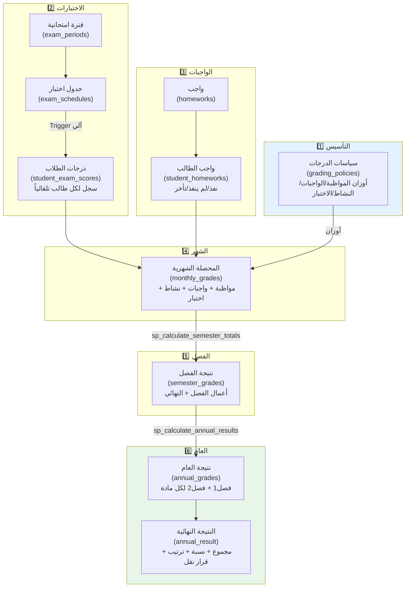
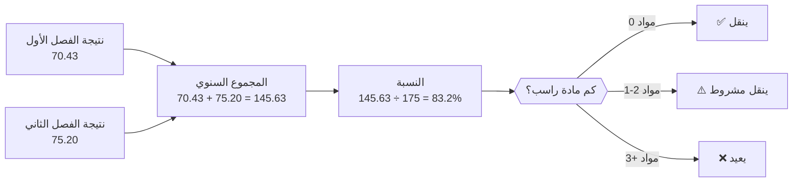
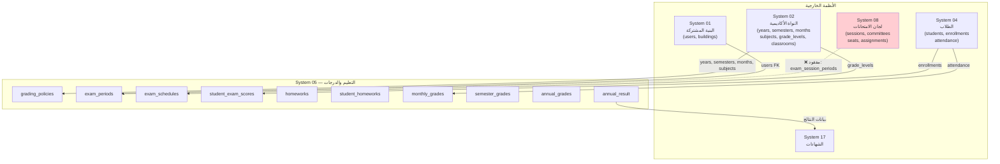
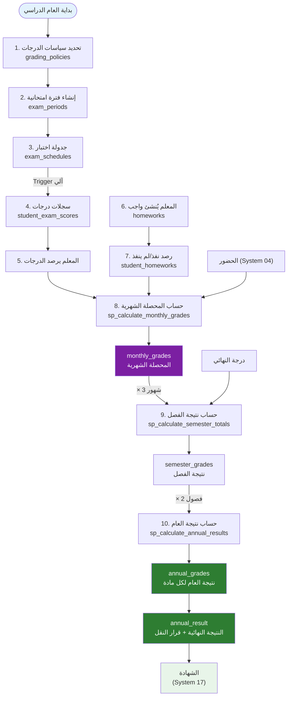

# 📊 التحليل الشامل: نظام التعليم والدرجات (System 05) — v3.1
## Smart Grading & Academic System (SGAS)

---

## 📌 ملخص تنفيذي

| البند | القيمة |
|-------|--------|
| **الإصدار** | v3.1 (بعد إعادة الهيكلة) |
| **عدد الملفات DDL** | 7 ملفات |
| **عدد الجداول** | 15 جدول + 3 lookup |
| **عدد Views** | 4 |
| **عدد Procedures** | 3 |
| **عدد Triggers** | 5 |
| **أنظمة مرتبطة** | System 02, 04, 08, 11, 17 |
| **حالة النظام** | ⭐⭐⭐⭐ (محتاج ربط واحد مفقود) |

---

## 1️⃣ ماذا يفعل النظام؟ (الوظائف الحالية)

### 🔄 دورة حياة كاملة من الاختبار إلى النقل



---

## 2️⃣ تفصيل كل ملف DDL

### 📁 هيكل الملفات (ترتيب التنفيذ)

| # | الملف | المحتوى | العناصر |
|---|-------|---------|---------|
| 0 | `DDL.sql` | الملف الرئيسي — يستدعي الباقي بالترتيب | مرجع + lookup_grading_statuses |
| 1 | `DDL_POLICIES.sql` | سياسات الدرجات والأوزان | 1 جدول (grading_policies) |
| 2 | `DDL_EXAMS.sql` | الاختبارات والفترات الامتحانية | 3 جداول + 1 View + 3 Triggers + 1 Procedure |
| 3 | `DDL_HOMEWORKS.sql` | الواجبات المنزلية | 2 جدول + 1 View + 2 Triggers + 1 Procedure |
| 4 | `DDL_MONTHLY.sql` | المحصلات الشهرية + الحساب الآلي | 1 جدول + 2 Views + 1 Procedure |
| 5 | `DDL_RESULTS.sql` | النتائج: فصل + عام + نقل | 5 جداول + 1 View + 2 Procedures |
| 6 | `DDL_LESSON_PREP.sql` | تحضير الدروس | 1 جدول |
| 7 | `DDL_AUDIT.sql` | التدقيق والحوكمة | 2 جدول + Triggers |

---

## 3️⃣ كيف تعمل الدرجات الشهرية؟

### السيناريو: شهر محرم — مادة الرياضيات — الصف الأول ثانوي (أ)

| الخطوة | ماذا يحدث | من يقوم بها | الجدول |
|--------|-----------|-------------|--------|
| 1 | تحديد الأوزان: مواظبة 5، واجبات 5، نشاط 5، اختبار 20 | الإدارة | `grading_policies` |
| 2 | إنشاء فترة امتحانية "اختبار شهر محرم" | الإدارة | `exam_periods` |
| 3 | جدولة اختبار رياضيات يوم 15/محرم | الإدارة | `exam_schedules` |
| 4 | (آلي) Trigger يُنشئ سجلات لكل طالب في الصف | النظام | `student_exam_scores` |
| 5 | المعلم يعدّل الدرجات (UPDATE فقط) | المعلم | `student_exam_scores` |
| 6 | المعلم يسجّل الواجبات (نفذ/لم ينفذ) | المعلم | `student_homeworks` |
| 7 | (آلي) حساب درجة المواظبة من الحضور | النظام | `v_auto_attendance_score` |
| 8 | (آلي) حساب درجة الواجبات من النفّذ/لم ينفذ | النظام | `v_auto_homework_score` |
| 9 | المعلم يدخل درجة النشاط يدوياً | المعلم | `monthly_grades` |
| 10 | تشغيل sp_calculate_monthly_grades | النظام | `monthly_grades` |

### النتيجة الشهرية (مثال):
| الطالب | المواظبة (5) | الواجبات (5) | النشاط (5) | الاختبار (20) | **المجموع (35)** |
|--------|-------------|-------------|-----------|--------------|-----------------|
| محمد أحمد | 4.80 | 5.00 | 4.50 | 18.50 | **32.80** |
| مريم علي | 5.00 | 3.50 | 4.00 | 15.00 | **27.50** |
| عمر خالد | 3.00 | 0.00 | 3.50 | 0.00 (غائب) | **6.50** |

---

## 4️⃣ كيف تعمل النتيجة الفصلية؟

### المعادلة:
```
semester_total = semester_work_total + final_exam_score
```
حيث:
```
semester_work_total = مجموع (المحصلات الشهرية لأشهر الفصل)
                    = monthly_total_month1 + monthly_total_month2 + monthly_total_month3
```

| الطالب | شهر 1 | شهر 2 | شهر 3 | أعمال الفصل | النهائي (50) | **إجمالي الفصل** |
|--------|-------|-------|-------|-------------|-------------|-----------------|
| محمد أحمد | 32.80 | 31.50 | 33.00 | 32.43* | 38.00 | **70.43** |
| مريم علي | 27.50 | 28.00 | 29.50 | 28.33* | 35.00 | **63.33** |

> *أعمال السنة = متوسط المحصلات الشهرية × (50 ÷ 35) حسب الأوزان

---

## 5️⃣ كيف تعمل نتيجة العام + قرار النقل؟



---

## 6️⃣ الربط مع الأنظمة الأخرى



---

## 7️⃣ نقاط القوة ✅

| # | القوة | التفصيل |
|---|-------|---------|
| 1 | **هيكلة مُقسّمة** | 7 ملفات DDL واضحة بدل ملف واحد ضخم |
| 2 | **حساب آلي للمواظبة** | View يسحب من `student_attendance` (System 04) |
| 3 | **حساب آلي للواجبات** | View يحسب من `student_homeworks` مع دعم التأخر والإعفاء |
| 4 | **Triggers ذكية** | إنشاء سجلات درجات آلياً عند جدولة اختبار |
| 5 | **تحقق من الدرجات** | Trigger يمنع تجاوز الدرجة العظمى |
| 6 | **نتيجة العام كاملة** | `annual_grades` + `annual_result` + قرار النقل |
| 7 | **حوكمة** | نظام تدقيق + حالات (مسودة/مراجعة/معتمد) + قفل الفترات |
| 8 | **Stored Procedures** | 3 إجراءات مخزنة لأتمتة الحسابات |
| 9 | **مرونة السياسات** | أوزان مختلفة لكل صف/مادة/فترة |
| 10 | **Generated Columns** | `semester_total` و `annual_total` محسوبة آلياً |

---

## 8️⃣ المشاكل والنواقص ❌

### 🔴 مشكلة عالية الأولوية

#### المشكلة #1: جدول `exam_session_periods` مفقود

| البند | التفصيل |
|-------|---------|
| **الوصف** | الجدول المذكور في README.md و README_EXAMS.md كحلقة ربط بين `exam_periods` (System 05) و `exam_sessions` (System 08) **لا يوجد في أي ملف DDL** |
| **التأثير** | لا يمكن ربط الفترة الامتحانية الأكاديمية (اختبار شهر محرم) بالجلسة اللوجستية (توزيع اللجان والمقاعد) |
| **الحل** | إنشاء جدول `exam_session_periods` في System 05 أو System 08 |

**الهيكل المقترح:**
```sql
CREATE TABLE IF NOT EXISTS exam_session_periods (
    id INT UNSIGNED AUTO_INCREMENT PRIMARY KEY,
    exam_session_id INT UNSIGNED NOT NULL COMMENT 'جلسة الامتحان (System 08)',
    exam_period_id INT UNSIGNED NOT NULL COMMENT 'الفترة الامتحانية (System 05)',
    notes TEXT,
    created_at TIMESTAMP DEFAULT CURRENT_TIMESTAMP,
    
    UNIQUE KEY uk_session_period (exam_session_id, exam_period_id),
    FOREIGN KEY (exam_session_id) REFERENCES exam_sessions(id) ON DELETE CASCADE,
    FOREIGN KEY (exam_period_id) REFERENCES exam_periods(id) ON DELETE CASCADE
) COMMENT='ربط جلسات الامتحان باللجان بالفترات الامتحانية';
```

---

### 🟡 مشاكل متوسطة الأولوية

#### المشكلة #2: `DEMO_DATA.sql` يحتوي بيانات غير كافية

| البند | التفصيل |
|-------|---------|
| **الوصف** | الملف الحالي يحتوي 1-3 سجلات فقط لكل جدول |
| **التأثير** | لا تكفي لاختبار حقيقي أو عرض للعميل |
| **الحل** | ✅ تم إنشاء ملف DEMO_DATA.sql جديد بـ 15-20 سجل لكل جدول |

#### المشكلة #3: `sp_fill_final_exam_score` مذكور في README لكن ليس في DDL_EXAMS.sql

| البند | التفصيل |
|-------|---------|
| **الوصف** | REF في README_EXAMS.md سطر 139: `CALL sp_fill_final_exam_score(1, 1)` لكن هذا الإجراء غير موجود في DDL_EXAMS.sql |
| **التأثير** | المبرمج لن يجد هذا الإجراء عند التنفيذ |
| **الحل** | إنشاء الإجراء في DDL_RESULTS.sql (لأنه يملأ `final_exam_score` في `semester_grades`) |

#### المشكلة #4: تحضير الدروس (lesson_preparation) غير مرتبط بالدرجات

| البند | التفصيل |
|-------|---------|
| **الوصف** | جدول `lesson_preparation` موجود لكنه معزول تماماً عن بقية النظام |
| **التأثير** | لا يؤثر على الدرجات — يمكن اعتباره أداة مستقلة للمعلم |
| **الحل** | هذا **مقبول معمارياً** — التحضير أداة تنظيمية وليس جزء من الدرجات |

---

### 🟢 ملاحظات إيجابية (مشاكل سابقة تم حلها)

| المشكلة السابقة | الحل في v3.1 |
|----------------|-------------|
| attendance_score يدوي | ✅ `v_auto_attendance_score` يحسب آلياً من System 04 |
| لا يوجد نتيجة العام | ✅ `annual_grades` + `annual_result` جداول جديدة |
| الواجبات معقدة | ✅ مع دعم `LATE` و `EXCUSED` + حساب `effective_grade` |
| النظام كتلة واحدة | ✅ 7 ملفات DDL مفصولة |
| semester_work_total يدوي | ✅ `sp_calculate_semester_totals` يحسب آلياً |

---

## 9️⃣ ملخص القرارات المطلوبة

| # | القرار | التوصية |
|---|--------|---------|
| 1 | أين يُوضع `exam_session_periods`؟ | في System 05 (DDL_EXAMS.sql) لأنه أقرب للفترات الامتحانية |
| 2 | هل يُضاف `sp_fill_final_exam_score` فوراً؟ | نعم، في DDL_RESULTS.sql |
| 3 | هل نحتاج DEMO_DATA أكثر من 20 سجل؟ | 15-20 سجل كافية للعرض والاختبار |

---

## 🔟 خارطة التدفق الكاملة (من الإدخال إلى الشهادة)



---

**المهندس المحلل:** Antigravity AI
**تاريخ التحليل:** 2026-02-14
**النسخة:** التحليل الشامل الثالث (بعد إعادة الهيكلة v3.1)
