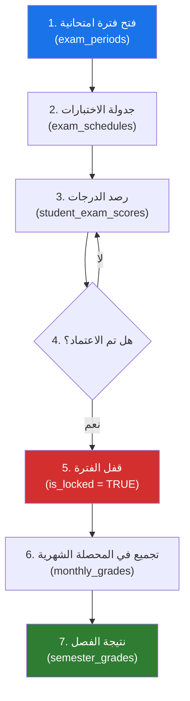
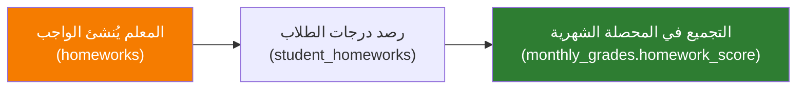
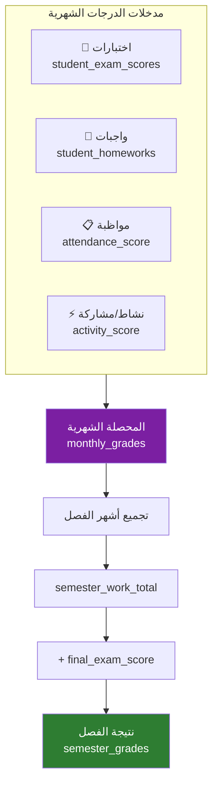
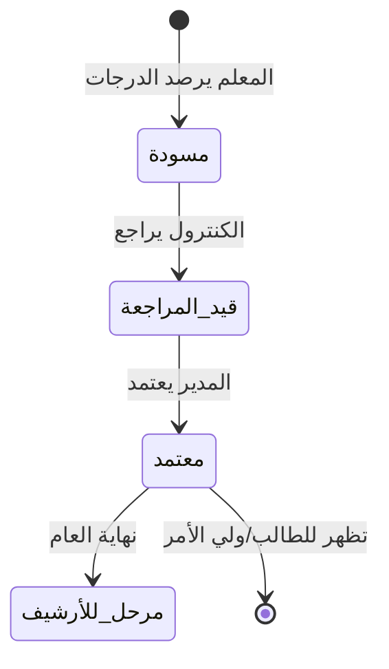
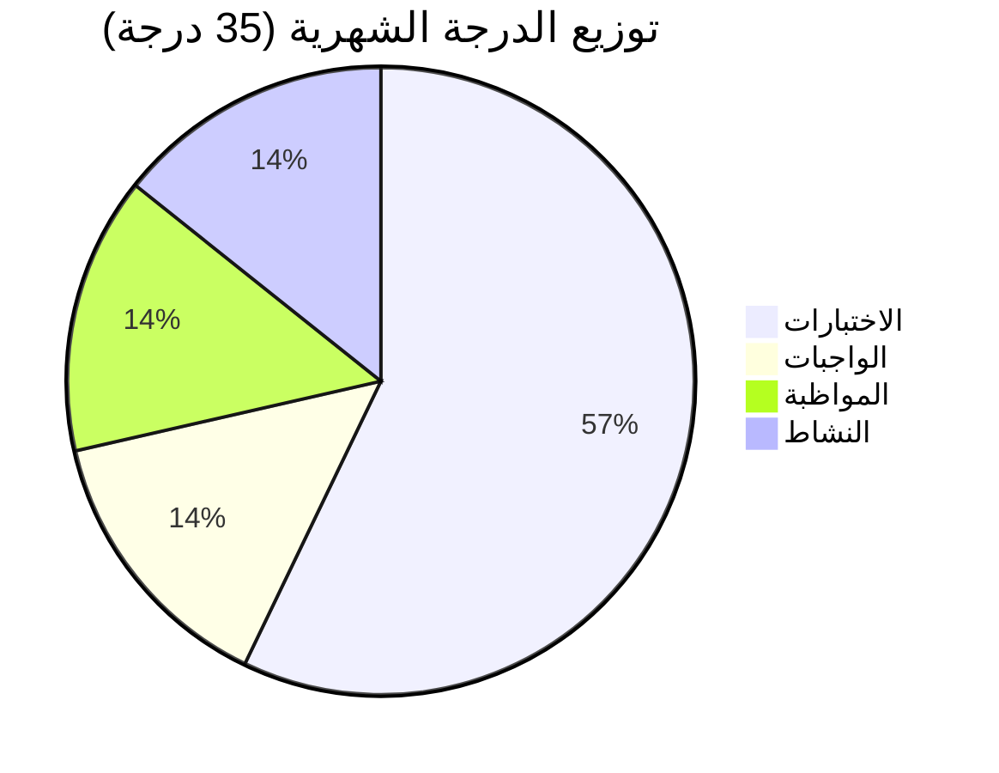
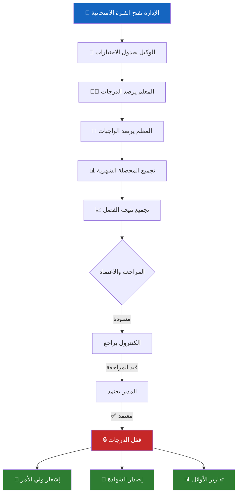

# 📊 تحليل قسم التعليم والدرجات (System 05)
## نظام الدرجات والتقويم الذكي (SGAS)

---

## 1️⃣ كيف يُضاف اختبار؟ (Exam Lifecycle)



### الخطوة 1: فتح الفترة الامتحانية (الإدارة)
- **الجدول:** [exam_periods](file:///c:/Users/mousa/Desktop/systems/05_التعليم_والدرجات/DDL.sql#L42-L60)
- **من يقوم بها:** مدير النظام / الوكيل
- **البيانات المطلوبة:**

| الحقل | الوصف | مثال |
|-------|-------|------|
| `name` | اسم الفترة | اختبار شهر محرم |
| `type` | النوع | `MONTHLY` / `MIDTERM` / `FINAL` / `DIAGNOSTIC` |
| `start_date` / `end_date` | مدة الفترة | 2025-09-01 → 2025-09-05 |
| `is_active` | هل هي الفترة الحالية؟ | `TRUE` |

### الخطوة 2: جدولة الاختبار لمادة محددة (الوكيل)
- **الجدول:** [exam_schedules](file:///c:/Users/mousa/Desktop/systems/05_التعليم_والدرجات/DDL.sql#L62-L74)
- **البيانات المطلوبة:**

| الحقل | الوصف | مثال |
|-------|-------|------|
| `exam_period_id` | ربط بالفترة | اختبار شهر محرم |
| `subject_id` | المادة | رياضيات |
| `grade_level_id` | الصف | أول ثانوي |
| `exam_date` | تاريخ الاختبار | 2025-09-02 |
| `max_score` | الدرجة العظمى | 20.00 |

> [!IMPORTANT]
> كل اختبار فريد بمفتاح مركب: **(الفترة + المادة + الصف)** — لا يمكن تكرار نفس الاختبار مرتين.

### الخطوة 3: رصد الدرجات (المعلم)
- **الجدول:** [student_exam_scores](file:///c:/Users/mousa/Desktop/systems/05_التعليم_والدرجات/DDL.sql#L76-L90)
- **البيانات المطلوبة:**

| الحقل | الوصف | مثال |
|-------|-------|------|
| `enrollment_id` | الطالب (عبر تسجيله) | 101 |
| `score` | الدرجة | 18.50 |
| `is_present` | هل حضر؟ | `TRUE` / `FALSE` |
| `teacher_notes` | ملاحظات | ممتاز / غائب بعذر |

---

## 2️⃣ كيف يُضاف واجب؟ (Homework Lifecycle)



### إنشاء الواجب (المعلم)
- **الجدول:** [homeworks](file:///c:/Users/mousa/Desktop/systems/05_التعليم_والدرجات/DDL.sql#L96-L111)

| الحقل | الوصف | مثال |
|-------|-------|------|
| `employee_id` | المعلم | أ. صالح |
| `subject_id` | المادة | رياضيات |
| `classroom_id` | الفصل/الشعبة | 1/أ ثانوي |
| `title` | عنوان الواجب | حل تمارين ص 50 |
| `max_grade` | الدرجة المستحقة | 5.0 |

### رصد درجات الواجب (المعلم)
- **الجدول:** [student_homeworks](file:///c:/Users/mousa/Desktop/systems/05_التعليم_والدرجات/DDL.sql#L113-L124)

| الحقل | الوصف | القيم الممكنة |
|-------|-------|--------------|
| `status` | حالة التسليم | `COMPLETED` ✅ / `INCOMPLETE` ❌ / `LATE` ⏰ / `EXCUSED` 🔖 |
| `grade` | الدرجة | 0.0 → 5.0 |
| `teacher_feedback` | تعقيب المعلم | "عمل متميز" |

---

## 3️⃣ كيف تُدخل الدرجة؟ (Grading Entry Flow)



### سياسات الدرجات (الأوزان)
- **الجدول:** [grading_policies](file:///c:/Users/mousa/Desktop/systems/05_التعليم_والدرجات/DDL.sql#L13-L36)
- تُحدد لكل **(عام دراسي + صف + مادة)**

| المكون | الدرجة الافتراضية | الوصف |
|--------|-------------------|-------|
| `max_exam_score` | **20.00** | اختبارات الشهر |
| `max_homework_score` | **5.00** | الواجبات |
| `max_attendance_score` | **5.00** | المواظبة |
| `max_activity_score` | **5.00** | النشاط والمشاركة |
| **المجموع الشهري** | **35.00** | |
| `passing_score` | **50.00%** | نسبة النجاح |

### المعادلة الشهرية
```
المحصلة الشهرية = exam_score + homework_score + attendance_score + activity_score
```

### المعادلة الفصلية
```
نتيجة الفصل = semester_work_total (مجموع المحصلات الشهرية) + final_exam_score
```

---

## 4️⃣ كيف تظهر النتيجة؟ (Result Display)

### مراحل ظهور النتيجة



### حالات النتيجة ([lookup_grading_statuses](file:///c:/Users/mousa/Desktop/systems/05_التعليم_والدرجات/DDL.sql#L134-L145))

| ID | الحالة | نهائية؟ | الوصف |
|----|--------|---------|-------|
| 1 | **مسودة** | ❌ | المعلم أدخل الدرجات، لم تُراجع بعد |
| 2 | **قيد المراجعة** | ❌ | تم إرسالها للكنترول/الإدارة |
| 3 | **✅ معتمد** | ✅ | المدير اعتمدها رسمياً — تظهر للطالب |
| 4 | **مرحل للأرشيف** | ✅ | تم أرشفتها لنهاية العام |

> [!NOTE]
> النتيجة لا تظهر للطالب وأولياء الأمور إلا بعد أن تصل لحالة **"معتمد"** (status_id = 3).

### أين تظهر النتيجة؟
| الجهة | الطريقة |
|-------|---------|
| **ولي الأمر** | تطبيق أولياء الأمور (System 12) |
| **الطالب** | المنصة التعليمية (System 13) |
| **الإدارة** | لوحة المعلومات (System 15) + التقارير (System 16) |
| **الشهادة** | نظام الشهادات (System 17) |

---

## 5️⃣ أنواع النتائج والتقييمات

### أنواع الاختبارات (exam_periods.type)

| النوع | الوصف | متى يُستخدم |
|-------|-------|-------------|
| `MONTHLY` | اختبار شهري | كل شهر أكاديمي |
| `MIDTERM` | منتصف الفصل | منتصف كل فصل دراسي |
| `FINAL` | نهائي | نهاية الفصل الدراسي |
| `DIAGNOSTIC` | تشخيصي | تقييم مستوى الطلاب |

### مكونات التقييم الشهري



### نتيجة الفصل ([semester_grades](file:///c:/Users/mousa/Desktop/systems/05_التعليم_والدرجات/DDL.sql#L164-L184))

| المكون | الوصف |
|--------|-------|
| `semester_work_total` | مجموع كل المحصلات الشهرية خلال الفصل |
| `final_exam_score` | درجة الاختبار النهائي |
| `status_id` | حالة الاعتماد |
| `approved_by_user_id` | من اعتمد النتيجة |

### الترتيب الآلي ([v_sgas_class_ranking](file:///c:/Users/mousa/Desktop/systems/05_التعليم_والدرجات/DDL.sql#L232-L245))
- يحسب مجموع كل الدرجات لكل طالب
- يرتب الطلاب داخل كل شعبة باستخدام `RANK()`
- يُستخدم لكشف الأوائل والتقارير الإحصائية

---

## 6️⃣ آليات الحماية والحوكمة

### قفل الدرجات (Triggers)

| Trigger | الحدث | الوظيفة |
|---------|-------|---------|
| [trg_exam_scores_block_locked_insert](file:///c:/Users/mousa/Desktop/systems/05_التعليم_والدرجات/DDL.sql#L253-L266) | `INSERT` على الدرجات | يمنع إدخال درجات إذا كانت الفترة مقفلة |
| [trg_exam_scores_block_locked_update](file:///c:/Users/mousa/Desktop/systems/05_التعليم_والدرجات/DDL.sql#L268-L281) | `UPDATE` على الدرجات | يمنع تعديل درجات إذا كانت الفترة مقفلة |
| [trg_semester_grades_block_final_update](file:///c:/Users/mousa/Desktop/systems/05_التعليم_والدرجات/DDL.sql#L283-L295) | `UPDATE` على النتائج | يمنع تعديل نتائج نهائية (معتمدة/أرشيف) |
| [trg_semester_grades_block_final_delete](file:///c:/Users/mousa/Desktop/systems/05_التعليم_والدرجات/DDL.sql#L297-L309) | `DELETE` على النتائج | يمنع حذف نتائج نهائية |

### سجل التدقيق ([student_grade_audit](file:///c:/Users/mousa/Desktop/systems/05_التعليم_والدرجات/DDL.sql#L212-L230))
يُسجل **كل** تعديل على أي درجة:

| الحقل | الوصف |
|-------|-------|
| `grade_table` | الجدول (اختبارات / واجبات / شهري / فصلي) |
| `old_score` → `new_score` | الدرجة قبل وبعد |
| `changed_by_user_id` | من قام بالتعديل |
| `change_reason` | السبب |
| `ip_address` | عنوان IP |

---

## 7️⃣ الرحلة الكاملة (من إنشاء الاختبار حتى ظهور الشهادة)



---

## 8️⃣ التكامل مع الأنظمة الأخرى

| النظام | الاتجاه | طبيعة التكامل |
|--------|---------|---------------|
| **04 - الطلاب** | ← يستقبل | قوائم الطلاب (`student_enrollments`) |
| **02 - النواة الأكاديمية** | ← يستقبل | المواد والصفوف والأعوام والفصول |
| **08 - لجان الامتحانات** | ↔ متبادل | ربط `exam_periods` مع `exam_sessions` عبر `exam_session_periods` |
| **12 - تطبيق أولياء الأمور** | → يُرسل | عرض بطاقة الأداء |
| **14 - الإشعارات** | → يُرسل | إبلاغ ولي الأمر فور رصد درجة |
| **16 - التقارير** | → يُرسل | كشوفات الأوائل والتقارير الإحصائية |
| **17 - الشهادات** | → يُرسل | بيانات النتائج لإصدار الشهادة |

---

## 9️⃣ ملخص الجداول (11 عنصر)

| # | الجدول/العنصر | النوع | الوظيفة |
|---|---------------|-------|---------|
| 1 | `grading_policies` | جدول | سياسات وأوزان الدرجات |
| 2 | `exam_periods` | جدول | الفترات الامتحانية |
| 3 | `exam_schedules` | جدول | جداول الاختبارات |
| 4 | `student_exam_scores` | جدول | درجات الاختبارات |
| 5 | `homeworks` | جدول | تعريف الواجبات |
| 6 | `student_homeworks` | جدول | رصد واجبات الطلاب |
| 7 | `monthly_grades` | جدول | المحصلة الشهرية |
| 8 | `semester_grades` | جدول | نتيجة الفصل |
| 9 | `lesson_preparation` | جدول | تحضير الدروس |
| 10 | `student_grade_audit` | جدول | سجل التدقيق |
| 11 | `lookup_grading_statuses` | جدول | حالات الاعتماد |
| 12 | `v_sgas_class_ranking` | View | ترتيب الطلاب |
| 13-16 | Triggers (×4) | Trigger | حماية الدرجات من التعديل |
