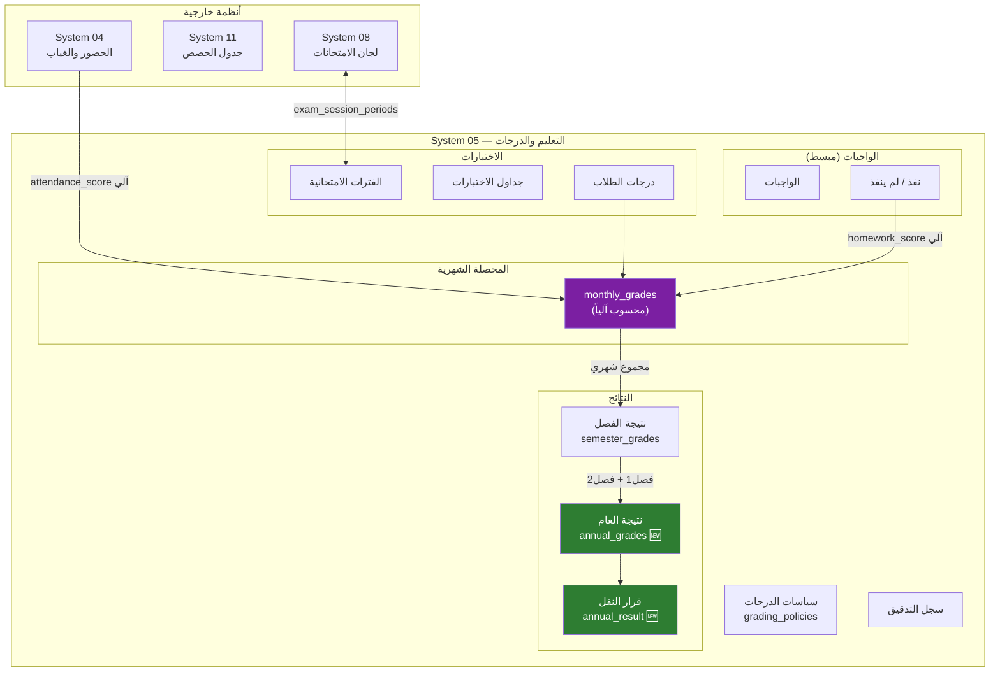

# 📊 تحليل شامل: قسم التعليم والدرجات (System 05)
## المشاكل المكتشفة + خطة إعادة الهيكلة المقترحة

---

## 📌 ملخص سريع

بعد تحليل System 05 وجميع الأنظمة المرتبطة به (04, 08, 11, 16, 17)، تم اكتشاف **6 مشاكل هيكلية** تحتاج معالجة. أدناه التحليل التفصيلي والحلول المقترحة.

---

## 🔴 المشكلة #1: درجة المواظبة (attendance_score) غير مرتبطة بنظام الحضور

### الوضع الحالي
- في [monthly_grades](file:///c:/Users/mousa/Desktop/systems/05_التعليم_والدرجات/DDL.sql#L147-L162) يوجد حقل `attendance_score` يُدخل **يدوياً**
- في [student_attendance](file:///c:/Users/mousa/Desktop/systems/04_الطلاب/DDL.sql#L277-L298) يوجد نظام حضور كامل مع `status_id` و `has_permission` و `has_excuse`

### المشكلة
❌ **لا يوجد ربط** بين `attendance_score` في الدرجات ونظام الحضور الفعلي. المعلم يكتب الرقم يدوياً!

### الحل المقترح
✅ إنشاء View أو Stored Procedure يحسب `attendance_score` **آلياً** من جدول `student_attendance`:

```sql
-- مثال: حساب درجة المواظبة من بيانات الحضور الفعلية
-- attendance_score = max_attendance_score × (أيام الحضور ÷ إجمالي الأيام)
```

---

## 🔴 المشكلة #2: لا توجد نتيجة العام (Annual Result)

### الوضع الحالي
- [semester_grades](file:///c:/Users/mousa/Desktop/systems/05_التعليم_والدرجات/DDL.sql#L164-L184): نتيجة **فصل واحد** فقط
- [v_certificate_data_primary](file:///c:/Users/mousa/Desktop/systems/17_نظام_الشهادات/DDL.sql#L111-L138): يجمع semester_grades لكن بدون جدول واضح

### المشكلة
❌ لا يوجد جدول `annual_grades` يحسب **النتيجة النهائية للعام** من الفصلين (الأول + الثاني)
❌ حساب النجاح/الرسوب/النقل غير موجود في أي مكان

### الحل المقترح
✅ إنشاء جدول `annual_grades` جديد:

```sql
-- annual_grades:
--   enrollment_id, subject_id
--   semester1_total, semester2_total
--   annual_total
--   final_status: 'ناجح' / 'راسب' / 'مكمل' / 'محروم (غياب)'
```

✅ إنشاء جدول `annual_result` للنتيجة النهائية الشاملة:

```sql
-- annual_result:
--   enrollment_id
--   total_all_subjects, percentage
--   rank_in_class
--   promotion_decision: 'ينقل للصف التالي' / 'يعيد' / 'يُفصل'
```

---

## 🔴 المشكلة #3: نظام الواجبات معقد أكثر من اللازم

### الوضع الحالي
- [homeworks](file:///c:/Users/mousa/Desktop/systems/05_التعليم_والدرجات/DDL.sql#L96-L111): تعريف واجب مع `title`, `content`, `max_grade`
- [student_homeworks](file:///c:/Users/mousa/Desktop/systems/05_التعليم_والدرجات/DDL.sql#L113-L124): رصد الواجب لكل طالب مع `status`, `grade`, `teacher_feedback`

### المشكلة
❌ في الواقع المعلم فقط يحدد: **نفّذ ✅ / لم يُنفّذ ❌** — والنظام يحسب الدرجة آلياً
❌ النظام الحالي يفترض أن كل واجب له تقييم تفصيلي وهذا غير عملي

### الحل المقترح
✅ تبسيط `student_homeworks`:

```diff
- status ENUM('COMPLETED', 'INCOMPLETE', 'LATE', 'EXCUSED')
- grade DECIMAL(4,1)
- teacher_feedback TEXT

+ is_completed BOOLEAN DEFAULT FALSE COMMENT 'نفذ/لم ينفذ'
```

✅ الدرجة تُحسب آلياً:
```
درجة الواجبات = (عدد الواجبات المنفذة ÷ إجمالي الواجبات) × max_homework_score
```

---

## 🟡 المشكلة #4: النظام "كتلة واحدة" بدلاً من أنظمة فرعية

### الوضع الحالي
كل شيء مدمج في مجلد واحد `05_التعليم_والدرجات`:
- الاختبارات + الواجبات + التحضير + الدرجات + التدقيق

### المشكلة
❌ صعوبة الصيانة والتطوير
❌ المعلم الذي يحتاج فقط رصد الواجبات يجب أن يتعامل مع كل شيء

### الحل المقترح
✅ فصل إلى ملفات DDL داخلية واضحة (داخل نفس المجلد):

```
05_التعليم_والدرجات/
├── DDL.sql                    → الجدول الرئيسي (grading_policies + lookup)
├── DDL_EXAMS.sql              → الاختبارات والفترات والرصد
├── DDL_HOMEWORKS.sql          → الواجبات المنزلية
├── DDL_MONTHLY.sql            → المحصلات الشهرية
├── DDL_SEMESTER_ANNUAL.sql    → نتائج الفصل + نتيجة العام
├── DDL_LESSON_PREP.sql        → تحضير الدروس
├── DDL_AUDIT.sql              → التدقيق والحوكمة
├── DEMO_DATA.sql
└── README.md
```

---

## 🟡 المشكلة #5: الاختبارات مكررة مع نظام لجان الامتحانات (System 08)

### الوضف الحالي
- System 05: [exam_periods](file:///c:/Users/mousa/Desktop/systems/05_التعليم_والدرجات/DDL.sql#L42-L60) + [exam_schedules](file:///c:/Users/mousa/Desktop/systems/05_التعليم_والدرجات/DDL.sql#L62-L74)
- System 08: [exam_sessions](file:///c:/Users/mousa/Desktop/systems/08_لجان_الامتحانات/DDL.sql#L82-L128) + [exam_session_periods](file:///c:/Users/mousa/Desktop/systems/08_لجان_الامتحانات/DDL.sql#L134-L148)

### العلاقة الحالية
✅ يوجد ربط عبر `exam_session_periods` — وهذا **صحيح ومصمم جيداً**:
- System 05 = **الجانب الأكاديمي** (الدرجات والمحصلات)
- System 08 = **الجانب اللوجستي** (اللجان والمقاعد والأرقام)

> [!TIP]
> هذا الجزء **لا يحتاج تعديل** — الفصل بين الأكاديمي واللوجستي سليم معمارياً.

---

## 🟡 المشكلة #6: نتيجة الترم تعتمد على `semester_work_total` يدوي

### الوضع الحالي
- `semester_work_total` في [semester_grades](file:///c:/Users/mousa/Desktop/systems/05_التعليم_والدرجات/DDL.sql#L170) يُدخل **يدوياً**

### المشكلة
❌ المفروض يُحسب **آلياً** من مجموع `monthly_grades` لنفس الفصل

### الحل المقترح
✅ إنشاء View أو Trigger يحسب `semester_work_total` آلياً:

```sql
semester_work_total = SUM(
    monthly_grades.attendance_score +
    monthly_grades.homework_score +
    monthly_grades.activity_score +
    monthly_grades.exam_score
) WHERE month_id IN (أشهر هذا الفصل)
```

---

## 📊 ملخص المشاكل والأولويات

| # | المشكلة | الأولوية | التأثير |
|---|---------|----------|---------|
| 1 | attendance_score يدوي | 🔴 **عالية** | نتائج خاطئة |
| 2 | لا يوجد نتيجة العام | 🔴 **عالية** | الشهادات ناقصة |
| 3 | الواجبات معقدة | 🔴 **عالية** | المعلمين لن يستخدموا |
| 4 | النظام كتلة واحدة | 🟡 **متوسطة** | صيانة صعبة |
| 5 | تكرار مع System 08 | ✅ **لا تحتاج** | مصمم صحيح |
| 6 | semester_work_total يدوي | 🟡 **متوسطة** | خطأ بشري محتمل |

---

## 📐 النظام بعد إعادة الهيكلة (المخطط المقترح)



---

## ❓ أسئلة تحتاج قرارك

1. **هل توافق على فصل ملفات DDL** داخل نفس المجلد (المشكلة #4)؟ أو تفضل يبقى ملف واحد؟
2. **نتيجة العام** — هل تريد جدول فعلي `annual_grades` أو View يحسبها على الطاير؟
3. **الواجبات** — هل المعلم يحدد فقط "نفذ/لم ينفذ" أو ممكن أحياناً يعطي درجة مختلفة؟
4. **هل تريد أبدأ بتنفيذ التعديلات** على DDL.sql فوراً بعد إجاباتك؟
