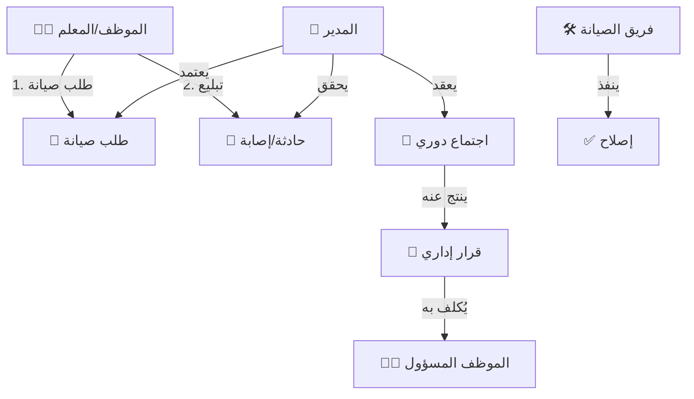

# 📁 الإدارة والعمليات (Administration & Operations)
## النسخة 2.0 - التحول للحوكمة المؤسسية 🏛️

---

## 📌 بطاقة النظام
| البند | القيمة |
|-------|--------|
| **المهندس المسؤول** | عماد الجماعي |
| **عدد الجداول** | 16 جدولاً مركّزاً (بعد الإصلاح المعماري) |
| **الملفات** | `DDL.sql` |
| **حالة المراجعة** | ✅ تمت إعادة الهيكلة الشاملة (Governance Refactor) |

## 🚀 المقدمة
الإدارة المدرسية الناجحة لا تقتصر على الفصول الدراسية، بل تمتد لتشمل صيانة المبنى، نظافة المرافق، استقبال الزوار، وتنظيم الاجتماعات. النظام الإداري هو "الدينامو" الذي يحرك العمليات اليومية خلف الكواليس، ليضمن بيئة مدرسية نظيفة، آمنة، ومنظمة تساعد على الإبداع.

## 🏗️ دورة العمليات (Operations Workflow)



## 💎 الفوائد الملموسة (القابلة للقياس)
- **طول عمر الممتلكات:** الصيانة الاستباقية للمقاعد والأجهزة توفر مبالغ طائلة.
- **توثيق تاريخي:** كل اجتماع، قرار، أو فعالية تم توثيقها بالصور والتفاصيل للرجوع إليها.
- **بيئة احترافية:** تنظيم دخول الزوار وحل مشكلاتهم بسرعة يعكس صورة إيجابية للمدرسة.

## 🌟 الفوائد غير الملموسة (القيمة الإدارية)
- **المسؤولية:** تحديد المسؤول عن كل عطل أو إهمال.
- **الذاكرة المؤسسية:** لا تضيع القرارات بتغير الإدارة، فكل شيء مسجل في المحاضر.
- **تفعيل الشراكة:** منح مجلس الآباء دور حقيقي ومنظم.

## 📖 أمثلة واقعية من داخل المدرسة
- **وكيل المدرسة:** يلاحظ تكدس الزوار عند البوابة، فيراجع "سجل الزيارات" لمعرفة أوقات الذروة وتنظيم المواعيد.
- **أمين المخزن:** بدلاً من العد اليدوي للكراسي كل يوم، يطبع "تقرير جرد الفصول" ويطابقه مع الواقع في دقائق.
- **المعلم:** يطلب صيانة للمروحة في فصله عبر التطبيق، فيستلم مسؤول الصيانة الطلب فوراً ويتم الإصلاح دون الحاجة لمطاردة العامل في الممرات.

---

## 🎯 الرؤية الجديدة
تحويل نظام الإدارة من مجرد "سجل تدوين" (Logbook) إلى **نظام حوكمة متصل** يربط القرارات بالتنفيذ، والصيانة بالمرافق، والحوادث بالمسؤولية القانونية.

## 🚀 المميزات المضافة (Governance 2.0)

1.  **سجل المشكلات الموحد (Unified Incidents):** إدارة مشكلات الطلاب، الموظفين، وأولياء الأمور في قاعدة بيانات مركزية مع تتبع دقيق للزمان (هجري/ميلادي) والشهود والمحاضر.
2.  **سجل الزوار المطوّر:** تتبع هوية الزوار، غرض الزيارة، والجهة القادمين منها، مع ربطها بالتقويم الدراسي المفصل.
3.  **حوكمة الاعتماد:** لا يتم إغلاق أي مشكلة إلا بدخول المدير واعتماد الإجراءات المتخذة.
4.  **نظام المرفقات:** ربط محاضر التحقيق وصور الوثائق رسمياً بكل حادثة أو زيارة.

---

## 🛠️ التغييرات الجوهرية (Refactor Log)

1.  **حوكمة الاجتماعات:** القرارات لم تعد مجرد "نص"؛ بل أصبحت كياناً مستقلاً (`meeting_decisions`) مرتبطاً بمسؤول تنفيذ وتاريخ استحقاق.
2.  **مركزية المرافق:** استبدال حقول مكان النشاط النصية بجدول مرجعي `lookup_facility_types` لتوحيد التقارير.
3.  **الربط مع القوى البشرية:** تفعيل `employee_id` في كافة العمليات (إسعاف، إشراف، صيانة) لضمان المساءلة.
4.  **نظام الصيانة:** التحول من "جدول إتلافات" بسيط إلى دورة حياة صيانة تتكون من (طلب صيانة -> تنفيذ -> تحقق).
5.  **سجلات السلامة:** تحويل سجل الإسعافات إلى "وثيقة قانونية" تشمل وقت الحادث، المسعف، وحالة إخطار ولي الأمر.

---

# 📊 قاموس البيانات (Data Dictionary) - عينات

## 1️⃣ إدارة الاجتماعات (Governance)
| الجدول | الوصف | الحقول الرئيسية |
|--------|-------|----------------|
| `meetings` | سياق الاجتماع | `meeting_type_id`, `status_id`, `minutes_approved_by` |
| `meeting_decisions` | متابعة المهام | `decision_text`, `assigned_employee_id`, `execution_status` |

---

## 2️⃣ العمليات والصيانة (O&M)
| الجدول | الوصف | الحقول الرئيسية |
|--------|-------|----------------|
| `maintenance_requests` | التبليغ عن خلل | `facility_id`, `priority`, `status_id` |
| `maintenance_logs` | توثيق الإصلاح | `action_taken`, `cost`, `verified_by_employee_id` |

---

## 3️⃣ السلامة والمسؤولية القانونية
| الجدول | الوصف | الحقول الرئيسية |
|--------|-------|----------------|
| `first_aid_incidents` | سجل الحوادث | `incident_time`, `executor_employee_id`, `parent_notified` |
| `visitor_logs` | سجل الزوار المطوّر | `visitor_source_id`, `is_documented_in_record`, `visit_reason` |
| `gov_incidents` | سجل المشكلات الموحد | `target_type_id`, `incident_sequence`, `witnesses_names` |

---

## 🔗 روابط التكامل
- **نظام الموارد البشرية (03):** لتحديد المسؤولين عن الإسعاف، الصيانة، والإشراف.
- **نظام الطلاب (04):** لربط الحوادث الصحية والمشاركة في الإذاعة.
- **البنية المشتركة (01):** المصدر الوحيد لأنواع المرافق، الزوار، وحالات الصيانة.

---
- **البنية المشتركة (01):** المصدر الوحيد لأنواع المرافق، الزوار، وحالات الصيانة.

---

## 💡 كيف يستخدم المبرمج هذا النظام؟ (SQL Examples)

### 1. تقرير "أكثر المرافق تضرراً" (للصيانة الوقائية)
```sql
SELECT 
    f.name_ar AS facility_name,
    COUNT(mr.id) AS incidents_count,
    SUM(ml.cost) AS total_repair_cost
FROM maintenance_requests mr
JOIN facilities f ON mr.facility_id = f.id
LEFT JOIN maintenance_logs ml ON mr.id = ml.request_id
WHERE mr.created_at >= DATE_SUB(NOW(), INTERVAL 1 YEAR)
GROUP BY f.name_ar
ORDER BY total_repair_cost DESC;
```

### 2. متابعة تنفيذ القرارات الإدارية
```sql
SELECT 
    m.title AS meeting_title,
    md.decision_text,
    e.full_name AS assigned_to,
    md.execution_status
FROM meeting_decisions md
JOIN meetings m ON md.meeting_id = m.id
JOIN employees e ON md.assigned_employee_id = e.id
WHERE md.execution_status != 'COMPLETED';
```

---
**شركة إنما سوفت للحلول التقنية** | 2026
