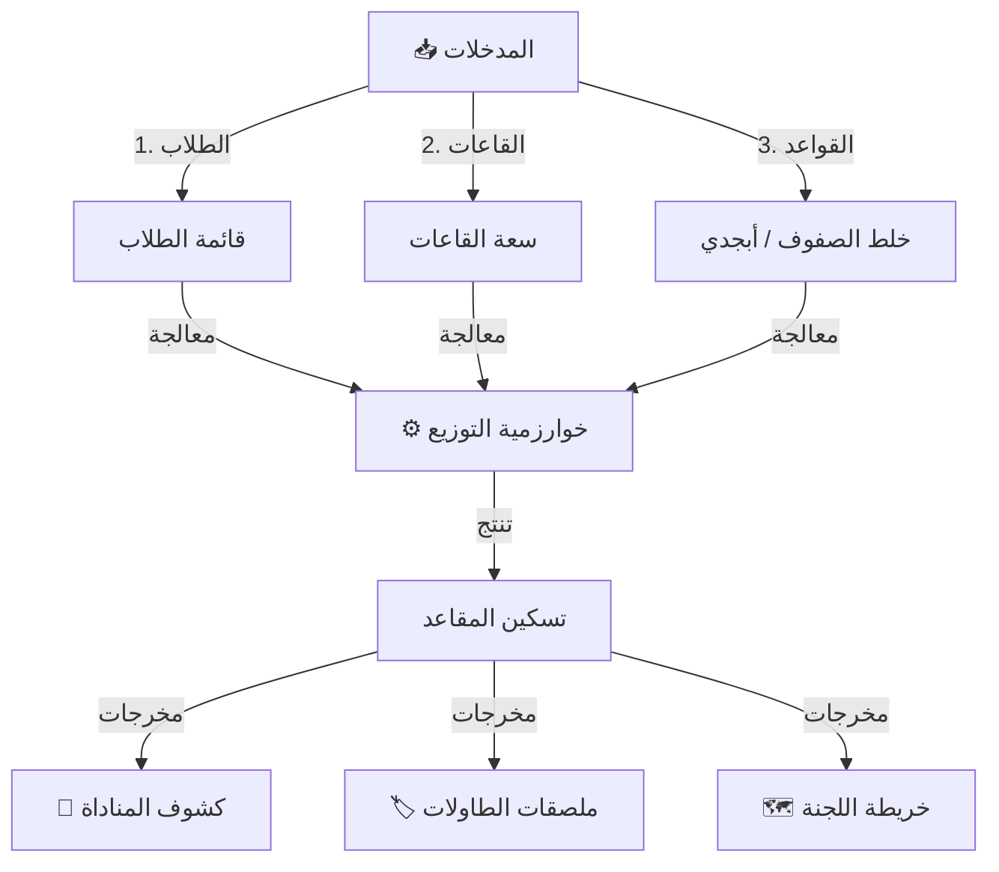

# 📁 لجان الامتحانات
## Exam Committees Distribution

---

## 📌 بطاقة النظام

| البند | القيمة |
|-------|--------|
| **المهندس المسؤول** | عمار الشعيبي / موسى العواضي |
| **عدد الجداول** | 12 جدول + 3 Views |
| **النسبة** | جزء من 16% |
| **ملف DDL** | `DDL.sql` |

---

## 🚀 المقدمة
فترة الامتحانات هي "موسم الحصاد"، ولكنها غالباً ما تكون "موسم الطوارئ" إدارياً بسبب فوضى توزيع الطلاب واللجان. نظام لجان الامتحانات يأتي ليفرض الهدوء والنظام؛ من خلال توزيع آلي وذكي يضمن العدالة، ويمنع الغش، ويوفر الجهد الهائل الذي يبذل في الترتيب اليدوي.

## ❓ ماذا يقدّم هذا النظام؟
يحول قاعات الامتحانات إلى بيئة منظمة بدقة:
- **توزيع آلي:** للطلاب على القاعات والمقاعد.
- **أرقام جلوس:** توليد وإدارة أرقام الجلوس والسرية.
- **إدارة اللجان:** كشوفات المناداة، ملصقات الطاولات، وتوزيع المراقبين.

## 💎 الفوائد الملموسة (القابلة للقياس)
- **توفير 90% من وقت التجهيز:** بدلاً من أسبوع عمل يدوي لترتيب اللجان، يتم التوزيع في دقائق.
- **منع الغش:** خوارزميات تضمن عدم جلوس طالبين من نفس الفصل بجوار بعضهما (الخلط الآلي).
- **الاستغلال الأمثل للمساحة:** توزيع الطلاب حسب سعة كل قاعة بالضبط.

## 🌟 الفوائد غير الملموسة (القيمة الإدارية)
- **الهيبة:** نظام صارم يعطي انطباعاً بالجدية للطلاب.
- **العدالة:** التوزيع عشوائي أو أبجدي وفق قواعد ثابتة تطبق على الجميع.
- **الهدوء:** كل طالب يعرف مكانه مسبقاً، مما يمنع التدافع والفوضى صباح يوم الامتحان.

## 🔄 كيف يعمل النظام؟ (بأسلوب مبسّط)
1. **الإعداد:** تحديد القاعات المتاحة وسعة كل قاعة.
2. **القواعد:** اختيار طريقة التوزيع (مثلاً: خلط صف تاسع مع أول ثانوي).
3. **التنفيذ:** ضغطة زر واحدة لتوزيع الطلاب وتوليد أرقام الجلوس.
4. **الطباعة:** طباعة ملصقات الطاولات، وكشوف المناداة للمراقبين على الباب.

## 🏗️ مكونات النظام (البيانات التي يعتمد عليها)

### 1. البيانات الأساسية (المكان)
- **اللجان (القاعات):** تعريف الغرف المتاحة وكم مقعداً فيها.
- **الأطر (Layout):** تخطيط القاعة (كم عمود وكم صف) ليعرف النظام أين اليمين وأين اليسار.

### 2. عمليات التوزيع (الخوارزمية)
- **إعدادات التوزيع:** خلط الصفوف، الفصل بين الجنسين، الترتيب الأبجدي.
- **أرقام الجلوس:** الرقم الذي سيتعامل به الطالب طوال فترة الامتحانات.

### 3. المخرجات والتقارير
- **خريطة اللجنة:** رسم توضيحي للقاعة ومن يجلس أين.
- **ملصقات المقاعد (Labels):** قصاصات تلصق على الطاولة باسم الطالب ورقم جلوسه.
- **كشف توقيع الحضور:** القائمة التي يوقع عليها الطالب داخل اللجنة.

## 📖 أمثلة واقعية من داخل المدرسة
- **رئيس الكنترول:** يريد منع الغش في صفوف الشهادة، فيختار خيار "توزيع شطرنجي" (طالب تاسع بجوار طالب أول ثانوي)، فيقوم النظام بفرزهم آلياً بهذا النمط في ثوانٍ.
- **الطالب:** يصل يوم الامتحان فيجد اسمه ورقمه ملصقاً على طاولته، فيجلس مباشرة ويبدأ الحل بهدوء.

## 🆚 مقارنة بالطريقة التقليدية

| الميزة | الطريقة اليدوية | نظام لجان الامتحانات |
|--------|-----------------|----------------------|
| **التوزيع** | كتابة الأسماء يدوياً ومحاولة الخلط (مرهق جداً) | توزيع رياضي دقيق بضغطة زر |
| **التغييرات** | صعوبة نقل طالب أو تعديل لجنة | إعادة توزيع مرنة مع تحديث كل الكشوفات |
| **الملصقات** | قص ولصق وكتابة يدوية | طباعة جاهزة ومنسقة |

## ❓ أسئلة شائعة (FAQ)
**س: هل يُراعي النظام الطلاب ذوي الاحتياجات (مثل ضعاف النظر)؟**
ج: نعم، يمكن تثبيت مقاعد محددة (في الصف الأول مثلاً) لطلاب معينين، ويقوم النظام بتوزيع البقية حولهم.

**س: هل يمكن استخدام النظام لاختبارات الشهر؟**
ج: نعم، ولكنه مصمم بشكل أساسي للامتحانات النصفية والنهائية التي تتطلب لجاناً رسمية.

## 📝 الخلاصة التنفيذية
نظام لجان الامتحانات هو **مهندس النظام** في وقت الفوضى. يحول عملية الامتحانات المعقدة والموترة إلى إجراء روتيني سلس منظم، مما يوفر بيئة هادئة تساعد الطالب على التركيز وتقديم أفضل ما لديه.

---

## 🚦 خوارزمية التوزيع (Distribution Logic)



## 🎯 وظيفة النظام
أتمتة عملية توزيع الطلاب على لجان الاختبارات، إدارة أرقام الجلوس، وتوزيع المراقبين، مع ضمان عدالة التوزيع ومنع الغش (مثل خلط الصفوف، وتوزيع الجنسين بحسب السياسة).

---

# 📊 تفاصيل الجداول والبيانات (Tables & Data Dictionary)

---

## 1️⃣ جدول جلسات الامتحان (exam_sessions)

يمثل "موسم" امتحاني كامل، مثل "اختبارات الفصل الدراسي الأول 2026/2026".

| الحقل | الوصف | مثال |
|-------|-------|------|
#### 🏗️ بنية الجدول (Schema Structure)
| اسم العمود | نوع البيانات | Null? | Default | مفتاح | الوصف |
|------------|--------------|-------|---------|-------|-------|
| `id` | INT UNSIGNED | NO | Auto Inc | PK | المعرف الفريد |
| `academic_year_id` | INT UNSIGNED | NO | - | FK | العام الدراسي |
| `semester_id` | INT UNSIGNED | NO | - | FK | الفصل الدراسي |
| `exam_name` | VARCHAR(100) | NO | - | - | اسم الامتحان |
| `exam_type` | ENUM | YES | فصلي | - | نوع الامتحان |
| `building_id` | TINYINT UNSIGNED | YES | NULL | FK | المبنى (من System 01) |
| `round_number` | TINYINT UNSIGNED | YES | 1 | - | الدور |
| `start_date` | DATE | YES | NULL | - | تاريخ البداية |
| `end_date` | DATE | YES | NULL | - | تاريخ النهاية |
| `is_locked` | BOOLEAN | YES | FALSE | - | هل تم القفل؟ |

**ملاحظة:** تم تحديث النظام ليرتبط بجدول `lookup_buildings` في البنية المشتركة لضمان توافق أسماء المباني.

#### 📋 بيانات استرشادية
| id | exam_name | exam_type | school_building | start_date | is_locked |
|----|-----------|-----------|-----------------|------------|-----------|
| 1 | اختبارات نهاية الفصل الأول 2025/2026 | فصلي | الجديدة | 2026-01-15 | 0 |
| 2 | اختبارات نهاية العام 2025/2026 | نهائي | كلاهما | 2026-06-01 | 0 |
| 3 | اختبارات الدور الثاني 2025/2026 | نهائي | القديمة | 2026-08-01 | 0 |
| 4 | اختبارات نصفية (الشهر الثالث) | شهري | الجديدة | 2025-11-20 | 1 |
| 5 | اختبارات قبول المستجدين | أخرى | الجديدة | 2025-08-15 | 1 |

---

## 2️⃣ جدول اللجان (exam_committees)

القاعات التي يتم فيها الاختبار (لجنة 1، لجنة 2...).

| الحقل | الوصف | مثال |
|-------|-------|------|
| `committee_number` | رقم اللجنة | 1 |
| `location` | المكان | قاعة ابن سيناء |
| `total_capacity` | السعة | 30 |

#### 🏗️ بنية الجدول (Schema Structure)
| اسم العمود | نوع البيانات | Null? | Default | مفتاح | الوصف |
|------------|--------------|-------|---------|-------|-------|
| `id` | INT UNSIGNED | NO | Auto Inc | PK | المعرف الفريد |
| `exam_session_id` | INT UNSIGNED | NO | - | FK | جلسة الامتحان |
| `committee_number` | SMALLINT UNSIGNED | NO | - | - | رقم اللجنة |
| `location` | VARCHAR(100) | YES | NULL | - | اسم القاعة/المكان |
| `classroom_id` | INT UNSIGNED | YES | NULL | FK | الفصل (اختياري) |
| `total_capacity` | SMALLINT UNSIGNED | NO | 0 | - | السعة الكلية |

#### 📋 بيانات استرشادية
| id | exam_session_id | committee_number | location | classroom_id | total_capacity |
|----|-----------------|------------------|----------|--------------|----------------|
| 1 | 1 | 1 | القاعة الكبرى | 10 | 100 |
| 2 | 1 | 2 | معمل الحاسوب | 12 | 25 |
| 3 | 1 | 3 | فصل 1/أ | 1 | 20 |
| 4 | 1 | 4 | فصل 1/ب | 2 | 20 |
| 5 | 1 | 5 | فصل 2/أ | 3 | 20 |
| 6 | 1 | 6 | فصل 2/ب | 4 | 20 |
| 7 | 1 | 7 | فصل 3/أ | 5 | 20 |
| 8 | 1 | 8 | فصل 3/ب | 6 | 20 |
| 9 | 1 | 9 | الخيمة | NULL | 50 |
| 10 | 1 | 10 | المكتبة | 11 | 30 |

---

## 3️⃣ جدول أطر اللجان (committee_frames)

التقسيم الداخلي للجنة (صف يمين، صف وسط، صف يسار).

| الحقل | الوصف |
|-------|-------|
| `committee_id` | اللجنة |
| `frame_number` | رقم الإطار (1، 2، 3) |
| `frame_gender` | جنس الإطار (ذكور/إناث) |

#### 📋 بيانات استرشادية
| id | committee_id | frame_number | frame_name_id | frame_gender | capacity |
|----|--------------|--------------|---------------|--------------|----------|
| 1 | 3 | 1 | 1 (جدار) | ذكور | 7 |
| 2 | 3 | 2 | 2 (وسط) | إناث | 6 |
| 3 | 3 | 3 | 3 (باب) | ذكور | 7 |
| 4 | 4 | 1 | 1 | إناث | 7 |
| 5 | 4 | 2 | 2 | ذكور | 6 |
| 6 | 4 | 3 | 3 | إناث | 7 |
| 7 | 1 | 1 | 1 | مختلط | 25 |
| 8 | 1 | 2 | 2 | مختلط | 50 |
| 9 | 1 | 3 | 3 | مختلط | 25 |
| 10 | 2 | 1 | 1 | مختلط | 25 |

---

## 4️⃣ جدول المقاعد (exam_seats)

وحدات الجلوس الفردية داخل كل إطار.

| الحقل | الوصف |
|-------|-------|
| `frame_id` | الإطار |
| `seat_number` | رقم المقعد المتسلسل |

#### 📋 بيانات استرشادية
| id | frame_id | seat_number | seat_position_id | is_available |
|----|----------|-------------|------------------|--------------|
| 1 | 1 | 1 | 1 (يمين) | 1 |
| 2 | 1 | 2 | 1 | 1 |
| 3 | 1 | 3 | 1 | 1 |
| 4 | 1 | 4 | 1 | 1 |
| 5 | 1 | 5 | 1 | 1 |
| 6 | 2 | 6 | 2 (وسط) | 1 |
| 7 | 2 | 7 | 2 | 1 |
| 8 | 2 | 8 | 2 | 1 |
| 9 | 3 | 13 | 3 (شمال) | 1 |
| 10 | 3 | 14 | 3 | 1 |

---

## 5️⃣ جدول التعيينات (exam_assignments)

الربط النهائي بين الطالب والمقعد.

| الحقل | الوصف |
|-------|-------|
| `exam_session_id` | الجلسة |
| `enrollment_id` | الطالب |
| `seat_id` | المقعد |
| `is_fixed` | مثبت يدوياً؟ |

#### 📋 بيانات استرشادية
| id | exam_session_id | enrollment_id | committee_id | seat_id | is_fixed |
|----|-----------------|---------------|--------------|---------|----------|
| 1 | 1 | 1001 | 3 | 1 | 0 |
| 2 | 1 | 1002 | 3 | 6 | 0 |
| 3 | 1 | 1003 | 3 | 2 | 0 |
| 4 | 1 | 1004 | 3 | 7 | 0 |
| 5 | 1 | 1005 | 3 | 3 | 0 |
| 6 | 1 | 1006 | 3 | 8 | 0 |
| 7 | 1 | 1007 | 3 | 4 | 1 (ضعيف نظر - مقعد أمامي) |
| 8 | 1 | 1008 | 3 | 9 | 0 |
| 9 | 1 | 1009 | 3 | 5 | 0 |
| 10 | 1 | 1010 | 3 | 10 | 0 |

---

## 6️⃣ جدول إعدادات التوزيع (exam_distribution_settings)

| الحقل | الوصف |
|-------|-------|
| `exam_session_id` | الجلسة |
| `mix_grades` | خلط الصفوف |

#### 📋 بيانات استرشادية
| id | exam_session_id | gender_policy_id | ordering_method_id | mix_grades |
|----|-----------------|------------------|--------------------|------------|
| 1 | 1 | 2 (دمج بإطارات منفصلة) | 4 (متوازن) | 1 |
| 2 | 2 | 2 | 4 | 1 |
| 3 | 3 | 3 (حر) | 1 (أبجدي) | 0 |
| 4 | 4 | 1 (فصل كامل) | 2 (صف ثم أبجدي) | 0 |

---

| 4 | 4 | 1 (فصل كامل) | 2 (صف ثم أبجدي) | 0 |

---

## 💡 كيف يستخدم المبرمج هذا النظام؟ (SQL Examples)

### 1. طباعة "كشف المناداة" للجنة معينة
```sql
SELECT 
    ea.committee_id,
    es.seat_number,
    s.full_name AS student_name,
    g.name_ar AS grade_name
FROM exam_assignments ea
JOIN students s ON ea.enrollment_id = s.id
JOIN student_enrollments se ON s.id = se.student_id
JOIN grade_levels g ON se.grade_level_id = g.id
JOIN exam_seats es ON ea.seat_id = es.id
WHERE ea.committee_id = 1
ORDER BY es.seat_number ASC;
```

### 2. البحث عن طالب (أين يجلس؟)
```sql
SELECT 
    s.full_name,
    ec.committee_number,
    ec.location,
    es.seat_number
FROM exam_assignments ea
JOIN students s ON ea.enrollment_id = s.id
JOIN exam_committees ec ON ea.committee_id = ec.id
JOIN exam_seats es ON ea.seat_id = es.id
WHERE s.full_name LIKE '%محمد أحمد%';
```

---

**المهندس المسؤول:** عمار الشعيبي
**تم التحديث:** 2026-01-16 (إضافة قاموس البيانات)
