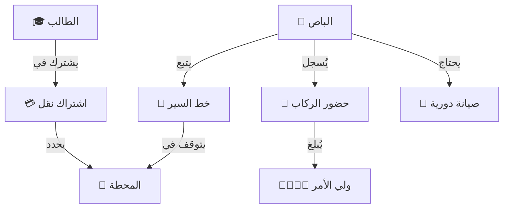

# 📁 النقل المدرسي
## Transportation System

---

## 📌 بطاقة النظام

| البند | القيمة |
|-------|--------|
| **المهندس المسؤول** | يونس العفيف / فيصل الجماعي |
| **عدد الجداول** | 9 جداول + 3 Views |
| **النسبة** | جزء من 10% |
| **ملف DDL** | `DDL.sql` |

---

## 🚀 المقدمة
رحلة الطالب المدرسية تبدأ من باب منزله لا من باب المدرسة. نظام النقل المدرسي هو المسؤول عن تأمين هذه الرحلة اليومية، وضمان وصول الطلاب آمنين وفي الوقت المحدد، مع إدارة أسطول الباصات بكفاءة لتقليل التكاليف وضمان السلامة.

## ❓ ماذا يقدّم هذا النظام؟
حل لوجستي متكامل لإدارة الحركة:
- **للطلاب:** ضمان مقعد ومسار محدد.
- **لأولياء الأمور:** الاطمئنان على ركوب ووصول أبنائهم.
- **للمدرسة:** إدارة الباصات، السائقين، خطوط السير، والاشتراكات المالية.

## 💎 الفوائد الملموسة (القابلة للقياس)
- **الكفاءة التشغيلية:** توزيع الطلاب على الباصات بناءً على مناطقهم لتقليل زمن الرحلة واستهلاك الوقود.
- **الرقابة المالية:** متابعة دقيقة لمن دفع اشتراك الباص ومن عليه متأخرات.
- **الصيانة:** التنبيه بمواعيد صيانة الباصات لتجنب الأعطال المفاجئة.

## 🌟 الفوائد غير الملموسة (القيمة الإدارية)
- **الأمان:** معرفة من ركب الباص ومن لم يركب في أي لحظة.
- **الراحة:** تقليل الشكاوى من تأخر الباصات أو تكدس الطلاب.
- **السمعة:** خدمة نقل منضبطة وآمنة تعتبر ميزة تنافسية قوية للمدرسة.

## 🔄 كيف يعمل النظام؟ (بأسلوب مبسّط)
1. **التخطيط:** رسم خطوط السير (مثل: خط الدائري، خط المطار) وتحديد المحطات.
2. **الاشتراك:** تسجيل الطالب في الخط المناسب لمنطقته.
3. **التشغيل:** السائق لديه قائمة بطلابه، ومشرف الباص يسجل الركوب والنزول يومياً.
4. **المتابعة:** الإدارة تتابع حركة الباصات وحضور الطلاب.

## 🏗️ مكونات النظام (البيانات التي يعتمد عليها)

### 1. الأسطول (الأصول)
- **الباصات:** بيانات المركبة، السعة، السائق، وتاريخ الترخيص.
- **الصيانة:** سجل الإصلاحات وتغيير الزيت والقطع.

### 2. الحركة (الخطوط)
- **خطوط السير (Routes):** مسار الرحلة وتوقيتها (صباحاً/ظهراً).
- **المحطات:** نقاط التوقف المحددة لكل خط.

### 3. الاشتراكات (الطلاب)
- **سجل المشتركين:** من مشترك في أي باص؟ وهل ذهاب وإياب أم أحدهما؟
- **سجل الركوب (Attendance):** التحضير اليومي داخل الباص.

## 📖 أمثلة واقعية من داخل المدرسة
- **ولي الأمر:** يتصل قلقاً لأن ابنه تأخر، يفتح المسؤول النظام فيخبره: "ابنك لم يصعد باص العودة اليوم، بل خرج مع أخيه". معلومة دقيقة تنهي القلق.
- **مسؤول الحركة:** يريد دمج خطين لقلة الطلاب، يستخرج تقرير "عدد الطلاب لكل منطقة" ويعيد رسم المسارات لتوفير باص كامل.

## 🆚 مقارنة بالطريقة التقليدية

| الميزة | الطريقة اليدوية | نظام النقل الذكي |
|--------|-----------------|------------------|
| **القوائم** | كشوفات ورقية تتلف وتضيع | قوائم إلكترونية في يد المشرف |
| **المتابعة** | لا أحد يعرف هل ركب الطالب أم لا | تسجيل حضور دقيق داخل الباص |
| **المالية** | ضياع رسوم الباص وسط الرسوم العامة | حساب منفصل للاشتراكات ومتابعتها |

## ❓ أسئلة شائعة (FAQ)
**س: هل يمكن لطالب تغيير الباص ليوم واحد؟**
ج: نعم، يمكن للمشرف نقل الطالب مؤقتاً لباص آخر (بإذن) ويظهر اسمه في قائمة الباص الجديد لذلك اليوم.

**س: كيف يعرف السائق المحطات الجديدة؟**
ج: عند إضافة مشترك جديد، يُحدث النظام قائمة السائق ومحطاته فوراً.

## 📝 الخلاصة التنفيذية
نظام النقل المدرسي هو **شريان الحركة**. يحول عملية النقل من عبء لوجستي معقد إلى خدمة سلسة وآمنة، تضمن راحة البال للأهل، والانضباط في مواعيد الدوام المدرسي.

---

## 🚦 انسياب الحركة اليومية (Operations Flow)



## 🎯 وظيفة النظام
إدارة أسطول الباصات، خطوط السير والمحطات، اشتراكات الطلاب، ومتابعة ركوب ونزول الطلاب لضمان سلامتهم.

---

# 📊 تفاصيل الجداول والبيانات (Tables & Data Dictionary)

---

## 1️⃣ جدول الباصات (buses)

| الحقل | الوصف | مثال |
|-------|-------|------|
| `bus_number` | رقم الباص (الداخلي) | B-01 |
| `plate_number` | اللوحة | 1234 فاصل 1 |
| `capacity` | السعة | 30 |

#### 📋 بيانات استرشادية
| id | bus_number | plate_number | brand | driver_id | status |
|----|------------|--------------|-------|-----------|--------|
| 1 | B-01 | 1122 أ ر ي | Toyota Coaster | 120 (سائق 1) | عامل |
| 2 | B-02 | 3344 د س ط | Toyota Coaster | 121 (سائق 2) | عامل |
| 3 | B-03 | 5566 م ن و | Nissan Civilian | 122 (سائق 3) | صيانة |
| 4 | B-04 | 7788 ف ق ل | Hyundai | 123 | عامل |
| 5 | B-05 | 9900 ص ض ط | Toyota | 124 | عامل |
| 6 | B-06 | 1212 ش س ي | Mercedes | 125 | معطل |
| 7 | B-07 | 3434 ز و ة | Toyota | 126 | عامل |
| 8 | B-08 | 5656 ب ن م | Nissan | 127 | عامل |
| 9 | B-09 | 7878 ك م ن | Hyundai | 128 | عامل |
| 10 | B-10 | 9090 ت ا ل | Toyota | 129 | عامل |

---

## 2️⃣ جدول خطوط السير (bus_routes)

| الحقل | الوصف | مثال |
|-------|-------|------|
| `route_name` | اسم الخط | خط حدة - المدينة |
| `bus_id` | الباص | B-01 |
| `direction` | الاتجاه | ذهاب |

#### 📋 بيانات استرشادية
| id | bus_id | route_name | direction | departure_time | estimated_duration |
|----|--------|------------|-----------|----------------|--------------------|
| 1 | 1 | خط حدة الصباحي | ذهاب | 06:30 | 45 |
| 2 | 1 | خط حدة المسائي | إياب | 13:00 | 45 |
| 3 | 2 | خط الستين الصباحي | ذهاب | 06:15 | 60 |
| 4 | 2 | خط الستين المسائي | إياب | 13:00 | 60 |
| 5 | 4 | خط المطار | ذهاب | 06:00 | 75 |
| 6 | 4 | خط المطار | إياب | 13:00 | 75 |
| 7 | 5 | خط الدائري | ذهاب | 06:45 | 30 |
| 8 | 5 | خط الدائري | إياب | 13:00 | 30 |
| 9 | 7 | خط الصافية | ذهاب | 06:30 | 40 |
| 10 | 7 | خط الصافية | إياب | 13:00 | 40 |

---

## 3️⃣ جدول محطات الخط (route_stops)

| الحقل | الوصف | ملاحظات |
|-------|-------|---------|
| `route_id` | الخط | FK |
| `stop_order` | الترتيب | 1 (أول محطة) |
| `stop_name` | اسم المحطة | جولة المصباحي |

#### 📋 بيانات استرشادية
| id | route_id | stop_name | stop_order | arrival_time | locality_id |
|----|----------|-----------|------------|--------------|-------------|
| 1 | 1 | جولة المصباحي | 1 | 06:35 | 5 |
| 2 | 1 | الكميم | 2 | 06:45 | 6 |
| 3 | 1 | الزبيري | 3 | 06:55 | 7 |
| 4 | 1 | المدرسة | 4 | 07:15 | NULL |
| 5 | 3 | جولة عمران | 1 | 06:20 | 8 |
| 6 | 3 | شارع تعز | 2 | 06:40 | 9 |
| 7 | 3 | المدرسة | 3 | 07:15 | NULL |
| 8 | 5 | المطار | 1 | 06:05 | 10 |
| 9 | 5 | دارس | 2 | 06:30 | 11 |
| 10 | 5 | المدرسة | 3 | 07:15 | NULL |

---

## 4️⃣ جدول الاشتراكات (bus_subscriptions)

| الحقل | الوصف |
|-------|-------|
| `enrollment_id` | الطالب |
| `route_id` | الخط |
| `stop_id` | المحطة |
| `subscription_type_id` | النوع (ذهاب/إياب/كلاهما) |

#### 📋 بيانات استرشادية
| id | enrollment_id | route_id | stop_id | subscription_type_id | monthly_fee | is_active |
|----|---------------|----------|---------|----------------------|-------------|-----------|
| 1 | 1001 | 1 | 1 | 3 (ذهاب وإياب) | 12000 | 1 |
| 2 | 1002 | 1 | 1 | 3 | 12000 | 1 |
| 3 | 1003 | 1 | 2 | 3 | 12000 | 1 |
| 4 | 1004 | 3 | 5 | 3 | 15000 | 1 |
| 5 | 1005 | 3 | 6 | 3 | 15000 | 1 |
| 6 | 1006 | 5 | 8 | 3 | 18000 | 1 |
| 7 | 1007 | 1 | 2 | 1 (ذهاب فقط) | 7000 | 1 |
| 8 | 1008 | 7 | 8 | 2 (إياب فقط) | 7000 | 1 |
| 9 | 1009 | 7 | 8 | 3 | 10000 | 0 |
| 10 | 1010 | 3 | 6 | 3 | 15000 | 1 |

---

## 5️⃣ جدول حضور الباص (bus_attendance)

تسجيل ركوب الطالب للحافلة.

| الحقل | الوصف |
|-------|-------|
| `attendance_date` | التاريخ |
| `status_id` | الحالة (ركب/لم يركب) |
| `actual_pickup_time` | وقت الركوب |

#### 📋 بيانات استرشادية
| id | subscription_id | attendance_date | direction | status_id | actual_pickup_time |
|----|-----------------|-----------------|-----------|-----------|--------------------|
| 1 | 1 | 2026-01-01 | ذهاب | 1 (ركب) | 06:36 |
| 2 | 2 | 2026-01-01 | ذهاب | 1 | 06:37 |
| 3 | 3 | 2026-01-01 | ذهاب | 1 | 06:48 |
| 4 | 4 | 2026-01-01 | ذهاب | 1 | 06:22 |
| 5 | 5 | 2026-01-01 | ذهاب | 2 (لم يركب) | NULL |
| 6 | 6 | 2026-01-01 | ذهاب | 1 | 06:07 |
| 7 | 1 | 2026-01-01 | إياب | 1 | 13:05 |
| 8 | 2 | 2026-01-01 | إياب | 1 | 13:05 |
| 9 | 4 | 2026-01-01 | إياب | 1 | 13:10 |
| 10 | 6 | 2026-01-01 | إياب | 1 | 13:10 |

---

## 6️⃣ جدول الصيانة (bus_maintenance)

| الحقل | الوصف |
|-------|-------|
| `description` | العطل |
| `cost` | الكلفة |

#### 📋 بيانات استرشادية
| id | bus_id | maintenance_type | maintenance_date | description | cost | status |
|----|--------|------------------|------------------|-------------|------|--------|
| 1 | 3 | إصلاح | 2026-01-02 | تغيير زيت وفلاتر | 15000 | مكتمل |
| 2 | 3 | طارئة | 2026-01-03 | انفجار إطار | 25000 | مكتمل |
| 3 | 1 | دورية | 2026-01-01 | فحص شامل | 5000 | مكتمل |
| 4 | 2 | دورية | 2026-01-01 | فحص شامل | 5000 | مكتمل |
| 5 | 6 | إصلاح | 2026-01-10 | سمكرة ودهان | 150000 | جاري |
| 6 | 4 | طارئة | 2026-01-15 | تغيير بطارية | 30000 | مكتمل |
| 7 | 5 | دورية | 2026-01-20 | تغيير زيت | 8000 | مجدول |
| 8 | 7 | إصلاح | 2026-01-22 | إصلاح تكيف | 40000 | مجدول |
| 9 | 8 | فحص | 2026-01-25 | فحص فرامل | 2000 | مكتمل |
| 10 | 9 | إصلاح | 2026-01-28 | تغيير مساحات | 3000 | مكتمل |

---

## 💡 كيف يستخدم المبرمج هذا النظام؟ (SQL Examples)

### 1. طباعة "قائمة ركاب" الباص (Driver Manifest)
```sql
SELECT 
    r.route_name,
    rs.stop_name,
    rs.arrival_time,
    s.full_name AS student_name,
    g.phone_primary AS parent_phone
FROM bus_subscriptions sub
JOIN bus_routes r ON sub.route_id = r.id
JOIN route_stops rs ON sub.stop_id = rs.id
JOIN student_enrollments se ON sub.enrollment_id = se.id
JOIN students s ON se.student_id = s.id
JOIN student_guardians sg ON s.id = sg.student_id
JOIN guardians g ON sg.guardian_id = g.id
WHERE r.bus_id = 1 
AND sub.is_active = 1
AND sg.is_primary = 1
ORDER BY rs.stop_order ASC;
```

### 2. تقرير تكلفة الباص مقابل إيراداته
```sql
SELECT 
    b.bus_number,
    (SELECT SUM(monthly_fee) FROM bus_subscriptions WHERE route_id IN (SELECT id FROM bus_routes WHERE bus_id = b.id)) AS monthly_revenue,
    (SELECT SUM(cost) FROM bus_maintenance WHERE bus_id = b.id AND MONTH(maintenance_date) = 1) AS monthly_cost
FROM buses b;
```

---

**المهندس المسؤول:** يونس العفيف

---

**المهندس المسؤول:** يونس العفيف
**تم التحديث:** 2026-01-16 (إضافة قاموس البيانات)
