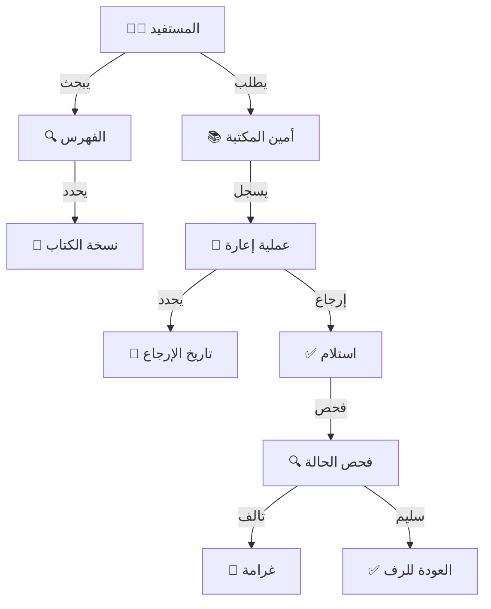

# 📁 المكتبة المدرسية
## Library Management System

---

## 📌 بطاقة النظام

| البند | القيمة |
|-------|--------|
| **المهندس المسؤول** | أحمد الهتار / موسى العواضي |
| **عدد الجداول** | 9 جداول + 5 Views |
| **النسبة** | جزء من 10% |
| **ملف DDL** | `DDL.sql` |

---

## 🚀 المقدمة
المكتبة هي قلب المعرفة في المدرسة، ولكن بدون نظام يديرها، تتحول إلى مخزن للكتب المغبرة. نظام المكتبة المدرسية يعيد للمكتبة بريقها، بنظام فهرسة عالمي، سهولة في البحث، وضبط لعمليات الإعارة، ليجعل الكتاب في متناول يد الطالب والمعلم بيسر وسهولة.

## ❓ ماذا يقدّم هذا النظام؟
أتمتة كاملة للمكتبة:
- **فهرس إلكتروني:** البحث عن أي كتاب (بالعنوان، المؤلف، التصنيف) في ثوانٍ.
- **إدارة الإعارة:** معرفة من استعار كتاباً ومتى يجب إعادته.
- **الجرد:** معرفة الكتب المفقودة أو التالفة.

## 💎 الفوائد الملموسة (القابلة للقياس)
- **الحفاظ على الكتب:** سجل دقيق لكل نسخة يمنع ضياع الكتب.
- **زيادة القراءة:** تسهيل البحث يشجع الطلاب على ارتياد المكتبة.
- **الانضباط:** نظام آلي للغرامات والتنبيهات عند تأخير الإعادة.

## 🌟 الفوائد غير الملموسة (القيمة الإدارية)
- **الوعي الثقافي:** تقارير عن "أكثر الكتب قراءة" تساعد في اختيار الكتب الجديدة المناسبة لميول الطلاب.
- **التحفيز:** تنظيم مسابقات "أكثر طالب قارئ" بناءً على إحصائيات دقيقة.
- **التنظيم:** ترتيب الكتب على الأرفف وفق تصنيف علمي (ديوي) يسهل الوصول إليها.

## 🔄 كيف يعمل النظام؟ (بأسلوب مبسّط)
1. **الفهرسة:** أمين المكتبة يدخل بيانات الكتب الجديدة ويطبع "باركود" لكل نسخة.
2. **البحث:** الطالب يبحث في الكمبيوتر عن كتاب "عن الفضاء" فيجد مكانه ورقم الرف.
3. **الإعارة:** عند الخروج، يمسح الأمين الباركود للكتاب وباركود الطالب، فتسجل الإعارة.
4. **الإرجاع:** عند العودة، يمسح الباركود فيتم "إبراء ذمة" الطالب.

## 🏗️ مكونات النظام (البيانات التي يعتمد عليها)

### 1. المحتوى (الكتب)
- **بيانات الكتب:** العنوان، المؤلف، دار النشر.
- **التصنيف:** (تاريخ، علوم، أدب...) لترتيب المكتبة.
- **النسخ (Copies):** كل نسخة لها رقم فريد (لتمييز النسخة السليمة عن الممزقة).

### 2. العمليات (التفاعل)
- **الإعارات:** سجل الخروج والعودة.
- **الحجوزات:** حجز كتاب مستعار حالياً ليحصل عليه الطالب فور عودته.

### 3. المخرجات والتقارير
- **الكتب المتأخرة:** قائمة بالطلاب الذين انتهت مدة إعارتهم للتواصل معهم.
- **إحصائيات المكتبة:** كم كتاباً لدينا؟ وكم إعارة تمت هذا الشهر؟
- **بطاقة الكتاب:** ملصق يوضع على كعب الكتاب يحتوي رقمه وتصنيفه.

## 📖 أمثلة واقعية من داخل المدرسة
- **الطالب:** يريد كتاباً للمشاركة في الإذاعة، يبحث في النظام فيجد أن "نسخة 1" مستعارة، و"نسخة 2" موجودة على الرف (ج-4). يذهب ويأخذها مباشرة.
- **أمين المكتبة:** نهاية العام، بضغطة زر يعرف "من لم يرجع الكتب" ويحجب نتائجهم أو يتواصل معهم لاسترداد عهدة المدرسة.

## 🆚 مقارنة بالطريقة التقليدية

| الميزة | الطريقة اليدوية (سجل الزيارات) | نظام المكتبة الرقمي |
|--------|--------------------------------|---------------------|
| **البحث** | سؤال الأمين والبحث في الأرفف عشوائياً | بحث إلكتروني فوري متعدد الخيارات |
| **الإعارة** | تدوين في دفتر ورقي وقشط عند الإرجاع | مسح باركود سريع ودقيق |
| **التقارير** | لا يمكن معرفة أكثر الكتب قراءة بسهولة | إحصائيات تحليلية دقيقة لتوجهات القراءة |

## ❓ أسئلة شائعة (FAQ)
**س: هل يخدم النظام المعلمين أيضاً؟**
ج: نعم، النظام يدعم إعارة المعلمين (ربما بمدد أطول وعدد كتب أكثر) وإعارة الطلاب بقواعد مختلفة.

**س: هل يمكن حجز كتاب من البيت؟**
ج: إذا كانت المكتبة مرتبطة بتطبيق المدرسة، يمكن للطالب تصفح الفهرس وحجز الكتاب إلكترونياً لاستلامه صباحاً.

## 📝 الخلاصة التنفيذية
نظام المكتبة المدرسية هو **بوابة الثقافة**. يحول المكتبة من "غرفة مهجورة" إلى مركز نشط وجذاب، يدار بتقنية حديثة تحترم عقلية الطالب الرقمي وتحافظ على ثروة المدرسة المعرفية.

---

## 🔁 دورة الإعارة (Borrowing Cycle)



## 🎯 وظيفة النظام

أتمتة عمليات المكتبة بالكامل: فهرسة الكتب، إدارة الإعارات والإرجاع، حساب الغرامات، إدارة النسخ، وتوفير بوابة بحث للطلاب والمعلمين.

---

# 📊 تفاصيل الجداول والبيانات (Tables & Data Dictionary)

---

## 1️⃣ جدول تصنيفات الكتب (book_categories)

| الحقل | الوصف | مثال |
|-------|-------|------|
| `name_ar` | التصنيف | العلوم الإسلامية |
| `code` | الرمز | ISL |

#### 📋 بيانات استرشادية
| id | name_ar | code | parent_id | description |
|----|---------|------|-----------|-------------|
| 1 | القرآن وعلومه | QURAN | NULL | تفاسير وعلوم القرآن |
| 2 | الحديث النبوي | HADITH | NULL | كتب الحديث والشروح |
| 3 | الفقه الإسلامي | FIQH | NULL | المذاهب الفقهية |
| 4 | الأدب العربي | ARB_LIT | NULL | الشعر والنثر |
| 5 | التاريخ | HIST | NULL | التاريخ الإسلامي والعالمي |
| 6 | العلوم | SCI | NULL | فيزياء، كيمياء، أحياء |
| 7 | الرياضيات | MATH | NULL | كتب الرياضيات العامة والمتقدمة |
| 8 | اللغات | LANG | NULL | إنجليزي، فرنسي |
| 9 | قصص الأطفال | KIDS | NULL | قصص مصورة وتربوية |
| 10 | روايات | NOVEL | 4 | روايات عربية وعالمية |

---

## 2️⃣ جدول الكتب (library_books)

سجل الكتاب "العنوان" بغض النظر عن عدد النسخ.

| الحقل | الوصف | مثال |
|-------|-------|------|
| `title` | العنوان | الرحيق المختوم |
| `isbn` | ردمك | 978-1234567890 |
| `total_copies` | عدد النسخ | 5 |

#### 📋 بيانات استرشادية
| id | title | author | category_id | isbn | total_copies | available_copies | shelf_location |
|----|-------|--------|-------------|------|--------------|------------------|----------------|
| 1 | الرحيق المختوم | صفي الرحمن المباركفوري | 5 | 9789960732550 | 10 | 8 | A-101 |
| 2 | رياض الصالحين | الإمام النووي | 2 | 9789953520089 | 15 | 12 | A-102 |
| 3 | عبقرية عمر | عباس محمود العقاد | 4 | 9789770908756 | 5 | 5 | B-201 |
| 4 | مقدمة ابن خلدون | ابن خلدون | 5 | 9789953650229 | 3 | 1 | B-205 |
| 5 | الفيزياء المسلية | ياكوف بيرلمان | 6 | 9785050016890 | 8 | 4 | C-301 |
| 6 | كليلة ودمنة | ابن المقفع | 4 | 9781234567891 | 10 | 10 | D-401 |
| 7 | قصص الأنبياء | ابن كثير | 5 | 9781234567892 | 12 | 6 | A-105 |
| 8 | لسان العرب | ابن منظور | 4 | 9781234567893 | 1 (مجلدات) | 1 | E-500 |
| 9 | رجال حول الرسول | خالد محمد خالد | 5 | 9781234567894 | 7 | 2 | A-108 |
| 10 | هاري بوتر (ج1) | جي كي رولينج | 10 | 9781234567895 | 5 | 0 | F-601 |

---

## 3️⃣ جدول نسخ الكتب (book_copies)

كل نسخة فيزيائية لها باركود خاص.

| الحقل | الوصف | مثال |
|-------|-------|------|
| `book_id` | الكتاب | 1 |
| `barcode` | الباركود | LIB-001001 |
| `condition_id` | الحالة | 1 (ممتاز) |

#### 📋 بيانات استرشادية
| id | book_id | copy_number | barcode | condition_id | is_available |
|----|---------|-------------|---------|--------------|--------------|
| 1 | 1 | 1 | LIB-001-01 | 1 (ممتاز) | 0 |
| 2 | 1 | 2 | LIB-001-02 | 1 | 1 |
| 3 | 1 | 3 | LIB-001-03 | 2 (جيد) | 1 |
| 4 | 5 | 1 | LIB-005-01 | 1 | 0 |
| 5 | 5 | 2 | LIB-005-02 | 3 (مقبول) | 0 |
| 6 | 5 | 3 | LIB-005-03 | 1 | 1 |
| 7 | 10 | 1 | LIB-010-01 | 2 | 0 |
| 8 | 10 | 2 | LIB-010-02 | 1 | 0 |
| 9 | 4 | 1 | LIB-004-01 | 1 | 0 |
| 10 | 2 | 1 | LIB-002-01 | 1 | 0 |

---

## 4️⃣ جدول الإعارات (book_loans)

سجل حركة الكتاب بين المكتبة والمستفيدين.

| الحقل | الوصف |
|-------|-------|
| `book_id` | الكتاب |
| `borrower_type` | المستعير (طالب/موظف) |
| `due_date` | تاريخ الإرجاع المفترض |

#### 📋 بيانات استرشادية
| id | book_id | copy_id | borrower_type | student_id | employee_id | loan_date | due_date | return_date | status_id |
|----|---------|---------|---------------|------------|-------------|-----------|----------|-------------|-----------|
| 1 | 1 | 1 | طالب | 1001 | NULL | 2026-01-01 | 2026-01-15 | NULL | 1 (معار) |
| 2 | 5 | 4 | طالب | 1005 | NULL | 2026-01-02 | 2026-01-16 | NULL | 1 |
| 3 | 5 | 5 | موظف | NULL | 101 | 2026-01-05 | 2026-01-19 | 2026-01-18 | 2 (مرجع) |
| 4 | 10 | 7 | طالب | 1002 | NULL | 2026-01-10 | 2026-01-24 | NULL | 3 (متأخر) |
| 5 | 10 | 8 | طالب | 1003 | NULL | 2026-01-10 | 2026-01-24 | NULL | 3 |
| 6 | 4 | 9 | موظف | NULL | 102 | 2026-01-12 | 2026-01-26 | NULL | 1 |
| 7 | 2 | 10 | طالب | 1010 | NULL | 2026-01-15 | 2026-01-29 | NULL | 1 |
| 8 | 1 | 2 | طالب | 1004 | NULL | 2025-12-01 | 2025-12-15 | 2025-12-14 | 2 |
| 9 | 1 | 3 | طالب | 1005 | NULL | 2025-12-05 | 2025-12-19 | NULL | 4 (مفقود) |
| 10 | 6 | NULL | طالب | 1006 | NULL | 2026-01-20 | 2026-02-03 | NULL | 1 |

---

## 5️⃣ جدول الحجوزات (book_reservations)

حجز كتاب مستعار حالياً ليتم إعارته للمستفيد التالي فور إرجاعه.

| الحقل | الوصف |
|-------|-------|
| `book_id` | الكتاب |
| `status` | حالة الحجز |

#### 📋 بيانات استرشادية
| id | book_id | borrower_type | student_id | employee_id | reservation_date | expiry_date | status |
|----|---------|---------------|------------|-------------|------------------|-------------|--------|
| 1 | 10 | طالب | 1006 | NULL | 2026-01-25 | 2026-01-28 | نشط |
| 2 | 5 | طالب | 1001 | NULL | 2026-01-26 | 2026-01-29 | نشط |
| 3 | 4 | موظف | NULL | 103 | 2026-01-27 | 2026-01-30 | نشط |
| 4 | 1 | طالب | 1008 | NULL | 2026-01-20 | 2026-01-23 | منتهي |
| 5 | 10 | طالب | 1009 | NULL | 2026-01-28 | 2026-01-31 | نشط |

---

| 5 | 10 | طالب | 1009 | NULL | 2026-01-28 | 2026-01-31 | نشط |

---

## 💡 كيف يستخدم المبرمج هذا النظام؟ (SQL Examples)

### 1. أكثر الطلاب قراءة (Top Readers)
```sql
SELECT 
    s.full_name,
    COUNT(bl.id) AS books_read
FROM book_loans bl
JOIN students s ON bl.student_id = s.id
WHERE bl.status_id = 2 -- (تم الإرجاع)
GROUP BY s.id
ORDER BY books_read DESC
LIMIT 10;
```

### 2. الكتب المتأخرة (Overdue Books)
```sql
SELECT 
    lb.title,
    bc.barcode,
    s.full_name AS student_name,
    g.phone_primary AS parent_phone
FROM book_loans bl
JOIN book_copies bc ON bl.copy_id = bc.id
JOIN library_books lb ON bc.book_id = lb.id
JOIN students s ON bl.student_id = s.id
JOIN student_guardians sg ON s.id = sg.student_id
JOIN guardians g ON sg.guardian_id = g.id
WHERE bl.status_id = 1 -- (معار)
AND bl.due_date < CURRENT_DATE
AND sg.is_primary = 1;
```

---

**المهندس المسؤول:** أحمد الهتار
**تم التحديث:** 2026-01-16 (إضافة قاموس البيانات)
