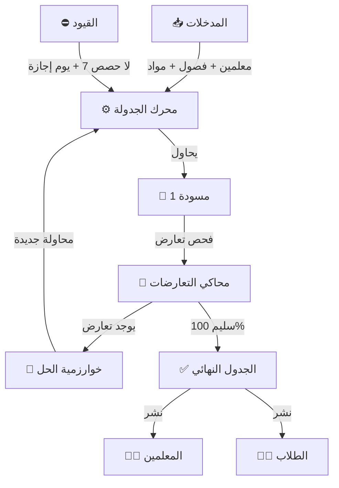

# 📁 جدول الحصص الذكي (Intelligent Timetable)
## النسخة 2.0 - محرك جدولة وطني 🏛️

---

## 📌 بطاقة النظام
| البند | القيمة |
|-------|--------|
| **المهندس المسؤول** | موسى العواضي (تصميم واعتماد) |
| **عدد الجداول** | 15 جدولاً مركزياً |
| **حالة المراجعة** | ⭐⭐⭐⭐⭐ (Enterprise Grade) |
| **ملف DDL** | `DDL.sql` |

---

## 🚀 المقدمة
بناء الجدول المدرسي كان دائماً "الكابوس السنوي" لوكلاء المدارس؛ أيام من العمل الشاق لتوفيق جداول عشرات المعلمين مع مئات الفصول، وغالباً ما ينتهي الأمر بتعارضات ومشاكل. نظام جدول الحصص الذكي ينهي هذه المعاناة تماماً، حيث يقوم العقل الإلكتروني بحل "الأحجية" المعقدة في دقائق، موزّعاً الحصص بعدالة وكفاءة لا يمكن للعقل البشري مجاراتها.

## ❓ ماذا يقدّم هذا النظام؟
محرك ذكاء اصطناعي مصغر يقوم بـ:
- **توزيع الحصص:** إسناد كل مادة لمعلمها في التوقيت المناسب.
- **منع التعارض:** ضمان استحالة وجود معلم في فصلين في وقت واحد.
- **الموازنة:** توزيع الحصص الثقيلة (كالرياضيات) على أيام الأسبوع، وعدم تكديسها في يوم واحد.

## 💎 الفوائد الملموسة (القابلة للقياس)
- **سرعة الإنجاز:** تجهيز جدول مدرسة كاملة في أقل من ساعة.
- **توزيع عادل للمعلمين:** يراعي "نصاب الحصص" ولا يظلم معلماً بضغط في يوم وفراغ في آخر.
- **استغلال الفراغات:** تقليل حصص الانتظار غير الضرورية.

## 🌟 الفوائد غير الملموسة (القيمة الإدارية)
- **الرضا الوظيفي:** المعلمون يشعرون بالعدالة في التوزيع.
- **المرونة:** القدرة على إصدار "جدول مؤقت" لرمضان أو قترة الاختبارات بضغطة زر.
- **الاستقرار:** بداية العام الدراسي بانتظام تام من الحصة الأولى.

## 🔄 كيف يعمل النظام؟ (بأسلوب مبسّط)
1. **المعطيات:** نخبر النظام بـ (من هم المعلمون؟ وماذا يدرسون؟ وغرف الفصول المتاحة).
2. **القيود:** نحدد الشروط (مثلاً: معلم الفيزياء لا يستطيع الحضور يوم الخميس).
3. **المعالجة:** يقوم النظام بتجربة آلاف الاحتمالات في ثوانٍ حتى يصل للحل الأمثل.
4. **النشر:** اعتماد الجدول وطباعته لكل فصل ولكل معلم.

## 🏗️ مكونات النظام (البيانات التي يعتمد عليها)

### 1. الإعدادات (الشروط)
- **أوزان المواد:** تصنيف المواد (ثقيلة/خفيفة) لعدم وضع 3 حصص ثقيلة متتالية للطالب.
- **توفر المعلمين:** الأيام التي يكون فيها المعلم متاحاً.
- **القيود المكانية:** المواد التي تتطلب معاملاً أو قاعات خاصة.

### 2. المحرك (بناء الجدول)
- **الإصدارات:** إمكانية عمل جدول "مسودة 1"، ثم تعديله لـ "مسودة 2" قبل الاعتماد النهائي.
- **المحاكاة:** اختبار الجدول بحثاً عن أي ثغرات قبل نشره.

### 3. المخرجات والتقارير
- **الجدول العام:** لوحة كبيرة توضح خريطة المدرسة بالكامل.
- **جدول المعلم:** ورقة خاصة بكل معلم توضح حصصه وأماكنها.

## 📖 أمثلة واقعية من داخل المدرسة
- **الوكيل:** يتصل معلم للاعتذار عن الحضور غداً لظرف طارئ. يفتح الوكيل النظام، ويحدد المعلمين الذين لديهم "حصة فراغ" في نفس وقت حصص المعلم الغائب، ويوزع حصص الاحتياط عليهم في دقيقة.
- **المعلم:** يطلب أن يكون يوم الثلاثاء "يوم راحة" أو حصص قليلة لظروف دراسته المسائية. يدخل الوكيل هذا الشرط، ويقوم النظام بإعادة ترتيب الحصص لتحقيق الرغبة دون الإخلال بالنظام العام.

## � مقارنة بالطريقة التقليدية

| الميزة | الطريقة اليدوية (اللوحة المغناطيسية) | نظام الجدول الذكي |
|--------|--------------------------------------|-------------------|
| **الوقت المستغرق** | أسبوع أو أكثر مع فريق عمل | دقائق معدودة |
| **الدقة** | احتمال كبير لنسيان حصة أو تعارض | نسبة خطأ 0% (يمنع النظام التعارض تقنياً) |
| **التعديل** | أي تغيير بسيط قد يقلب الجدول رأساً على عقب | إعادة توزيع ذكية تحافظ على ثبات الجدول |

## ❓ أسئلة شائعة (FAQ)
**س: هل يضع النظام حصص التربية الرياضية في نهاية اليوم دائماً؟**
ج: يمكن برمجة النظام ليفضل ذلك، أو ليوزعها كفواصل نشاط بين الحصص الدسمة.

**س: ماذا لو كان عدد المعلمين غير كافٍ؟**
ج: سينبهك النظام بوجود "حصص ميتة" لا يوجد من يغطيها، لتتدارك الأمر بتوظيف معلم جديد أو زيادة النصاب.

## 📝 الخلاصة التنفيذية
نظام جدول الحصص الذكي هو **مايسترو المدرسة**. يضبط إيقاع اليوم الدراسي بدقة متناهية، ويحول عملية التخطيط المعقدة إلى تجربة تقنية ممتعة، مما يضمن سير العملية التعليمية بسلاسة وهدوء.

---

## 🎨 آلية التوزيع (Distribution Engine)



## �🎯 الرؤية التقنية (Intelligence Layer)
هذا النظام ليس مجرد "سجل حصص"، بل هو **Scheduling Engine** متكامل يدعم المحاكاة (Simulation)، وإدارة القيود المعقدة، وموازنة الأحمال النوعية للمعلمين.

---

## � المميزات المتقدمة (Refactor 2.0)

1.  **المصطلحات الموحدة (Lookup Types):** تم تحويل أنواع الحصص إلى جداول مرجعية (`NORMAL`, `ACTIVITY`, `SUBSTITUTE`, `EMERGENCY`) لضمان صحة التقارير.
2.  **التوفر الزمني (Temporal Availability):** دعم الحالات المؤقتة للمعلمين عبر حقول `effective_from` و `effective_to` في جدول توفر المعلمين.
3.  **تدقيق أداء المحاكاة:** تتبع دقيق لوقت التنفيذ بالملي ثانية (`execution_time_ms`) والمستخدم المنفذ، لضمان استقرار الأداء في المدارس الكبيرة.
4.  **حوكمة التعارضات:** السماح بتخزين التعارضات في المسودة ليتم اكتشافها عبر "محرك المحاكاة" (Simulation Engine)، مما يعطي مرونة للمجدول في التعامل مع الحالات الصعبة.

---

# 📊 قاموس البيانات (Samples)

## 1️⃣ إصدارات الجدول (timetable_versions)
| الحقل | الوصف | المنطق البرمجي |
|--------|-------|----------------|
| `total_conflicts` | إجمالي التعارضات | يُحسب آلياً عبر محرك المحاكاة |
| `status_id` | حالة الإصدار | مسودة -> محاكاة -> معتمد |

---

## 2️⃣ حصص الجدول (timetable_slots)
| الحقل | الوصف | ملاحظات |
|--------|-------|---------|
| `slot_type_id` | نوع الحصة | مرتبط بالبنية المشتركة |
| `is_fixed` | حصة مثبتة | لا يقوم محرك التوزيع التلقائي بتغييرها |

---

## 3️⃣ محرك المحاكاة (Simulation Engine)
| الجدول | الوصف | الحقول الرئيسية |
|--------|-------|----------------|
| `simulation_runs` | سجل التشغيل | `execution_time_ms`, `run_by_user_id` |
| `simulation_conflicts` | سجل الأعطال | `severity`, `suggested_fix`, `is_resolved` |

---

## 🔗 روابط التكامل
- **النواة الأكاديمية (02):** لمصدر الصفوف، الشعب، والمواد.
- **الموارد البشرية (03):** لربط الجداول بالمعلمين الفعليين.
- **البنية المشتركة (01):** للمصطلحات المرجعية وأيام الأسبوع.

---
**شركة إنما سوفت للحلول التقنية** | 2026

---

## 💡 كيف يستخدم المبرمج هذا النظام؟ (SQL Examples)

### 1. كشف تعارض المعلمين (Conflict Detection)
```sql
SELECT 
    t1.teacher_id,
    e.full_name,
    t1.day_of_week,
    t1.period_no,
    c1.name_ar AS class1,
    c2.name_ar AS class2
FROM timetable_slots t1
JOIN timetable_slots t2 
    ON t1.teacher_id = t2.teacher_id 
    AND t1.day_of_week = t2.day_of_week 
    AND t1.period_no = t2.period_no
    AND t1.id < t2.id
JOIN employees e ON t1.teacher_id = e.id
JOIN classes c1 ON t1.class_id = c1.id
JOIN classes c2 ON t2.class_id = c2.id
WHERE t1.version_id = (SELECT id FROM timetable_versions WHERE is_active = 1);
```

### 2. توزيع أنصبة المعلمين (Teacher Workload)
```sql
SELECT 
    e.full_name,
    COUNT(ts.id) AS assigned_periods,
    e.max_periods_per_week AS contract_limit,
    (e.max_periods_per_week - COUNT(ts.id)) AS remaining_capacity
FROM employees e
LEFT JOIN timetable_slots ts ON e.id = ts.teacher_id AND ts.version_id = 105
GROUP BY e.id
ORDER BY remaining_capacity DESC;
```

---

**شركة إنما سوفت للحلول التقنية** | 2026
