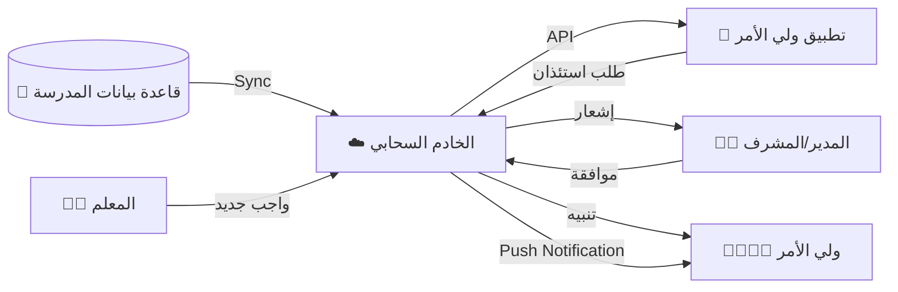

# 📱 تطبيق أولياء الأمور (Parents Mobile App)
## النسخة 2.0 - واجهة العميل الذكية 🏛️

---

## 📌 بطاقة النظام
| البند | القيمة |
|-------|--------|
| **المهندس المصمم** | أحمد الهتار |
| **المهندس المعتمد** | موسى العواضي |
| **حالة المراجعة** | ⭐⭐⭐⭐⭐ (Client Layer Maturity) |
| **ملف DDL** | `DDL.sql` |

---

## 🚀 المقدمة
انتهى زمن "استدعاء ولي الأمر" و "دفتر المراسلات الضائع". تطبيق أولياء الأمور يضع المدرسة في جيب ولي الأمر، ويجعله شريكاً لحظياً في تعليم ابنه. هو حلقة الوصل الرقمية التي تبني الثقة، وتضمن أن البيت والمدرسة يعملان كفريق واحد لمصلحة الطالب.

## ❓ ماذا يقدّم هذا النظام؟
نافذة مباشرة لولي الأمر على حياة ابنه المدرسية:
- **المتابعة الأكاديمية:** معرفة الدرجات والواجبات.
- **المتابعة السلوكية:** إشعارات الغياب والملاحظات والانضباط.
- **التواصل:** رسائل آمنة ومباشرة مع المعلمين والإدارة.
- **الخدمات:** تقديم طلبات الاستئذان ودفع الرسوم.

## 💎 الفوائد الملموسة (القابلة للقياس)
- **إنهاء ظاهرة "لم أكن أعلم":** ولي الأمر يعلم بغياب ابنه لحظة حدوثه.
- **توفير الوقت:** بدلاً من زيارة المدرسة للسؤال عن المستوى، كل شيء متاح في التطبيق.
- **تحسين التحصيل:** المتابعة المستمرة تجعل الطالب يشعر بالاهتمام فيجتهد أكثر.

## 🌟 الفوائد غير الملموسة (القيمة الإدارية)
- **رضا العملاء:** الآباء يقدرون الشفافية والخدمة العصرية.
- **تقليل المشاكل:** حل الخلافات وسوء الفهم عبر التواصل السريع قبل تفاقمها.
- **التوثيق:** كل رسالة وطلب موثق للرجوع إليه وقت الحاجة.

## 🔄 كيف يعمل النظام؟ (بأسلوب مبسّط)
1. **التحميل:** ينزل ولي الأمر التطبيق ويدخل برقم جواله المسجل في المدرسة.
2. **الاستعراض:** يرى قائمة أبنائه، ويختار أحدهم ليرى ملفه (الحضور، الدرجات، الواجبات).
3. **التفاعل:** يرسل استفساراً لمعلم الرياضيات، أو يرفع إيصال سداد الرسوم.
4. **التنبيه:** يصله إشعار فوري: "ابنك لم يحضر الحصة الأولى اليوم".

## 🏗️ مكونات النظام (البيانات التي يعتمد عليها)

### 1. الحسابات (الدخول)
- **حساب الوالد:** حساب واحد يجمع كل الأبناء في المدرسة مهما اختلفت صفوفهم.
- **الأجهزة:** ربط الحساب بهاتف الأب والأم لاستلام الإشعارات.

### 2. التفاعل (الخدمات)
- **الإشعارات:** (طوارئ، غياب، واجب جديد، إعلان رحلة).
- **الرسائل:** دردشة رسمية بين الوالد والمعلم (تحت رقابة الإدارة).
- **الطلبات:** (استئذان، شكوى، نقل).

### 3. المخرجات (ما يراه الوالد)
- **كشف الدرجات المصغر:** نتائج الاختبارات الشهرية والفصلية.
- **سجل السلوك:** الملاحظات الإيجابية والسلبية التي سجلها المعلمون.
- **أجندة الواجبات:** ما المطلوب من الطالب إنجازه اليوم.

## 📖 أمثلة واقعية من داخل المدرسة
- **الأم العاملة:** وهي في عملها، يصلها إشعار: "تم تكريم ابنتك ليلى في الإذاعة اليوم". تشعر بالفخر وترسل رسالة شكر للمعلمة، مما يعزز العلاقة الإيجابية.
- **الأب المسافر:** يتابع درجات ابنه ويلاحظ انخفاضاً في اللغة الإنجليزية، يرسل رسالة للمعلم عبر التطبيق يستفسر عن السبب، فيشرح المعلم نقاط الضعف ليتم تداركها.

## 🆚 مقارنة بالطريقة التقليدية

| الميزة | الطريقة اليدوية (الهاتف والزيارات) | تطبيق أولياء الأمور |
|--------|------------------------------------|---------------------|
| **معرفة الغياب** | قد تمر أيام قبل أن تتصل المدرسة (لو اتصلت) | إشعار فوري في نفس اللحظة |
| **الدرجات** | انتظار نهاية الشهر أو الفصل لاستلام الشهادة الورقية | اطلاع مباشر أولاً بأول |
| **الاستئذان** | الحضور شخصياً لأخذ الطالب | طلب إلكتروني والموافقة عن بعد |

## ❓ أسئلة شائعة (FAQ)
**س: هل يرى ولي الأمر بيانات طلاب آخرين؟**
**ج:** مستحيل. التطبيق مصمم بخصوصية تامة، الأب يرى أبناءه فقط.

**س: هل يمكن للأب التواصل مع المعلم في أي وقت؟**
**ج:** يمكنه إرسال الرسالة في أي وقت، لكن المعلم يجيب في أوقات الدوام المحددة، حفاظاً على وقت المعلم الخاص.

## 📝 الخلاصة التنفيذية
تطبيق أولياء الأمور هو **جسر الثقة**. يزيل الحواجز والجدران بين البيت والمدرسة، ويجعل العملية التربوية شراكة حقيقية فاعلة، مما ينعكس مباشرة على استقرار وتفوق الطالب.

---

## 📱 تدفق البيانات (Data Flow)



## 🎯 الرؤية التقنية (Client Layer)
يعمل هذا النظام كـ **Client Layer** (واجهة) تستهلك خدمات المنظومة وتعرضها لولي الأمر بسلاسة، مع توفير قناة تواصل رسمية وموثقة مع المدرسة.

---

## 🚀 المميزات المتقدمة (Refactor 2.0)

1.  **توحيد الإشعارات (Shared Notif Core):** تم ربط التطبيق بجدول الإشعارات العالمي (`lookup_notification_types`) لضمان تزامن كامل بين ما يرسله النظام وما يراه ولي الأمر.
2.  **حوكمة الطلبات (Governance-Driven Leaves):** تطوير نظام الاستئذان ليدعم حقول القرار الإداري (`approved_by`, `decision_at`) لضمان وجود سلسلة مسؤولية واضحة.
3.  **سجل النشاط (Customer Activity Log):** تحويل سجل التدقيق إلى `parent_activity_logs` لتتبع دقيق لكل عملية عرض (View Grades) أو طلب (Submit Leave) يقوم بها ولي الأمر.
4.  **دعم الـ Push Notifications:** توفير جدول مركزي للأجهزة (`parent_devices`) يدعم رموز الأجهزة (Device Tokens) لأنظمة Android و iOS.

---

# 📊 قاموس البيانات (Samples)

## 1️⃣ حسابات المستخدمين (parent_accounts)
| الحقل | الوصف | المنطق |
|--------|-------|--------|
| `phone_number` | معرف الدخول | يستخدم كرقم هوية للدخول |
| `locked_until` | الحظر المؤقت | منع الدخول في حال تكرار المحاولات الفاشلة |

---

## 2️⃣ طلبات الاستئذان (leave_requests)
| الحقل | الوصف | الفائدة |
|--------|-------|--------|
| `approved_by_user_id` | متخذ القرار | تحديد المسؤولية الإدارية |
| `decision_at` | وقت القرار | تتبع سرعة الاستجابة للطلبات |

---

## 🔗 روابط التكامل
- **نظام الطلاب (04):** لسحب بيانات الأبناء والحضور والدرجات.
- **نظام الإشعارات (14):** لاستقبال التنبيهات الفورية.
- **الموارد البشرية (03):** لربط الرسائل بالمعلمين المعنيين.

---

## 💡 كيف يستخدم المبرمج هذا النظام؟ (SQL Examples)

### 1. أولياء الأمور النشطين (Active Users Report)
```sql
SELECT 
    g.full_name,
    g.phone_primary,
    COUNT(l.id) AS login_count,
    MAX(l.login_at) AS last_seen
FROM guardians g
JOIN parent_activity_logs l ON g.id = l.guardian_id
WHERE l.login_at > DATE_SUB(CURRENT_DATE, INTERVAL 30 DAY)
GROUP BY g.id
ORDER BY last_seen DESC;
```

### 2. طلبات الاستئذان المعلقة (Pending Leaves)
```sql
SELECT 
    r.created_at,
    s.full_name AS student_name,
    g.full_name AS parent_name,
    r.reason,
    r.duration_days
FROM leave_requests r
JOIN students s ON r.student_id = s.id
JOIN guardians g ON r.guardian_id = g.id
WHERE r.status_id = 1 -- (معلق)
ORDER BY r.created_at ASC;
```

---

**شركة إنما سوفت للحلول التقنية** | 2026
