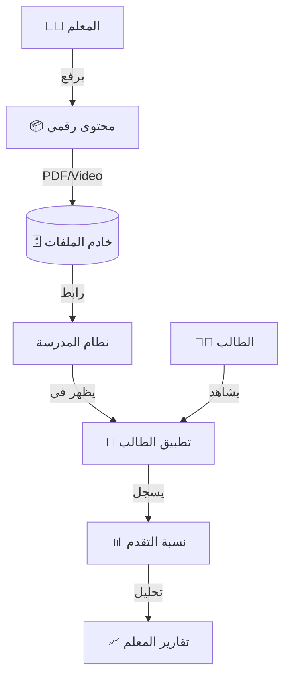

# 📁 جسر المنصة التعليمية
## Learning Platform Bridge (LMS Bridge)

---

## 📌 بطاقة النظام

| البند | القيمة |
|-------|--------|
| **المهندس المسؤول** | موسى العواضي (تصميم واعتماد) |
| **عدد الجداول** | 8 جداول + 2 Views |
| **النسبة** | نظام ربط وتتبع |
| **ملف DDL** | `DDL.sql` |

---

## 🚀 المقدمة
التعليم لم يعد محصوراً بين جدران الفصل ولا ينتهي بقرع الجرس. المنصة التعليمية الرقمية هي امتداد للمدرسة في العالم الافتراضي، تتيح للطالب الوصول للمحتوى، حل الواجبات، ومشاهدة الدروس المسجلة في أي وقت ومن أي مكان، ليكون التعلم رحلة مستمرة وممتعة.

## ❓ ماذا يقدّم هذا النظام؟
بوابة تعليمية إلكترونية متكاملة:
- **مكتبة المحتوى:** فيديوهات، ملخصات PDF، وعروض تقديمية.
- **الواجبات الإلكترونية:** حل الواجبات وتصحيحها آلياً.
- **الفصول الافتراضية:** دروس عن بعد عند الحاجة.

## 💎 الفوائد الملموسة (القابلة للقياس)
- **التعلم الذاتي:** الطالب يعيد مشاهدة شرح درس صعب عدة مرات حتى يفهمه.
- **توفير الورق:** استبدال ملازم المراجعة والواجبات الورقية بملفات رقمية.
- **تحليل الأداء:** المعلم يعرف من شاهد الدرس ومن لم يشاهده.

## 🌟 الفوائد غير الملموسة (القيمة الإدارية)
- **جاهزية الطوارئ:** المدرسة مستعدة للتحول للتعليم عن بعد في أي لحظة (أوبئة، ظروف جوية) وبدون ارتباك.
- **العدالة في الوصول:** توفير مصادر تعلم موحدة وعالية الجودة لجميع الطلاب.
- **مواكبة العصر:** التحدث بلغة التكنولوجيا التي يحبها ويتقنها الجيل الجديد.

## 🔄 كيف يعمل النظام؟ (بأسلوب مبسّط)
1. **الرفع:** المعلم يرفع ملف الدرس (فيديو أو PDF) على المنصة.
2. **الربط:** يربط المعلم هذا المحتوى بدرس اليوم في الجدول.
3. **الوصول:** يدخل الطالب من منزله، يجد الدرس جاهزاً، يشاهده، ثم يحل الاختبار القصير المرفق.
4. **التحليل:** يظهر للمعلم تقرير: "80% من الطلاب شاهدوا الفيديو وحلوا الاختبار".

## 🏗️ مكونات النظام (البيانات التي يعتمد عليها)

### 1. المحتوى (المادة العلمية)
- **الروابط:** فيديوهات من يوتيوب، ملفات مرفوعة، روابط لمواقع مفيدة.
- **بنك الإثراء:** مواد إضافية للمتفوقين أو لمن يحتاج تقوية.

### 2. التفاعل (نشاط الطالب)
- **المشاهدات:** سجل دقيق (كم دقيقة شاهد الطالب من الفيديو؟).
- **الواجبات:** رفع الطالب لحل الواجب وتلقي تصحيح المعلم.

### 3. المخرجات والتقارير
- **تقرير التفاعل:** أنشط الطلاب على المنصة.
- **تقرير إكمال المنهج:** نسبة المحتوى الإلكتروني الذي تم رفعه لكل مادة.

## 📖 أمثلة واقعية من داخل المدرسة
- **الطالب المريض:** غاب عن المدرسة لأسبوع، فدخل المنصة ووجد كل الدروس التي فاتته مشروحة ومسجلة، فذاكرها وعاد وكأنه لم يغب.
- **المعلم المبدع:** بدلاً من تضييع وقت الحصة في الكتابة على السبورة، طلب من الطلاب مشاهدة فيديو تمهيدي في البيت (Flipped Classroom)، وخصص وقت الحصة للنقاش والتطبيق العملي.

## 🆚 مقارنة بالطريقة التقليدية

| الميزة | الطريقة اليدوية (الكتاب فقط) | المنصة التعليمية الرقمية |
|--------|------------------------------|--------------------------|
| **المصادر** | مصدر واحد (الكتاب المدرسي) وربما ملزمة | مصادر مساعدة متنوعة (فيديو، صوت، صورة) |
| **المتابعة** | لا يعرف المعلم هل ذاكر الطالب أم لا | المعلم يرى إحصائيات دقيقة عن نشاط الطالب |
| **المرونة** | التعليم يتوقف بانتهاء الدوام | التعلم متاح 24 ساعة طوال الأسبوع |

## ❓ أسئلة شائعة (FAQ)
**س: هل تحتاج المنصة إنترنت سريع جداً؟**
ج: النظام مصمم ليكون خفيفاً ويعمل بكفاءة حتى مع سرعات الإنترنت المتوسطة.

**س: ماذا لو لم يملك الطالب جهاز حاسوب؟**
ج: المنصة متجاوبة تماماً (Responsive) وتعمل بكفاءة كاملة على جميع أجهزة الهواتف الذكية والأجهزة اللوحية.

## 📝 الخلاصة التنفيذية
المنصة التعليمية ليست "ترفاً" إضافياً، بل هي **ضرورة العصر**. تكسر حواجز الزمان والمكان، وتعطي الطالب فرصة للتعلم بطريقته وسرعته الخاصة، مما يرفع من جودة المخرجات التعليمية بشكل ملحوظ.

---

## 🌩️ بنية التعلم الرقمي (Digital Learning Architecture)



## 🎯 وظيفة النظام
ربط نظام إدارة المدرسة (SIS) بالمنصات التعليمية الخارجية أو المحلية. يتيح للمعلمين إرفاق فيديوهات، PDF، واختبارات إلكترونية بالتحضير والواجبات، مع تتبع دقيق لمشاهدة الطلاب لهذه المواد.

---

# 📊 تفاصيل الجداول والبيانات (Tables & Data Dictionary)

---

## 1️⃣ جدول روابط المحتوي (lms_content_links)

الربط الفعلي بين الدرس المحضر في المدرسة والملف الرقمي.

| الحقل | الوصف | مثال |
|-------|-------|------|
| `content_title` | عنوان المادة | شرح قانون الجاذبية |
| `content_type_id` | النوع | 1 (فيديو) |
| `content_url` | الرابط | youtube.com/watch... |

#### 📋 بيانات استرشادية
| id | lesson_prep_id | content_title | type_id | source | content_url |
|----|----------------|---------------|---------|--------|-------------|
| 1 | 501 | فيديو مقدمة الجبر | 1 (VIDEO) | خارجي | youtube.com/alg1 |
| 2 | 501 | تمارين الجبر PDF | 3 (PDF) | محلي | /files/math/hw1.pdf |
| 3 | 505 | شرح سورة النبأ | 1 | خارجي | drive.google.com/vid1 |
| 4 | 510 | خريطة الوطن العربي | 5 (IMAGE) | محلي | /files/geo/map1.jpg |
| 5 | 512 | عرض تقديمي عن الخلية | 4 (PPT) | LMS | lms.school.com/cell |
| 6 | 515 | تجربة كيميائية تفاعلية | 7 (HTML) | خارجي | phet.colorado.edu/exp1 |
| 7 | 520 | اختبار قصير - قواعد | 8 (QUIZ) | LMS | forms.gle/quiz1 |
| 8 | 525 | تسجيل صوتي للدرس | 2 (AUDIO) | محلي | /audio/les1.mp3 |
| 9 | 530 | مراجعة الباب الثاني | 3 | محلي | /files/rev2.pdf |
| 10 | 540 | فيلم وثائقي عن النحل | 1 | خارجي | netflix.com/edu1 |

---

## 2️⃣ جدول مشاهدات الطلاب (lms_student_content_views)

تتبع تفاعل الطلاب مع المحتوى الرقمي.

| الحقل | الوصف |
|-------|-------|
| `enrollment_id` | الطالب |
| `is_completed` | تم الإكمال؟ |
| `progress_percentage` | النسبة (%) |

#### 📋 بيانات استرشادية
| id | enrollment_id | content_link_id | view_count | progress | is_completed | last_viewed_at |
|----|---------------|-----------------|------------|----------|--------------|----------------|
| 1 | 1001 | 1 | 3 | 100 | 1 | 2026-01-10 |
| 2 | 1002 | 1 | 1 | 45 | 0 | 2026-01-11 |
| 3 | 1001 | 2 | 5 | 100 | 1 | 2026-01-12 |
| 4 | 1005 | 3 | 2 | 100 | 1 | 2026-01-14 |
| 5 | 1008 | 5 | 1 | 10 | 0 | 2026-01-15 |
| 6 | 1009 | 7 | 1 | 100 | 1 | 2026-01-16 |
| 7 | 1010 | 1 | 0 | 0 | 0 | NULL |
| 8 | 1003 | 1 | 2 | 80 | 0 | 2026-01-15 |
| 9 | 1004 | 4 | 4 | 100 | 1 | 2026-01-13 |
| 10 | 1005 | 9 | 1 | 50 | 0 | 2026-01-16 |

---

## 💡 كيف يستخدم المبرمج هذا النظام؟ (SQL Examples)

### 1. أكثر المواد مشاهدة (Top Content)
```sql
SELECT 
    cl.content_title,
    lt.name_ar AS type,
    COUNT(scv.id) AS view_count,
    AVG(scv.progress_percentage) AS avg_completion
FROM lms_content_links cl
JOIN lookup_lms_types lt ON cl.content_type_id = lt.id
LEFT JOIN lms_student_content_views scv ON cl.id = scv.content_link_id
GROUP BY cl.id
ORDER BY view_count DESC
LIMIT 5;
```

### 2. الطلاب "الخاملين" رقمياً (Inactive Students Analysis)
```sql
SELECT 
    s.full_name,
    c.name_ar AS class_name,
    COUNT(scv.id) AS total_views
FROM students s
JOIN enrollments e ON s.id = e.student_id
JOIN classes c ON e.class_id = c.id
LEFT JOIN lms_student_content_views scv ON e.id = scv.enrollment_id
WHERE e.is_active = 1
GROUP BY s.id
HAVING total_views = 0;
```

---

**المهندس المسؤول:** موسى العواضي  
**تم التحديث:** 2026-01-16 (إضافة قاموس البيانات)
