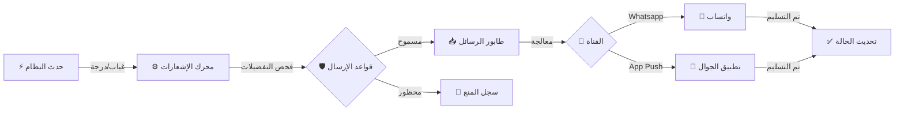

# 📁 نظام الإشعارات الذكي (Smart Notification System)
## النسخة 2.0 - محرك الاتصال الحدثي 🚀

---

## 📌 بطاقة النظام
| البند | القيمة |
|-------|--------|
| **المهندس المسؤول** | موسى العواضي (Lead Engineer) |
| **عدد الجداول** | 8 جداول مركزية |
| **حالة المراجعة** | ⭐⭐⭐⭐⭐ (Enterprise Communication Hub) |
| **ملف DDL** | `DDL.sql` |

---

## 🚀 المقدمة
في عالم مليء بالضجيج الرقمي، لا تحتاج المدرسة إلى "مجرد تطبيق آخر" يرسل مئات التنبيهات المزعجة. نظام الإشعارات الذكي هو "فلتر ذكي" ومدير علاقات محترف، يضمن الصمت عندما لا يكون هناك شيء مهم، ويتحدث بوضوح وفورية عندما يستدعي الأمر ذلك. هو النظام الذي يحول المدرسة من "مصدر إزعاج" إلى "شريك موثوق".

## ❓ ماذا يقدّم هذا النظام؟
إدارة ذكية للتواصل تقوم بـ:
- **لولي الأمر:** رسائل واتساب دقيقة ومختصرة عن (الغياب، الدرجات، الرسوم).
- **للمعلم:** تنبيهات تشغيلية (حصتك الآن، اجتماع، قرار إداري) على تطبيقه الخاص.
- **للإدارة:** لوحة قيادة ترى منها كل ما يحدث في المدرسة لحظة بلحظة.

## 💎 الفوائد الملموسة (القابلة للقياس)
- **توفير 50% من الجهد الإداري:** بدلاً من اتصال المشرف بـ 20 ولي أمر، النظام يرسل لهم جميعاً في ثانية واحدة.
- **سرعة الاستجابة:** ولي الأمر يعرف بغياب ابنه في تمام الساعة 8:15 صباحاً، وليس في اليوم التالي.
- **الاحترام:** النظام يحترم وقت الناس؛ لا يرسل تذكير بالرسوم في منتصف الليل، ولا يزعج المعلم في وقت راحته.

## 🌟 الفوائد غير الملموسة (القيمة الإدارية)
- **المصداقية:** التوثيق الإلكتروني يمنع "لم يخبرني أحد".
- **الانضباط:** معرفة الطالب وولي أمره بأن "كل شيء مسجل ويصل فوراً" يُعدّل السلوك تلقائياً.
- **راحة البال:** المدير يعرف أن قناة الطوارئ جاهزة وتعمل 100% عند الحاجة.

## 🔄 كيف يعمل النظام؟ (بأسلوب مبسّط)
1. **الحدث:** (مثلاً: معلم يسجل غياب طالب).
2. **التحليل:** النظام يفحص الأهمية (غياب = مهم)، ويفحص التفضيلات (هل الوقت مناسب للإرسال؟).
3. **الإرسال:** يرسل رسالة واتساب لولي الأمر: "محمد غائب اليوم - الرجاء التواصل".
4. **التأكيد:** يسجل النظام "تمت القراءة" عندما يفتح ولي الأمر الرسالة، ويخبر الإدارة بذلك.

## 🏗️ مكونات النظام (البيانات التي يعتمد عليها)

### 1. القنوات (طرق الوصول)
- **واتساب (القناة الذهبية):** لأولياء الأمور (لأن الجميع يستخدمه).
- **تطبيق المدرسة:** للمعلمين والموظفين (لفصل العمل عن الحياة الشخصية).

### 2. المحرك (عقل النظام)
- **الطابور (Queue):** مكان تنظيم الرسائل لترتيب خروجها وعدم تداخلها.
- **القواعد الذكية:** (مثلاً: لا ترسل 5 رسائل غياب لنفس الطالب في أسبوع، بل أرسل "ملخص غياب أسبوعي").

### 3. المخرجات والتقارير
- **تقرير التواصل:** من قرأ الرسائل؟ ومن يتجاهلها؟
- **مؤشر التفاعل:** إحصائية توضح للمعلم مدى اهتمام أولياء أمور طلاب فصله.

## 📖 أمثلة واقعية من داخل المدرسة
- **الحالة الطارئة:** تعطل باص 101. المشرف يضغط "تنبيه طوارئ لباص 101". في ثانية واحدة، يصل واتساب لـ 20 ولي أمر: "الباص سيتأخر 15 دقيقة لعطل فني، أبناؤكم بخير". نتيجته: 0 اتصالات قلقة للإدارة.
- **التقدير:** طالب حصل على الدرجة النهائية. النظام يرسل "تهنئة تلقائية" لوالده. يشعر الأب بالفخر والطالب بالتحفيز، دون أي جهد إضافي من المعلم.

## 🆚 مقارنة بالطريقة التقليدية

| الميزة | الطريقة اليدوية (رسائل عشوائية) | نظام الإشعارات الذكي |
|--------|---------------------------------|----------------------|
| **الوسيلة** | رسائل SMS مكلفة أو مجموعات واتساب مزعجة | رسائل واتساب فردية وموجهة (API) |
| **التوقيت** | عشوائي، قد يكون متأخراً | فوري (Real-time) |
| **التأثير** | يتم تجاهلها كـ "رسائل دعائية" | تُقرأ لثقة الأهل بأهميتها |

## ❓ أسئلة شائعة (FAQ)
**س: هل يستطيع ولي الأمر الرد على رسالة النظام؟**
ج: نعم، ويمكن توجيه الرد آلياً للمسؤول المختص (مثلاً رد على غياب يذهب للمشرف، رد على درجة يذهب للمعلم).

**س: ماذا لو لم يكن لدى ولي الأمر واتساب؟**
ج: النظام ذكي؛ إذا فشل الإرسال عبر واتساب، يمكنه تحويل الرسالة تلقائياً إلى SMS كبديل.

## 📝 الخلاصة التنفيذية
نظام الإشعارات الذكي هو **صوت المدرسة**. عندما يتحدث، الجميع يستمع. هو النظام الذي يحول البيانات الجامدة (غياب، درجات) إلى "حوار حي" ومثمر بين المدرسة والمنزل، مما يصب في النهاية في مصلحة الطالب.

---

## 🔔 دورة حياة الإشعار (Notification Lifecycle)



## 🎯 الرؤية التقنية
يُعد نظام (SNS) المحرك العصبي للمنظومة، حيث يقوم بإدارة كافة الرسائل الصادرة (واتساب، تطبيق، رسائل داخلية) بناءً على أحداث حقيقية في الأنظمة الأخرى.

---

## 🛠️ المميزات الجديدة (Enterprise Refactor)

1.  **حوكمة الحالة (Status Governance):** تم استبدال الحالات النصية بجدول مرجعي (`lookup_notification_statuses`) يدعم دورة حياة كاملة للإشعار (قيد الانتظار -> جاري المعالجة -> تم التسليم -> تمت القراءة).
2.  **منطق إعادة المحاولة (Retry Logic):** إذا فشل الإرسال (مثلاً بسبب انقطاع الإنترنت أو API)، يقوم النظام آلياً بإعادة المحاولة بناءً على حقول `retry_count` و `max_retries`.
3.  **الجدولة المتقدمة (Message Scheduling):** دعم الإرسال المجدول عبر `scheduled_at` وتلقي الإشعارات التي تنتهي صلاحيتها عبر `expires_at` (مثل إشعارات الطوارئ التي لا قيمة لها بعد انتهاء الحدث).
4.  **أرشفة المحتوى (Audit Rendering):** يتم تخزين النص النهائي المرسل (`title`, `body`) لضمان تتبع قانوني دقيق لما وصل للمستخدم فعلياً، حتى لو تغير القالب لاحقاً.

---

# 📊 قاموس البيانات (Samples)

## 1️⃣ طابور الإشعارات (notifications_queue)
| الحقل | الوصف | الفائدة التقنية |
|--------|-------|----------------|
| `status_id` | الحالة الحالية | متابعة دقيقة لنسبة الوصول (Delivery Rate) |
| `retry_count` | عدد المحاولات | إدارة الأعطال التقنية آلياً |
| `expires_at` | انتهاء الصلاحية | حذف الإشعارات غير الضرورية تلقائياً |

---

## 2️⃣ سجلات واتساب (whatsapp_interactions)
| الحقل | الوصف | الميزة |
|--------|-------|--------|
| `whatsapp_message_id` | معرف API | الربط المباشر مع مزود الخدمة |
| `interaction_type` | نوع التفاعل | دعم الردود الاستباقية (Replies) لاحقاً |

---

## 🔗 روابط التكامل
- **نظام الطلاب (04):** لرسائل الغياب والسلوك.
- **نظام التعليم (05):** لرسائل الدرجات والواجبات.
- **النظام المالي (07):** لرسائل المطالبات المالية والرسوم.

---

## 💡 كيف يستخدم المبرمج هذا النظام؟ (SQL Examples)

### 1. الإشعارات الفاشلة (Failed Notifications Audit)
```sql
SELECT 
    nq.id,
    nq.recipient_phone,
    nq.title,
    nq.retry_count,
    nq.last_error_message,
    nq.scheduled_at
FROM notifications_queue nq
WHERE nq.status_id = 99 -- (فشل نهائي)
AND nq.created_at >= CURDATE()
ORDER BY nq.retry_count DESC;
```

### 2. حجم الرسائل اليومي (Daily Volume)
```sql
SELECT 
    DATE(created_at) AS sending_date,
    COUNT(*) AS total_messages,
    SUM(CASE WHEN status_id = 1 THEN 1 ELSE 0 END) AS delivered,
    SUM(CASE WHEN interaction_type = 'READ' THEN 1 ELSE 0 END) AS read_by_user
FROM notifications_queue
GROUP BY DATE(created_at)
ORDER BY sending_date DESC
LIMIT 7;
```

---

**شركة إنما سوفت للحلول التقنية** | 2026
