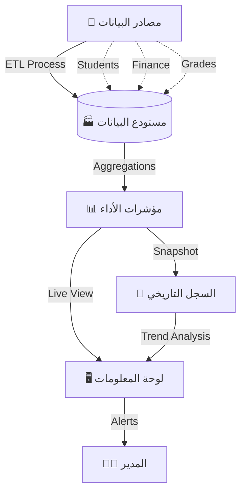

# 🖼️ لوحة التحكم التنفيذية (Executive / BI Dashboard)
## النسخة 1.0 - مركز ذكاء المنظومة 🏛️

---

## 📌 بطاقة النظام
| البند | القيمة |
|-------|--------|
| **المهندس المسؤول** | موسى العواضي |
| **المسؤولية** | ذكاء الأعمال (BI)، التقارير التنفيذية، مراقبة الـ KPIs |
| **حالة المراجعة** | ⭐⭐⭐⭐⭐ (Executive Grade) |
| **ملف DDL** | `DDL.sql` |

---

## 🚀 المقدمة
في عالم البيانات الضخمة، لا يكفي أن تمتلك المعلومات، بل يجب أن "تراها". لوحة المعلومات هي "قمرة القيادة" التي يرى منها مدير المدرسة كل صغيرة وكبيرة، ليس عبر جداول مملة، بل من خلال مؤشرات نابضة ورسوم بيانية تحكي قصة نجاح أو تطلق صفارة إنذار، ليكون القرار مبنياً على حقائق لا على تخمينات.

## ❓ ماذا يقدّم هذا النظام؟
مركز عمليات ذكي يعرض:
- **النبض اليومي:** الحضور، الغياب، السلوك في اللحظة الحالية.
- **الصحة المالية:** مؤشر التحصيل الفوري.
- **الأداء الأكاديمي:** مقارنات مستوى الطلاب بين الفصول والمواد.

## 💎 الفوائد الملموسة (القابلة للقياس)
- **سرعة القرار:** اكتشاف انخفاض درجات مادة معينة في منتصف الفصل وتدارك الأمر، بدلاً من الانتظار لنهاية العام.
- **توفير الوقت:** بدلاً من طلب 10 تقارير من 10 موظفين، نظرة واحدة على الشاشة تعطي الصورة كاملة.
- **كشف الخلل:** معرفة المعلم الأكثر غياباً أو الفصل الأكثر شغباً بلمحة بصر.

## 🌟 الفوائد غير الملموسة (القيمة الإدارية)
- **السيطرة:** شعور المدير بأنه يمسك بزمام الأمور.
- **الشفافية:** الأرقام لا تكذب، مما ينهي الجدل حول تقييم الأداء.
- **التحفيز:** عندما يرى الموظفون مؤشرات أدائهم، يتحفزون لتحسينها.

## 🔄 كيف يعمل النظام؟ (بأسلوب مبسّط)
1. **الجمع:** يسحب النظام البيانات من جميع الأنظمة (طلاب، مالية، درجات) كل دقيقة.
2. **التحليل:** يعالج البيانات ويحولها لنسب مئوية ومقارنات.
3. **العرض:** يعرض المستخلص على شاشات تفاعلية (Dashboard) بألوان ومؤشرات واضحة (أخضر = ممتاز، أحمر = خطر).
4. **التنبيه:** يرسل تنبيهاً للمدير إذا تجاوز مؤشر الخطر حداً معيناً.

---

## 🚀 المميزات الرئيسية (Intelligence Layer)
يعمل هذا النظام كـ **"عقل"** المنظومة، حيث يقوم بتجميع البيانات من جميع الأنظمة الفرعية (الطلاب، الدرجات، الحضور، المالية) وتحويلها إلى رؤى بصرية (Visual Insights) تدعم اتخاذ القرار السريع والدقيق.

---

## 🚀 المميزات الرئيسية (Intelligence Layer)

1.  **مؤشرات الأداء (Real-time KPIs):** تتبع حي لمعدلات الحضور، نسب النجاح، وتحصيل الرسوم عبر جداول `bi_kpi_definitions`.
2.  **اللقطات التاريخية (Trend Analysis):** حفظ "لقطات" دورية للبيانات عبر `bi_kpi_snapshots` لمقارنة أداء المدرسة شهرياً وسنوياً.
3.  **تنبيهات المخاطر (Risk Matrix):** اكتشاف تلقائي للطلاب المعرضين للفشل الأكاديمي أو التسرب المدرسي بناءً على خوارزميات الربط بين الحضور والدرجات.
4.  **تخصيص الواجهات (Widget System):** نظام مرن لتوزيع العناصر البصرية (رسوم بيانية، عدادات، خرائط حرارية) لكل مستخدم حسب صلاحياته.
5.  **حوكمة التقارير:** أرشفة آلية للتقارير الدورية (يومية/أسبوعية) وحفظها كمرجع تاريخي للإدارة.

---

## 📊 الرؤى التحليلية المتوفرة (Analytical Views)

| الرؤية (View) | الهدف التحليلي |
|---------------|----------------|
| `v_bi_attendance_analytics` | تحديد أيام وفصول الغياب الجماعي (Heatmap). |
| `v_bi_academic_kpis` | قياس جودة التعليم ومقارنة أداء المواد الدراسية. |
| `v_bi_teacher_efficiency` | ربط أحمال المعلمين بنتائج طلابهم لقياس الفعالية. |
| `v_bi_parent_engagement` | قياس مدى تفاعل ولي الأمر مع التطبيق والرسائل. |
| `v_bi_risk_matrix` | التنبؤ المبكر بالمشاكل قبل وقوعها (الإنذار المبكر). |

---

## 🔗 روابط التكامل الحيوية
- **نظام الطلاب (04):** المصدر الأساسي للتصنيفات الديموغرافية.
- **نظام الدرجات الذكي (05):** المصدر الأساسي لبيانات التحصيل العلمي.
- **نظام الإشعارات (14):** قناة إرسال التنبيهات الحرجة للإدارة.
- **الجدول الذكي (11):** تحليل كفاءة استخدام الموارد والوقت.

- **الجدول الذكي (11):** تحليل كفاءة استخدام الموارد والوقت.

---

## 🧠 بنية ذكاء الأعمال (BI Architecture)



## 💡 كيف يستخدم المبرمج هذا النظام؟ (SQL Examples)

### 1. مؤشرات الأداء الحالية (Live KPIs)
```sql
SELECT 
    kpi_code,
    name_ar,
    current_value,
    target_value,
    CASE 
        WHEN current_value >= target_value THEN 'SUCCESS'
        WHEN current_value < error_threshold THEN 'CRITICAL'
        ELSE 'WARNING'
    END AS status_indicator
FROM bi_kpi_definitions
WHERE is_active = 1
ORDER BY priority_level DESC;
```

### 2. مصفوفة المخاطر (Students at Risk)
```sql
SELECT 
    s.full_name,
    c.name_ar AS class_name,
    rm.risk_score,
    rm.academic_risk_factor,
    rm.behavioral_risk_factor,
    rm.attendance_risk_factor
FROM bi_risk_matrix rm
JOIN students s ON rm.student_id = s.id
JOIN classes c ON s.current_class_id = c.id
WHERE rm.risk_score > 70
ORDER BY rm.risk_score DESC;
```

---

**شركة إنما سوفت للحلول التقنية** | 2026
