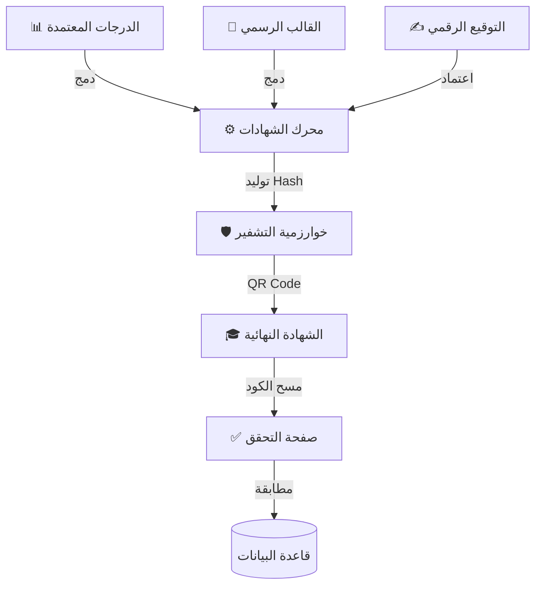

# 📜 نظام الشهادات الذكي (Smart Certificate System - SCS)
## النسخة 1.0 - الأتمتة الرسمية للمخرجات 🎓

---

## 📌 بطاقة النظام
| البند | القيمة |
|-------|--------|
| **المهندس المسؤول** | موسى العواضي / أحمد الهتار |
| **المسؤولية** | هندسة الشهادات، دمج البيانات الديناميكية، التوثيق الرقمي |
| **حالة المراجعة** | ⭐⭐⭐⭐⭐ (Official Signature Grade) |
| **ملف DDL** | `DDL.sql` |

---

## 🚀 المقدمة
الشهادة هي "ثمرة الحصاد" لعام كامل من الجهد. هي الوثيقة الأهم التي ينتظرها الطالب وولي الأمر. نظام الشهادات الذكي يضمن أن تكون هذه الوثيقة دقيقة، آمنة، وغير قابلة للتزوير، مع القدرة على إصدار آلاف الشهادات في دقائق معدودة، بدلاً من أسابيع من الكتابة والمراجعة اليدوية.

## ❓ ماذا يقدّم هذا النظام؟
مصنع آلي لإصدار الوثائق الرسمية:
- **الأتمتة:** سحب الدرجات وحساب التقديرات وطباعة الشهادة آلياً.
- **الحماية:** تشفير الشهادات بكود (QR) لمنع التزوير.
- **الأرشفة:** حفظ نسخة رقمية لكل شهادة صدرت للرجوع إليها مستقبلاً.

## 💎 الفوائد الملموسة (القابلة للقياس)
- **السرعة القياسية:** إصدار شهادات المدرسة كاملة في يوم واحد.
- **انعدام الأخطاء:** لا مجال لخطأ في نقل درجة أو جمع درجات، فالنظام يقوم بكل شيء.
- **التوفير:** الاستغناء عن "خطاط" الشهادات أو النماذج الجاهزة المكلفة.

## 🌟 الفوائد غير الملموسة (القيمة الإدارية)
- **الموثوقية:** شهادة لا يمكن التشكيك فيها بفضل التشفير الرقمي.
- **الهوية البصرية:** تصميم موحد واحترافي يعزز صورة المدرسة.
- **راحة البال:** نسخة احتياطية إلكترونية دائمة تحمي المدرسة من ضياع السجلات.

## 🔄 كيف يعمل النظام؟ (بأسلوب مبسّط)
1. **الإعداد:** اعتماد النتائج من الكنترول.
2. **القالب:** اختيار تصميم الشهادة (شهادة نجاح، شهادة تفوق).
3. **المعالجة:** يدمج النظام اسم الطالب ودرجاته مع القالب.
4. **التوقيع:** يضيف النظام توقيع المدير والختم إلكترونياً.
5. **الإصدار:** تخرج الشهادة جاهزة للطباعة وعليها كود التحقق.

---

## 🎯 الرؤية التقنية (Manual Workflow Mirroring)
يحاكي هذا النظام "الواقع اليدوي" للمدارس ولكن بكفاءة رقمية كاملة. يعتمد النظام على فصل **التصميم الثابت** عن **البيانات المتغيرة**، حيث يتم رفع "قالب الشهادة" كصورة أو تنسيق ثابت، ثم يتم إسقاط البيانات (اسم الطالب، درجاته، تقديره) في أماكن محددة سلفاً.

---

## 🚀 رحلة إصدار الشهادة (The 3-Step Process)

1.  **تصميم القالب (The Fixed Form):** يتم تعريف شكل الشهادة عبر `certificate_templates` (هوامش، خلفية رسمية، شعار المدرسة).
2.  **خريطة الحقول (Placeholder Mapping):** عبر جدول `certificate_placeholders` يتم ربط أماكن الفراغات في الشهادة بحقول قاعدة البيانات (مثل: ربط خانة الاسم بحقل `full_name` في جدول الطلاب).
3.  **الدمج والطباعة (Auto-Merge):** يقوم المحرك بقراءة صفوف الطلاب ودرجاتهم من الـ Views المخصصة، ودمجها لحظياً مع القالب لإنتاج نسخة PDF جاهزة لكل طالب.

---

## 🔒 حوكمة الشهادات (Security & Trust)

- **التوقيع الرقمي:** دمج تواقيع المدير والأختام الرسمية آلياً في الشهادة عبر `authorized_signers`.
- **التوثيق الرقمي:** كل شهادة صادرة تحصل على رقم تسلسلي فريد وكود تحقق (`verification_hash`) يمنع التزوير ويتيح التأكد من صحة البيانات عبر مسح الكود.
- **سجل الإصدار:** تتبع كامل لعدد مرات طباعة الشهادة ومن قام بإصدارها عبر `issued_certificates`.

---

## 📊 محرك البيانات (Data Sources)
يستمد النظام قوته من التكامل العميق مع الأنظمة الأخرى:
- **SIS (04):** لهوية الطلاب وصورهم الشخصية.
- **SGAS (05):** لنتائج الاختبارات والتحصيل الأكاديمي النهائي.
- **Academic Core (02):** لبيانات العام الدراسي والمدرسة.

- **Academic Core (02):** لبيانات العام الدراسي والمدرسة.

---

## 🔐 آلية الأمان الرقمي (Digital Security Flow)



## 💡 كيف يستخدم المبرمج هذا النظام؟ (SQL Examples)

### 1. التحقق من صحة الشهادة (Verification)
```sql
SELECT 
    ic.certificate_number,
    s.full_name AS student_name,
    ic.issued_at,
    ic.verification_hash,
    CASE 
        WHEN ic.is_revoked = 1 THEN 'INVALID (REVOKED)'
        ELSE 'VALID'
    END AS status
FROM issued_certificates ic
JOIN students s ON ic.student_id = s.id
WHERE ic.verification_hash = 'A1B2-C3D4-E5F6' -- (القيمة المقروءة من الـ QR)
LIMIT 1;
```

### 2. سجل إصدار الشهادات (Generation Log)
```sql
SELECT 
    ct.template_name,
    COUNT(ic.id) AS total_issued,
    u.username AS issued_by,
    DATE(ic.issued_at) AS issue_date
FROM issued_certificates ic
JOIN certificate_templates ct ON ic.template_id = ct.id
JOIN users u ON ic.created_by = u.id
GROUP BY ct.id, u.id, DATE(ic.issued_at)
ORDER BY issue_date DESC;
```

---

**شركة إنما سوفت للحلول التقنية** | 2026
